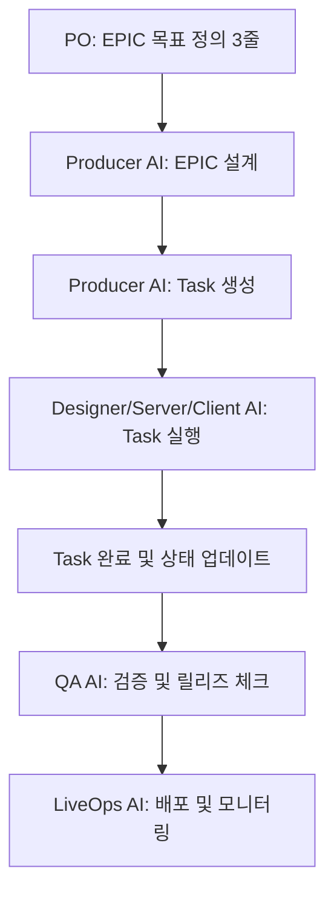

# 워크플로우: Task 기반 EPIC 실행

> **목적**: EPIC을 Feature 단위로 분해하고, Task 도구를 사용하여 진행 상황을 추적한다.

---

## 전체 워크플로우



---

## Phase 1: EPIC 설계 (Producer AI)

### 입력
- PO의 목표 정의 (3줄 이내)
- `.ai/context/vision.md`, `.ai/context/gdd.md`
- 기존 EPIC 문서들

### 절차
1. `.ai/skills/epic-breakdown.md` 스킬 실행
2. EPIC 문서 작성 → `docs/epics/EPIC-{번호}-{kebab-case}.md`
3. Feature 분해 (3-7개)
4. 의존성 맵 작성
5. 릴리즈 전략 수립

### 산출물
- **EPIC 문서**: `docs/epics/EPIC-{번호}-{제목}.md`
- 템플릿: `.ai/templates/epic-template.md`

---

## Phase 2: Task 생성 및 의존성 설정 (Producer AI)

### 절차

**Step 1: Feature별 Task 생성**

각 Feature마다 TaskCreate 도구를 사용하여 Task 등록:

```typescript
TaskCreate({
  subject: "[EPIC-{번호}] Feature {번호} - {기능명}",
  description: "{Feature 상세 설명}\n\n책임자: {Designer/Server/Client AI}\n예상 리스크: {...}",
  activeForm: "{기능명} 구현 중"
})
```

**Step 2: Task 간 의존성 설정**

Feature 의존성 맵을 기반으로 TaskUpdate의 `addBlockedBy` 사용:

```typescript
TaskUpdate({
  taskId: "3",
  addBlockedBy: ["1", "2"]  // Feature 3은 Feature 1, 2 완료 후 시작
})
```

**Step 3: 책임자 할당**

각 Task에 owner 설정:

```typescript
TaskUpdate({
  taskId: "1",
  owner: "Server AI"
})
```

### 예시

**EPIC-05: 유저 분석 대시보드**

```
Feature 1: 데이터 수집 API 구현 (Server AI)
  → Task #1: [EPIC-05] Feature 1 - 데이터 수집 API 구현

Feature 2: 데이터 집계 로직 구현 (Server AI, Feature 1 의존)
  → Task #2: [EPIC-05] Feature 2 - 데이터 집계 로직 구현
  → blockedBy: [Task #1]

Feature 3: 대시보드 UI 구현 (Client AI, Feature 2 의존)
  → Task #3: [EPIC-05] Feature 3 - 대시보드 UI 구현
  → blockedBy: [Task #2]
```

### 산출물
- Task List (TaskList 도구로 확인 가능)
- 각 Task는 pending 상태로 시작

---

## Phase 3: Feature 구현 (Designer/Server/Client AI)

### 역할별 작업 흐름

#### Designer AI
- TaskList로 자신에게 할당된(owner) Task 확인
- 담당 Task를 **in_progress**로 변경
- Feature Spec 작성 → `docs/features/epic-{번호}/feature-{번호}-{기능명}.md`
- 완료 후 Task를 **completed**로 변경

#### Server AI / Client AI
- TaskList로 자신에게 할당된 Task 확인
- blockedBy가 비어있는(의존성이 해결된) Task만 선택
- Task를 **in_progress**로 변경
- Implementation Plan 작성 → `docs/implementations/epic-{번호}/impl-{feature번호}-{설명}.md`
- 코드 구현 및 테스트
- 완료 후 Task를 **completed**로 변경

### 절차

**Step 1: Task 확인**
```typescript
TaskList()  // 전체 Task 목록 확인
```

**Step 2: 작업 시작**
```typescript
TaskUpdate({
  taskId: "1",
  status: "in_progress"
})
```

**Step 3: Feature Spec / Implementation Plan 작성**
- Feature Spec: `.ai/skills/feature-spec.md` 참조
- Implementation Plan: `.ai/skills/implementation-plan.md` 참조

**Step 4: 구현 및 테스트**
- 코드 작성
- Unit Test / Integration Test
- 문서화

**Step 5: 작업 완료**
```typescript
TaskUpdate({
  taskId: "1",
  status: "completed"
})
```

### 산출물
- **Feature Spec**: `docs/features/epic-{번호}/feature-{번호}-{기능명}.md`
- **Implementation Plan**: `docs/implementations/epic-{번호}/impl-{feature번호}-{설명}.md`
- 구현된 코드 및 테스트

---

## Phase 4: 검증 (QA AI)

### 트리거
- EPIC의 모든 Feature Task가 completed 상태일 때

### 절차

**Step 1: Test Plan 작성**
```typescript
TaskCreate({
  subject: "[EPIC-{번호}] QA - 통합 테스트 및 검증",
  description: "EPIC-{번호}의 모든 Feature에 대한 통합 테스트 및 회귀 테스트 수행",
  activeForm: "통합 테스트 진행 중"
})
```

**Step 2: 테스트 실행**
- `.ai/skills/test-plan.md` 참조
- Unit Test, Integration Test, E2E Test 실행
- Edge Case 테스트

**Step 3: Verification Report 작성**
- `docs/verification/epic-{번호}-verification-report.md` 작성
- 테스트 결과, 발견된 이슈, 해결 여부 기록

**Step 4: Release Checklist 작성**
- `.ai/skills/release-check.md` 참조
- `docs/verification/epic-{번호}-release-checklist.md` 작성

### 산출물
- **Test Plan**: `docs/test-plans/epic-{번호}-test-plan.md`
- **Verification Report**: `docs/verification/epic-{번호}-verification-report.md`
- **Release Checklist**: `docs/verification/epic-{번호}-release-checklist.md`

---

## Phase 5: 배포 및 모니터링 (LiveOps AI)

### 트리거
- QA AI의 Release Checklist가 모두 ✅ 체크 완료
- PO/PM의 최종 승인

### 절차

**Step 1: 배포 준비**
- DB 마이그레이션 스크립트 검증
- Rollback 시나리오 준비
- 모니터링 알람 설정

**Step 2: 배포**
- Staging 환경 배포 및 검증
- Production 배포
- Canary / Blue-Green 배포 전략 적용

**Step 3: 모니터링**
- `.ai/context/monitoring.md` 참조
- 에러율, 응답 시간, DB 성능 모니터링
- 이상 징후 감지 시 Rollback 결정

**Step 4: Release Note 작성**
- `docs/release-notes/epic-{번호}-release-note.md` 작성
- 템플릿: `.ai/templates/release-note-template.md`

### 산출물
- **Release Note**: `docs/release-notes/epic-{번호}-release-note.md`
- 배포 로그 및 모니터링 대시보드

---

## Task 상태 관리 규칙

### Task 상태 전이

```
pending → in_progress → completed
```

### 상태별 의미

| 상태 | 의미 | 누가 변경하는가 |
|------|------|----------------|
| `pending` | 작업 대기 중 (의존성 미해결 또는 아직 시작 안 함) | Producer AI (생성 시) |
| `in_progress` | 작업 진행 중 | 담당 AI (작업 시작 시) |
| `completed` | 작업 완료 | 담당 AI (작업 완료 시) |

### 의존성 확인 규칙

Task를 시작하기 전에 반드시 확인:
```typescript
TaskGet({ taskId: "3" })
// blockedBy: ["1", "2"]
// → Task 1, 2가 모두 completed 상태인지 확인 후 시작
```

### Task 업데이트 원칙

1. **작업 시작 전**: Task를 `in_progress`로 변경 (TaskUpdate)
2. **작업 완료 후**: Task를 `completed`로 변경 (TaskUpdate)
3. **의존성 해결**: blockedBy Task가 모두 completed 상태여야 시작 가능
4. **문서화**: Task 완료 시 산출물(Feature Spec, Implementation Plan 등) 생성 필수

---

## 디렉토리 구조 규칙

```
docs/
├── epics/                    # EPIC 문서
│   ├── EPIC-03-dynamic-event-system.md
│   ├── EPIC-04-trust-system-improvement.md
│   └── EPIC-05-{새로운-에픽}.md
│
├── features/                 # Feature Spec 문서
│   ├── epic-03/
│   │   ├── feature-1-trigger-system.md
│   │   └── feature-2-event-pool.md
│   ├── epic-04/
│   │   ├── feature-4-trust-gauge.md
│   │   └── feature-6-alternative-investment.md
│   └── epic-05/
│
├── implementations/          # Implementation Plan 문서
│   ├── epic-03/
│   ├── epic-04/
│   │   ├── impl-3-trust-calculation.md
│   │   └── impl-4-trust-gauge-summary.md
│   └── epic-05/
│
├── verification/             # Verification Report 및 Checklist
│   ├── epic-03-verification-report.md
│   ├── epic-04-final-verification-report.md
│   └── epic-05-release-checklist.md
│
└── release-notes/           # Release Note
    ├── epic-03-release-note.md
    └── epic-04-release-note.md
```

---

## 명명 규칙

### EPIC 문서
- 형식: `EPIC-{번호}-{kebab-case-제목}.md`
- 예시: `EPIC-05-user-analytics-dashboard.md`

### Feature Spec 문서
- 형식: `feature-{번호}-{kebab-case-기능명}.md`
- 예시: `feature-1-data-collection-api.md`
- 위치: `docs/features/epic-{번호}/`

### Implementation Plan 문서
- 형식: `impl-{feature번호}-{kebab-case-설명}.md`
- 예시: `impl-1-data-collection-api.md`
- 위치: `docs/implementations/epic-{번호}/`

### Verification 문서
- 형식: `epic-{번호}-{verification|release-checklist|final-report}.md`
- 예시: `epic-05-verification-report.md`
- 위치: `docs/verification/`

### Release Note
- 형식: `epic-{번호}-release-note.md`
- 예시: `epic-05-release-note.md`
- 위치: `docs/release-notes/`

---

## 체크리스트

### Producer AI (EPIC 설계 단계)
- [ ] EPIC 문서가 `docs/epics/`에 생성되었는가?
- [ ] Feature가 3-7개로 적절히 분해되었는가?
- [ ] 각 Feature마다 Task가 생성되었는가?
- [ ] Task 간 의존성이 설정되었는가?
- [ ] 각 Task에 owner가 할당되었는가?

### Designer/Server/Client AI (구현 단계)
- [ ] 담당 Task를 확인했는가? (TaskList)
- [ ] 의존성이 모두 해결되었는가? (blockedBy가 비어있는가?)
- [ ] Task를 in_progress로 변경했는가?
- [ ] Feature Spec / Implementation Plan을 작성했는가?
- [ ] 코드 구현 및 테스트를 완료했는가?
- [ ] Task를 completed로 변경했는가?

### QA AI (검증 단계)
- [ ] 모든 Feature Task가 completed 상태인가?
- [ ] Test Plan을 작성했는가?
- [ ] 회귀 테스트를 수행했는가?
- [ ] Verification Report를 작성했는가?
- [ ] Release Checklist를 작성했는가?

### LiveOps AI (배포 단계)
- [ ] Release Checklist가 모두 ✅인가?
- [ ] Rollback 계획이 준비되었는가?
- [ ] 모니터링 알람이 설정되었는가?
- [ ] Release Note를 작성했는가?

---

## 안티 패턴 (하지 말 것)

❌ **Task 없이 Feature 구현**
→ 반드시 Task를 생성하고 추적해야 함

❌ **의존성 무시하고 작업 시작**
→ blockedBy가 해결되지 않으면 시작 불가

❌ **Task 상태를 업데이트하지 않음**
→ 작업 시작 시 in_progress, 완료 시 completed로 변경 필수

❌ **문서 없이 코드만 작성**
→ Feature Spec / Implementation Plan 작성 필수

❌ **명명 규칙 무시**
→ kebab-case 통일 필수

❌ **산출물을 잘못된 디렉토리에 저장**
→ 디렉토리 구조 규칙 준수 필수

---

**문서 버전**: v1.0
**최종 업데이트**: 2026-02-04
**상태**: ✅ 초기 작성 완료
