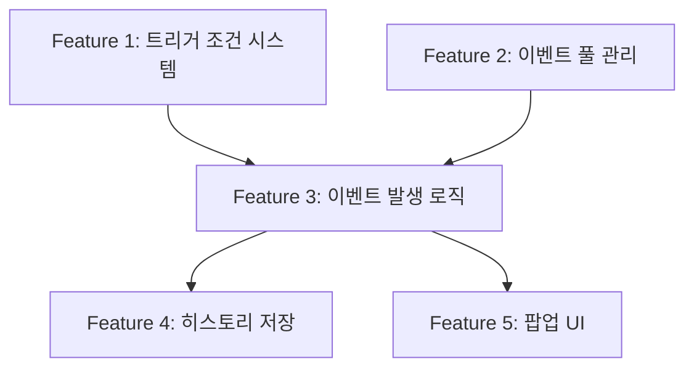
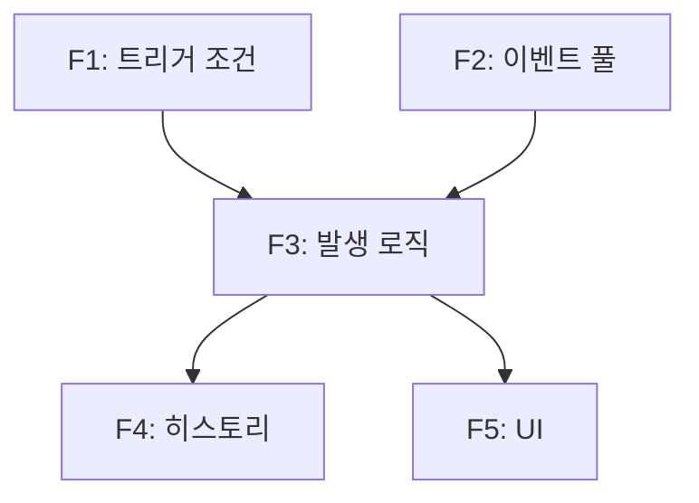

# Skill: Epic Breakdown

**사용자**: Producer AI
**목적**: 대규모 목표를 실행 가능한 Feature 단위로 분해하고 의존성을 파악한다.

---

## 입력

- **PO의 목표 정의** (3줄 이내 텍스트)
- `.ai/context/vision.md` - 게임 비전
- `.ai/context/gdd.md` - 게임 디자인 문서
- 기존 EPIC 문서들 (의존성 파악용)

---

## 출력

- **EPIC 문서** (`docs/epics/EPIC-{번호}-{제목}.md`)
- 템플릿: `.ai/templates/epic-template.md`

---

## 절차

### Step 1: 목표 분석 및 검증

1. PO의 목표를 읽고 핵심 요구사항을 추출한다
2. 게임 비전(vision.md)과 정합성을 확인한다
3. 불명확한 부분이 있다면 질문 리스트를 작성한다

**체크리스트**:
- [ ] 목표가 게임 비전과 일치하는가?
- [ ] 목표가 측정 가능한가?
- [ ] 목표가 명확한가? (모호한 표현 없음)

**불명확한 경우**:
```markdown
## 질문 사항
1. {질문 1}
2. {질문 2}
```
→ AskUserQuestion 툴 사용하여 PO에게 확인

---

### Step 2: Feature 분해

1. 목표를 **3-7개의 Feature**로 분해한다
2. 각 Feature는 **독립적으로 구현 가능**해야 한다
3. Feature 이름은 **"동사 + 명사"** 형태로 작성한다

**분해 기준**:
- 각 Feature는 하나의 역할(Designer/Client/Server)이 주도할 수 있어야 함
- Feature 크기는 1-2주 이내 구현 가능해야 함 (단, 시간 추정은 하지 않음)
- Feature는 단독으로 테스트 가능해야 함

**예시**:
```markdown
목표: "유저가 게임 중 랜덤 이벤트를 만난다"

Feature 분해:
1. 이벤트 트리거 조건 시스템 구현 (Server AI)
2. 이벤트 풀 관리 시스템 구현 (Server AI)
3. 이벤트 발생 로직 통합 (Server AI)
4. 이벤트 히스토리 저장 및 조회 (Server AI)
5. 이벤트 팝업 UI 구현 (Client AI)
```

---

### Step 3: 의존성 분석

1. Feature 간 **의존 관계**를 파악한다
2. **병렬 가능한 Feature**와 **순차 진행 필요한 Feature**를 구분한다
3. **Critical Path**를 식별한다

**의존성 타입**:
- **Hard Dependency**: 반드시 선행 완료 필요 (예: DB 스키마 → API 구현)
- **Soft Dependency**: 선호하지만 필수 아님 (예: 디자인 → 구현)

**Mermaid 다이어그램 작성**:


---

### Step 4: 릴리즈 전략 수립

1. Feature를 **Phase 단위**로 그룹화한다
2. 각 Phase의 **릴리즈 기준**을 정의한다
3. **Rollback 조건**을 명시한다

**Phase 그룹화 기준**:
- Phase 1: 최소 기능 (MVP)
- Phase 2: 핵심 기능
- Phase 3: 개선 및 최적화

**예시**:
```markdown
## 릴리즈 전략

### Phase 1: Backend 준비
- **포함 Feature**: F1 (트리거 조건), F2 (이벤트 풀)
- **릴리즈 기준**:
  - API 엔드포인트 구현 완료
  - Unit Test 커버리지 > 80%
- **Rollback 조건**: API 에러율 > 5%

### Phase 2: 통합 및 저장
- **포함 Feature**: F3 (발생 로직), F4 (히스토리)
- **릴리즈 기준**:
  - Integration Test 통과
  - 게임 진행 중 이벤트 정상 발생
- **Rollback 조건**: 게임 진행 불가 시

### Phase 3: UI 구현
- **포함 Feature**: F5 (팝업 UI)
- **릴리즈 기준**:
  - E2E Test 통과
  - 모바일 반응형 확인
- **Rollback 조건**: UI 렌더링 실패 시
```

---

### Step 5: 리스크 식별 및 대응 방안

1. **기술 리스크**, **일정 리스크**, **리소스 리스크**를 식별한다
2. 각 리스크별 **영향도**와 **확률**을 평가한다
3. **대응 방안**과 **우회 방안(Contingency)**을 제시한다

**리스크 분류**:
- **P0 (Critical)**: 프로젝트 전체에 영향
- **P1 (High)**: Phase 지연 가능성
- **P2 (Medium)**: 일부 Feature 영향
- **P3 (Low)**: 무시 가능

**리스크 테이블 작성**:
```markdown
| 리스크 | 영향도 | 확률 | 대응 방안 | 우회 방안 |
|--------|--------|------|-----------|-----------|
| 이벤트 매칭 로직이 복잡해져 성능 저하 | High | Medium | Rule Engine 패턴 적용 | 단순 조건만 먼저 지원 |
| Frontend 다이어그램 렌더링 성능 이슈 | Medium | Low | Canvas 대신 SVG 사용 | 텍스트로만 표시 |
| DB 마이그레이션 실패 | High | Low | Rollback 스크립트 준비 | 이전 버전 유지 |
```

---

### Step 6: 조율 포인트 명시

1. **Designer AI와 조율**: 게임 규칙, 밸런스
2. **Client/Server AI와 조율**: 기술적 제약, API 스펙
3. **QA AI와 조율**: 테스트 범위, 품질 기준

**조율 체크리스트**:
```markdown
## 조율 포인트

### Designer AI
- [ ] 이벤트 발생 확률이 게임 밸런스에 미치는 영향 확인
- [ ] 이벤트 종류 및 효과 범위 협의

### Server AI
- [ ] API 엔드포인트 설계 협의
- [ ] DB 스키마 변경 사항 확인
- [ ] 성능 요구사항 전달

### Client AI
- [ ] UI/UX 요구사항 전달
- [ ] API 응답 구조 협의

### QA AI
- [ ] 회귀 테스트 범위 정의
- [ ] Edge Case 공유
```

---

### Step 7: EPIC 문서 작성

템플릿 `.ai/templates/epic-template.md`를 사용하여 최종 문서를 작성한다.

**필수 섹션**:
1. 목표 및 배경
2. 성공 기준
3. Feature 분해
4. 의존성 맵
5. 릴리즈 전략
6. 리스크 관리
7. 조율 포인트

---

## 품질 체크

작성한 EPIC 문서가 아래 기준을 충족하는지 확인한다:

- [ ] 목표가 명확하고 측정 가능한가?
- [ ] Feature가 3-7개로 적절히 분해되었는가?
- [ ] 각 Feature가 독립적으로 구현 가능한가?
- [ ] 의존성 맵이 명확한가?
- [ ] 릴리즈 전략이 실행 가능한가?
- [ ] 리스크가 식별되고 대응 방안이 있는가?
- [ ] 조율 포인트가 명시되었는가?

---

## 안티 패턴 (하지 말 것)

❌ **Feature가 너무 많음** (10개 이상)
→ EPIC을 더 작은 단위로 분리하거나 Feature를 병합

❌ **Feature가 너무 적음** (2개 이하)
→ EPIC이 아니라 단일 Feature일 가능성

❌ **의존성이 순환 구조**
→ Feature 설계 재검토 필요

❌ **게임 규칙을 직접 설계**
→ Designer AI의 역할, Producer는 Feature 분해만

❌ **구현 방법을 구체적으로 제시**
→ Server/Client AI의 역할

❌ **시간 추정**
→ "2주 소요" 같은 표현 금지

---

## 예시

**입력 (PO)**:
> "유저가 게임 중 특정 조건에서 랜덤 이벤트를 만나게 하고 싶다.
> 이벤트는 긍정/부정 효과를 가지며, 플레이어가 선택할 수 있어야 한다.
> 이벤트 발생 조건과 빈도는 조정 가능해야 한다."

**출력 (Producer AI)**:
```markdown
# EPIC-03: 동적 이벤트 시스템

## 목표
유저가 게임 진행 중 특정 조건(턴 수, 인프라 상태, 자금)에 따라
예상치 못한 랜덤 이벤트를 경험하게 한다.

## 배경
현재 게임은 고정된 턴 기반 이벤트만 제공하여 반복 플레이 시
예측 가능성이 높아진다. 동적 이벤트를 도입하여 리플레이 가치를
높이고, 플레이어에게 예상치 못한 도전과 기회를 제공한다.

## 성공 기준
- [ ] 플레이어가 게임 중 최소 1회 이상 랜덤 이벤트를 경험
- [ ] 이벤트 발생 조건을 JSON으로 설정 가능
- [ ] 이벤트 히스토리가 DB에 저장됨
- [ ] 이벤트 효과가 게임 밸런스를 크게 깨지 않음

## Feature 분해

### Feature 1: 이벤트 트리거 조건 시스템 구현
- **설명**: 게임 상태를 기반으로 이벤트 발생 조건을 평가하는 시스템
- **책임자**: Server AI
- **의존성**: None
- **예상 리스크**: 조건 로직이 복잡해질 수 있음

### Feature 2: 이벤트 풀 관리 시스템 구현
- **설명**: 이벤트 데이터를 로드하고 필터링하는 시스템
- **책임자**: Server AI
- **의존성**: None
- **예상 리스크**: 이벤트 데이터가 많아지면 로딩 성능 저하

### Feature 3: 이벤트 발생 로직 통합
- **설명**: 게임 턴 진행 시 이벤트 트리거 및 적용
- **책임자**: Server AI
- **의존성**: F1, F2 완료 후
- **예상 리스크**: 기존 게임 플로우와 충돌 가능성

### Feature 4: 이벤트 히스토리 저장 및 조회
- **설명**: 발생한 이벤트 기록 및 조회 API
- **책임자**: Server AI
- **의존성**: F3 완료 후
- **예상 리스크**: None

### Feature 5: 이벤트 팝업 UI 구현
- **설명**: 이벤트 발생 시 팝업 표시 및 선택 처리
- **책임자**: Client AI
- **의존성**: F3 완료 후
- **예상 리스크**: 모바일 반응형 처리

## 의존성 맵


**Critical Path**: F1 → F3 → F5

## 릴리즈 전략

### Phase 1: Backend 준비 (Week 1)
- **포함 Feature**: F1, F2
- **릴리즈 기준**: API 엔드포인트 구현, Unit Test > 80%
- **Rollback 조건**: API 에러율 > 5%

### Phase 2: 통합 (Week 2)
- **포함 Feature**: F3, F4
- **릴리즈 기준**: Integration Test 통과, 게임 진행 정상
- **Rollback 조건**: 게임 진행 불가

### Phase 3: UI (Week 3)
- **포함 Feature**: F5
- **릴리즈 기준**: E2E Test 통과, 모바일 확인
- **Rollback 조건**: UI 렌더링 실패

## 리스크 관리

| 리스크 | 영향도 | 확률 | 대응 방안 |
|--------|--------|------|-----------|
| 조건 로직 복잡도 증가 | High | Medium | Rule Engine 패턴 적용 |
| 이벤트 풀 로딩 성능 저하 | Medium | Low | Redis 캐싱 (Phase 1+) |
| 기존 플로우와 충돌 | High | Low | 철저한 회귀 테스트 |

## 조율 포인트

### Designer AI
- [ ] 이벤트 발생 확률 및 밸런스 검증
- [ ] 이벤트 종류 및 효과 설계

### Server AI
- [ ] API 스펙 협의
- [ ] DB 스키마 설계

### Client AI
- [ ] 이벤트 팝업 UI/UX 설계

### QA AI
- [ ] 회귀 테스트 범위: 기존 게임 플로우 전체
- [ ] Edge Case: 동시 이벤트 발생, 이벤트 없음 등

---
**작성자**: Producer AI
**작성일**: 2026-02-04
**검토자**: {PO 이름}
```

---

**문서 버전**: v1.0
**최종 업데이트**: 2026-02-04
