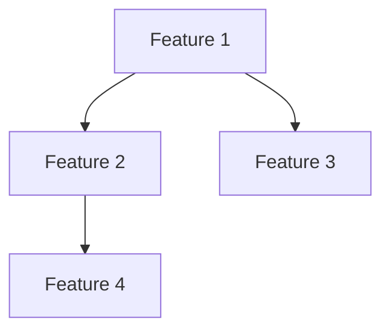

# EPIC-{번호}: {제목}

## 목표
{PO가 제시한 목표를 명확히 재진술}

## 배경
{왜 이 기능이 필요한가}

## 성공 기준
- [ ] 기준 1
- [ ] 기준 2
- [ ] 기준 3

---

## Feature 분해

### Feature 1: {이름}
- **설명**: {무엇을 하는가}
- **책임자**: {Designer/Client/Server AI}
- **의존성**: None / Feature X 완료 후
- **예상 리스크**: {있다면}

### Feature 2: {이름}
- **설명**: {...}
- **책임자**: {...}
- **의존성**: {...}
- **예상 리스크**: {...}

---

## 의존성 맵

**Critical Path**: {가장 긴 경로}

---

## 릴리즈 전략

### Phase 1: {이름}
- **포함 Feature**: F1, F2
- **릴리즈 기준**: {...}
- **Rollback 조건**: {...}

### Phase 2: {이름}
- **포함 Feature**: F3, F4
- **릴리즈 기준**: {...}
- **Rollback 조건**: {...}

---

## 리스크 관리

| 리스크 | 영향도 | 확률 | 대응 방안 | 우회 방안 |
|--------|--------|------|-----------|-----------|
| {...}  | High   | Low  | {...}     | {...}     |

---

## 조율 포인트

### Designer AI
- [ ] {...}

### Server AI
- [ ] {...}

### Client AI
- [ ] {...}

### QA AI
- [ ] {...}

---

**작성자**: Producer AI
**작성일**: {날짜}
**검토자**: {PO/PM 이름}
**상태**: Draft / Review / Approved
