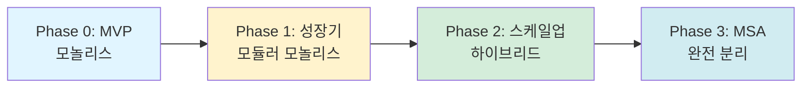
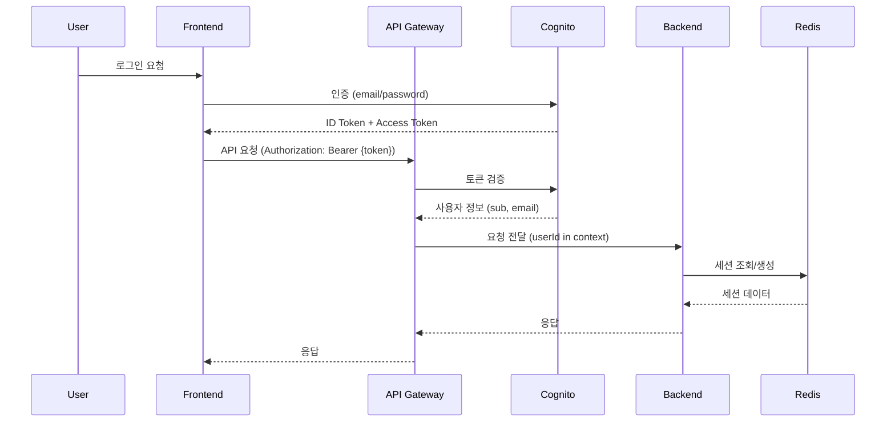
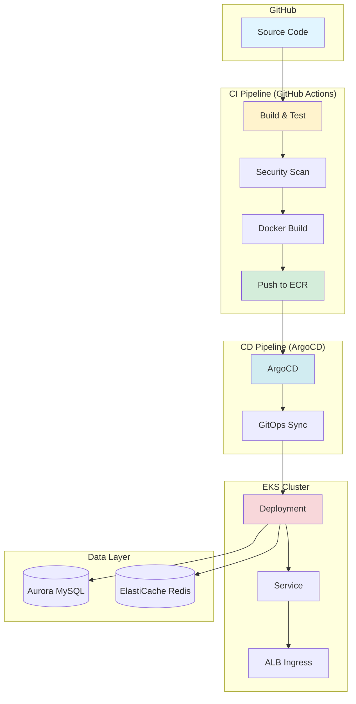

# AWS 스타트업 타이쿤 백엔드 아키텍처 설계서

## 문서 개요

- **목적**: 턴 기반 경영 시뮬레이션 게임의 백엔드 시스템 설계 및 구현 가이드
- **대상 독자**: 백엔드 개발자, DevOps 엔지니어
- **게임 특성**: 3700+ 라인 게임 데이터 (25턴, 300+ 선택지), 비즈니스 + AWS 인프라 의사결정
- **확장 목표**: MVP(~5천 유저) → 성장기(5만) → 스케일업(15만+)

---

## 1. 기술 스택 선택

### 1.1 백엔드 프레임워크 최종 결정: **NestJS (TypeScript)**

#### 선택 근거

| 항목 | NestJS (선택) | FastAPI | 비고 |
|------|--------------|---------|------|
| **타입 안정성** | TypeScript 네이티브 | Python + Pydantic | TS로 프론트와 타입 공유 가능 |
| **생태계** | 성숙한 모듈 시스템 | 빠르게 성장 중 | NestJS의 DI/모듈 구조가 MSA 진화에 유리 |
| **성능** | 충분 (비동기 I/O) | 약간 빠름 | 게임 로직은 CPU보다 I/O 집약적 |
| **팀 역량** | React + TS 개발자 전환 용이 | Python 신규 학습 필요 | 프론트엔드 팀과 기술 스택 공유 |
| **AWS 통합** | AWS SDK v3 성숙 | boto3 성숙 | 동등 |
| **ORM** | TypeORM, Prisma | SQLAlchemy, Tortoise | TypeORM으로 마이그레이션 관리 편의성 |

**결론**: TypeScript 기반 풀스택 개발 효율성 + NestJS의 엔터프라이즈급 구조화 장점 선택

### 1.2 아키텍처 패턴: 모놀리스 우선 → 점진적 MSA 진화



**Phase 0 (MVP)**: 단일 NestJS 앱 → Aurora MySQL + Redis
**Phase 1**: 모듈 분리 (game, auth, analytics) → 동일 프로세스
**Phase 2**: 무거운 기능 분리 (analytics-worker, notification-service) → 별도 프로세스
**Phase 3**: 완전 MSA (API Gateway + gRPC)

---

## 2. 핵심 API 설계

### 2.1 REST API 엔드포인트

#### 인증 (Auth Module)

```typescript
POST   /api/v1/auth/register          # 회원가입
POST   /api/v1/auth/login             # 로그인 (JWT 발급)
POST   /api/v1/auth/refresh           # 토큰 갱신
POST   /api/v1/auth/logout            # 로그아웃 (세션 무효화)
GET    /api/v1/auth/me                # 현재 사용자 정보
```

#### 게임 (Game Module)

```typescript
POST   /api/v1/games                  # 새 게임 시작
GET    /api/v1/games                  # 내 게임 목록 조회
GET    /api/v1/games/:gameId          # 특정 게임 상태 조회
POST   /api/v1/games/:gameId/choices  # 선택 실행 (게임 진행)
DELETE /api/v1/games/:gameId          # 게임 삭제
GET    /api/v1/games/:gameId/history  # 선택 히스토리 조회
```

#### 턴/선택지 (Turn Module)

```typescript
GET    /api/v1/turns/:turnId          # 턴 정보 조회 (이벤트 설명)
GET    /api/v1/turns/:turnId/choices  # 해당 턴의 선택지 목록
GET    /api/v1/choices/:choiceId      # 특정 선택지 상세 정보
```

#### 리더보드 (Leaderboard Module)

```typescript
GET    /api/v1/leaderboard            # 전체 랭킹 (페이지네이션)
GET    /api/v1/leaderboard/top/:n     # 상위 N명
GET    /api/v1/leaderboard/me         # 내 순위
```

### 2.2 WebSocket Events

```typescript
// 클라이언트 → 서버
ws.send({ type: 'subscribe', gameId: 'xxx' })

// 서버 → 클라이언트
{
  type: 'game.state.updated',
  payload: {
    gameId: 'xxx',
    currentTurn: 5,
    metrics: { users: 50000, cash: 5000000, trust: 75 }
  }
}

{
  type: 'infrastructure.changed',
  payload: {
    gameId: 'xxx',
    added: ['Aurora', 'EKS'],
    removed: ['EC2']
  }
}

{
  type: 'game.ended',
  payload: {
    gameId: 'xxx',
    result: 'won', // 'won' | 'lost'
    finalScore: 1250000000 // 기업가치
  }
}
```

### 2.3 API 응답 표준 포맷

```typescript
// 성공 응답
{
  "success": true,
  "data": { ... },
  "metadata": {
    "timestamp": "2025-10-01T12:34:56Z",
    "requestId": "req_xxx"
  }
}

// 에러 응답
{
  "success": false,
  "error": {
    "code": "INSUFFICIENT_CASH",
    "message": "자금이 부족하여 선택을 실행할 수 없습니다.",
    "details": {
      "required": 5000000,
      "current": 3000000
    }
  },
  "metadata": {
    "timestamp": "2025-10-01T12:34:56Z",
    "requestId": "req_xxx"
  }
}
```

---

## 3. 데이터 모델 (TypeScript + TypeORM)

### 3.1 엔티티 정의

#### Game Entity

```typescript
@Entity('games')
export class Game {
  @PrimaryGeneratedColumn('uuid')
  gameId: string;

  @Column({ type: 'varchar', length: 36 })
  userId: string;

  @Column({ type: 'int', default: 1 })
  currentTurn: number;

  @Column({ type: 'int', default: 0 })
  users: number;

  @Column({ type: 'bigint', default: 0 })
  cash: number;

  @Column({ type: 'int', default: 0 })
  revenue: number;

  @Column({ type: 'int', default: 50 })
  trust: number;

  @Column({ type: 'json' })
  infrastructure: string[]; // ['Aurora', 'EKS', 'S3']

  @Column({
    type: 'enum',
    enum: GameStatus,
    default: GameStatus.ACTIVE
  })
  status: GameStatus; // 'active' | 'won' | 'lost'

  @CreateDateColumn()
  createdAt: Date;

  @UpdateDateColumn()
  updatedAt: Date;

  @OneToMany(() => ChoiceHistory, history => history.game)
  history: ChoiceHistory[];
}

enum GameStatus {
  ACTIVE = 'active',
  WON = 'won',
  LOST = 'lost'
}
```

#### ChoiceHistory Entity

```typescript
@Entity('choice_history')
export class ChoiceHistory {
  @PrimaryGeneratedColumn('increment')
  id: number;

  @Column({ type: 'varchar', length: 36 })
  gameId: string;

  @Column({ type: 'int' })
  turn: number;

  @Column({ type: 'int' })
  choiceId: number;

  @Column({ type: 'json' })
  effects: ChoiceEffect; // 선택의 효과 기록

  @CreateDateColumn()
  createdAt: Date;

  @ManyToOne(() => Game, game => game.history)
  @JoinColumn({ name: 'gameId' })
  game: Game;
}

interface ChoiceEffect {
  users: number;      // 변화량 (delta)
  cash: number;
  trust: number;
  infrastructure: string[]; // 추가된 인프라
  nextTurn: number;
}
```

#### Turn Entity (읽기 전용)

```typescript
@Entity('turns')
export class Turn {
  @PrimaryColumn()
  turn: number;

  @Column({ type: 'text' })
  event: string; // 턴 이벤트 설명

  @OneToMany(() => Choice, choice => choice.turn)
  choices: Choice[];
}
```

#### Choice Entity (읽기 전용)

```typescript
@Entity('choices')
export class Choice {
  @PrimaryColumn()
  id: number;

  @Column({ type: 'int' })
  turn: number;

  @Column({ type: 'text' })
  text: string; // 선택지 텍스트

  @Column({ type: 'int' })
  users: number; // 효과: 유저 증가량

  @Column({ type: 'bigint' })
  cash: number; // 효과: 자금 증가량

  @Column({ type: 'int' })
  trust: number; // 효과: 신뢰도 변화

  @Column({ type: 'json' })
  infraJson: string[]; // 추가되는 인프라

  @Column({ type: 'int' })
  nextTurn: number; // 다음 턴 번호

  @ManyToOne(() => Turn, turn => turn.choices)
  @JoinColumn({ name: 'turn' })
  turnEntity: Turn;
}
```

#### User Entity (확장용)

```typescript
@Entity('users')
export class User {
  @PrimaryGeneratedColumn('uuid')
  userId: string;

  @Column({ type: 'varchar', length: 255, unique: true })
  email: string;

  @Column({ type: 'varchar', length: 100 })
  username: string;

  @Column({ type: 'varchar', length: 255, nullable: true })
  cognitoSub: string; // Cognito 사용자 ID

  @CreateDateColumn()
  createdAt: Date;

  @UpdateDateColumn()
  updatedAt: Date;
}
```

### 3.2 인덱스 전략

```sql
-- games 테이블
CREATE INDEX idx_games_user_id ON games(user_id);
CREATE INDEX idx_games_status ON games(status);
CREATE INDEX idx_games_created_at ON games(created_at);

-- choice_history 테이블
CREATE INDEX idx_choice_history_game_id ON choice_history(game_id);
CREATE INDEX idx_choice_history_turn ON choice_history(turn);

-- choices 테이블 (읽기 전용)
CREATE INDEX idx_choices_turn ON choices(turn);
CREATE INDEX idx_choices_next_turn ON choices(next_turn);
```

---

## 4. 게임 로직 엔진

### 4.1 핵심 서비스 구조

```typescript
@Injectable()
export class GameService {
  constructor(
    @InjectRepository(Game)
    private gameRepo: Repository<Game>,
    @InjectRepository(Choice)
    private choiceRepo: Repository<Choice>,
    @InjectRepository(ChoiceHistory)
    private historyRepo: Repository<ChoiceHistory>,
    private cacheService: CacheService,
    private wsGateway: GameGateway
  ) {}

  async startGame(userId: string): Promise<Game> {
    const game = this.gameRepo.create({
      userId,
      currentTurn: 1,
      users: 0,
      cash: 0,
      revenue: 0,
      trust: 50,
      infrastructure: [],
      status: GameStatus.ACTIVE
    });

    return await this.gameRepo.save(game);
  }

  async executeChoice(
    gameId: string,
    choiceId: number
  ): Promise<GameStateDto> {
    // 1. 게임 상태 조회
    const game = await this.gameRepo.findOne({
      where: { gameId, status: GameStatus.ACTIVE }
    });

    if (!game) {
      throw new NotFoundException('활성화된 게임을 찾을 수 없습니다');
    }

    // 2. 선택지 조회
    const choice = await this.choiceRepo.findOne({
      where: { id: choiceId, turn: game.currentTurn }
    });

    if (!choice) {
      throw new BadRequestException('유효하지 않은 선택입니다');
    }

    // 3. 효과 적용
    const updatedGame = await this.applyChoiceEffects(game, choice);

    // 4. 승패 조건 체크
    const gameResult = this.checkGameEnd(updatedGame);

    // 5. 히스토리 저장
    await this.historyRepo.save({
      gameId: game.gameId,
      turn: game.currentTurn,
      choiceId: choice.id,
      effects: {
        users: choice.users,
        cash: choice.cash,
        trust: choice.trust,
        infrastructure: choice.infraJson,
        nextTurn: choice.nextTurn
      }
    });

    // 6. 게임 상태 업데이트 저장
    await this.gameRepo.save(updatedGame);

    // 7. WebSocket 실시간 업데이트
    this.wsGateway.emitGameStateUpdate(gameId, updatedGame);

    // 8. 캐시 무효화
    await this.cacheService.del(`game:${gameId}`);

    return this.toGameStateDto(updatedGame, gameResult);
  }

  private async applyChoiceEffects(
    game: Game,
    choice: Choice
  ): Promise<Game> {
    game.users += choice.users;
    game.cash += choice.cash;
    game.trust += choice.trust;

    // 인프라 중복 제거하여 병합
    const newInfra = new Set([
      ...game.infrastructure,
      ...choice.infraJson
    ]);
    game.infrastructure = Array.from(newInfra);

    game.currentTurn = choice.nextTurn;
    game.updatedAt = new Date();

    return game;
  }

  private checkGameEnd(game: Game): GameResult {
    // 패배 조건
    if (game.cash < -10000000) {
      game.status = GameStatus.LOST;
      return { ended: true, result: 'lost', reason: '자금 고갈로 파산' };
    }

    if (game.trust < 0) {
      game.status = GameStatus.LOST;
      return { ended: true, result: 'lost', reason: '신뢰도 하락으로 서비스 중단' };
    }

    // 승리 조건 (턴 25 도달 + 기준 충족)
    if (game.currentTurn > 25) {
      if (game.users >= 100000 && game.cash >= 1000000000 && game.trust >= 70) {
        game.status = GameStatus.WON;
        return { ended: true, result: 'won', reason: 'IPO 성공!' };
      } else {
        game.status = GameStatus.LOST;
        return { ended: true, result: 'lost', reason: 'IPO 조건 미달' };
      }
    }

    return { ended: false };
  }
}

interface GameResult {
  ended: boolean;
  result?: 'won' | 'lost';
  reason?: string;
}
```

### 4.2 Turn Processor

```typescript
@Injectable()
export class TurnService {
  constructor(
    @InjectRepository(Turn)
    private turnRepo: Repository<Turn>,
    @InjectRepository(Choice)
    private choiceRepo: Repository<Choice>,
    private cacheService: CacheService
  ) {}

  async getTurnInfo(turnId: number): Promise<TurnDto> {
    // 캐시 확인 (정적 데이터이므로 24시간 TTL)
    const cacheKey = `turn:${turnId}`;
    const cached = await this.cacheService.get(cacheKey);

    if (cached) {
      return JSON.parse(cached);
    }

    const turn = await this.turnRepo.findOne({
      where: { turn: turnId },
      relations: ['choices']
    });

    if (!turn) {
      throw new NotFoundException(`턴 ${turnId}를 찾을 수 없습니다`);
    }

    const dto = {
      turn: turn.turn,
      event: turn.event,
      choices: turn.choices.map(c => ({
        id: c.id,
        text: c.text,
        preview: {
          users: c.users,
          cash: c.cash,
          trust: c.trust,
          infrastructure: c.infraJson
        }
      }))
    };

    // 캐시 저장 (24시간)
    await this.cacheService.set(cacheKey, JSON.stringify(dto), 86400);

    return dto;
  }

  async getChoicesForTurn(turnId: number): Promise<Choice[]> {
    const cacheKey = `turn:${turnId}:choices`;
    const cached = await this.cacheService.get(cacheKey);

    if (cached) {
      return JSON.parse(cached);
    }

    const choices = await this.choiceRepo.find({
      where: { turn: turnId }
    });

    await this.cacheService.set(cacheKey, JSON.stringify(choices), 86400);

    return choices;
  }
}
```

### 4.3 Infrastructure Tracker

```typescript
@Injectable()
export class InfrastructureService {
  // 인프라별 유지 비용 (턴당)
  private readonly INFRA_COSTS: Record<string, number> = {
    'EC2': 50000,
    'RDS': 100000,
    'Aurora': 150000,
    'EKS': 200000,
    'Redis': 80000,
    'S3': 20000,
    'CloudFront': 30000,
    'Lambda': 10000,
    'SageMaker': 500000,
    'Bedrock': 300000
  };

  calculateInfraCost(infrastructure: string[]): number {
    return infrastructure.reduce((total, infra) => {
      return total + (this.INFRA_COSTS[infra] || 0);
    }, 0);
  }

  // 인프라 과부하 체크
  checkInfraCapacity(users: number, infrastructure: string[]): {
    adequate: boolean;
    warnings: string[];
  } {
    const warnings: string[] = [];

    // EC2만 있는 경우 5천 유저 초과 시 경고
    if (users > 5000 && infrastructure.includes('EC2') && !infrastructure.includes('Aurora')) {
      warnings.push('Aurora 도입을 권장합니다 (DB 병목 위험)');
    }

    // 5만 유저 초과인데 EKS 없으면 경고
    if (users > 50000 && !infrastructure.includes('EKS')) {
      warnings.push('EKS 도입을 권장합니다 (트래픽 처리 한계)');
    }

    // Redis 없이 3만 유저 초과 시 경고
    if (users > 30000 && !infrastructure.includes('Redis')) {
      warnings.push('Redis 캐시 도입을 권장합니다 (성능 저하 위험)');
    }

    return {
      adequate: warnings.length === 0,
      warnings
    };
  }
}
```

---

## 5. 캐싱 전략 (Redis)

### 5.1 캐시 키 설계

```typescript
// 게임 상태 (동적 데이터)
game:{gameId}                    // TTL: 1시간

// 턴 정보 (정적 데이터)
turn:{turnId}                    // TTL: 24시간
turn:{turnId}:choices            // TTL: 24시간

// 리더보드 (집계 데이터)
leaderboard:global               // TTL: 5분 (자주 갱신)
leaderboard:user:{userId}        // TTL: 10분

// 세션
session:{sessionId}              // TTL: 7일
```

### 5.2 Cache Service 구현

```typescript
@Injectable()
export class CacheService {
  constructor(
    @InjectRedis() private readonly redis: Redis
  ) {}

  async get(key: string): Promise<string | null> {
    return await this.redis.get(key);
  }

  async set(key: string, value: string, ttl?: number): Promise<void> {
    if (ttl) {
      await this.redis.setex(key, ttl, value);
    } else {
      await this.redis.set(key, value);
    }
  }

  async del(key: string): Promise<void> {
    await this.redis.del(key);
  }

  async getOrSet<T>(
    key: string,
    fetchFn: () => Promise<T>,
    ttl: number
  ): Promise<T> {
    const cached = await this.get(key);

    if (cached) {
      return JSON.parse(cached);
    }

    const data = await fetchFn();
    await this.set(key, JSON.stringify(data), ttl);

    return data;
  }

  // 리더보드용 Sorted Set
  async addToLeaderboard(userId: string, score: number): Promise<void> {
    await this.redis.zadd('leaderboard:global', score, userId);
  }

  async getTopN(n: number): Promise<Array<{userId: string, score: number}>> {
    const results = await this.redis.zrevrange(
      'leaderboard:global',
      0,
      n - 1,
      'WITHSCORES'
    );

    const leaderboard = [];
    for (let i = 0; i < results.length; i += 2) {
      leaderboard.push({
        userId: results[i],
        score: parseInt(results[i + 1])
      });
    }

    return leaderboard;
  }

  async getUserRank(userId: string): Promise<number | null> {
    const rank = await this.redis.zrevrank('leaderboard:global', userId);
    return rank !== null ? rank + 1 : null; // 1-based index
  }
}
```

### 5.3 캐시 무효화 전략

```typescript
@Injectable()
export class CacheInvalidationService {
  constructor(private cacheService: CacheService) {}

  async invalidateGameCache(gameId: string): Promise<void> {
    await this.cacheService.del(`game:${gameId}`);
  }

  async invalidateLeaderboard(): Promise<void> {
    // 리더보드는 TTL로 자동 갱신되므로 강제 무효화는 특수 상황에만
    await this.cacheService.del('leaderboard:global');
  }

  // 게임 종료 시 리더보드 갱신
  async onGameEnd(game: Game): Promise<void> {
    if (game.status === GameStatus.WON) {
      const score = this.calculateFinalScore(game);
      await this.cacheService.addToLeaderboard(game.userId, score);
    }
  }

  private calculateFinalScore(game: Game): number {
    // 기업가치 = cash + (users * 1000) + (trust * 10000)
    return game.cash + (game.users * 1000) + (game.trust * 10000);
  }
}
```

---

## 6. 데이터베이스 스키마 설계

### 6.1 Aurora MySQL 스키마

```sql
-- 사용자 테이블
CREATE TABLE users (
  user_id VARCHAR(36) PRIMARY KEY,
  email VARCHAR(255) NOT NULL UNIQUE,
  username VARCHAR(100) NOT NULL,
  cognito_sub VARCHAR(255),
  created_at TIMESTAMP DEFAULT CURRENT_TIMESTAMP,
  updated_at TIMESTAMP DEFAULT CURRENT_TIMESTAMP ON UPDATE CURRENT_TIMESTAMP,
  INDEX idx_users_email (email),
  INDEX idx_users_cognito_sub (cognito_sub)
) ENGINE=InnoDB DEFAULT CHARSET=utf8mb4 COLLATE=utf8mb4_unicode_ci;

-- 게임 테이블
CREATE TABLE games (
  game_id VARCHAR(36) PRIMARY KEY,
  user_id VARCHAR(36) NOT NULL,
  current_turn INT NOT NULL DEFAULT 1,
  users INT NOT NULL DEFAULT 0,
  cash BIGINT NOT NULL DEFAULT 0,
  revenue INT NOT NULL DEFAULT 0,
  trust INT NOT NULL DEFAULT 50,
  infrastructure JSON NOT NULL,
  status ENUM('active', 'won', 'lost') NOT NULL DEFAULT 'active',
  created_at TIMESTAMP DEFAULT CURRENT_TIMESTAMP,
  updated_at TIMESTAMP DEFAULT CURRENT_TIMESTAMP ON UPDATE CURRENT_TIMESTAMP,
  INDEX idx_games_user_id (user_id),
  INDEX idx_games_status (status),
  INDEX idx_games_created_at (created_at),
  CONSTRAINT fk_games_user_id FOREIGN KEY (user_id) REFERENCES users(user_id) ON DELETE CASCADE
) ENGINE=InnoDB DEFAULT CHARSET=utf8mb4 COLLATE=utf8mb4_unicode_ci;

-- 선택 히스토리 테이블
CREATE TABLE choice_history (
  id BIGINT AUTO_INCREMENT PRIMARY KEY,
  game_id VARCHAR(36) NOT NULL,
  turn INT NOT NULL,
  choice_id INT NOT NULL,
  effects JSON NOT NULL,
  created_at TIMESTAMP DEFAULT CURRENT_TIMESTAMP,
  INDEX idx_choice_history_game_id (game_id),
  INDEX idx_choice_history_turn (turn),
  INDEX idx_choice_history_created_at (created_at),
  CONSTRAINT fk_choice_history_game_id FOREIGN KEY (game_id) REFERENCES games(game_id) ON DELETE CASCADE
) ENGINE=InnoDB DEFAULT CHARSET=utf8mb4 COLLATE=utf8mb4_unicode_ci;

-- 턴 테이블 (읽기 전용, game_choices_db.sql에서 임포트)
CREATE TABLE turns (
  turn INT PRIMARY KEY,
  event TEXT NOT NULL
) ENGINE=InnoDB DEFAULT CHARSET=utf8mb4 COLLATE=utf8mb4_unicode_ci;

-- 선택지 테이블 (읽기 전용, game_choices_db.sql에서 임포트)
CREATE TABLE choices (
  id INT PRIMARY KEY,
  turn INT NOT NULL,
  text TEXT NOT NULL,
  users INT NOT NULL,
  cash BIGINT NOT NULL,
  trust INT NOT NULL,
  infra_json JSON NOT NULL,
  next_turn INT NOT NULL,
  INDEX idx_choices_turn (turn),
  INDEX idx_choices_next_turn (next_turn),
  CONSTRAINT fk_choices_turn FOREIGN KEY (turn) REFERENCES turns(turn)
) ENGINE=InnoDB DEFAULT CHARSET=utf8mb4 COLLATE=utf8mb4_unicode_ci;
```

### 6.2 데이터 임포트 스크립트

```bash
#!/bin/bash
# import_game_data.sh

DB_HOST="your-aurora-endpoint.rds.amazonaws.com"
DB_USER="admin"
DB_NAME="startup_tycoon"

# 1. 기본 스키마 생성
mysql -h $DB_HOST -u $DB_USER -p $DB_NAME < schema.sql

# 2. 게임 데이터 임포트 (turns, choices)
mysql -h $DB_HOST -u $DB_USER -p $DB_NAME < game_choices_db.sql

# 3. 데이터 검증
mysql -h $DB_HOST -u $DB_USER -p $DB_NAME -e "
  SELECT
    (SELECT COUNT(*) FROM turns) as turn_count,
    (SELECT COUNT(*) FROM choices) as choice_count;
"
```

### 6.3 파티셔닝 전략 (확장 대비)

```sql
-- choice_history 테이블 파티셔닝 (월별)
ALTER TABLE choice_history
PARTITION BY RANGE (YEAR(created_at) * 100 + MONTH(created_at)) (
  PARTITION p202510 VALUES LESS THAN (202511),
  PARTITION p202511 VALUES LESS THAN (202512),
  PARTITION p202512 VALUES LESS THAN (202601),
  PARTITION p_future VALUES LESS THAN MAXVALUE
);

-- 오래된 파티션 자동 삭제 (3개월 이상)
-- 별도 Lambda 함수로 주기 실행
DROP PARTITION p202507;
```

---

## 7. 인증 및 세션 관리

### 7.1 AWS Cognito 통합



### 7.2 JWT Guard 구현

```typescript
@Injectable()
export class JwtAuthGuard implements CanActivate {
  constructor(
    private configService: ConfigService,
    private cacheService: CacheService
  ) {}

  async canActivate(context: ExecutionContext): Promise<boolean> {
    const request = context.switchToHttp().getRequest();
    const token = this.extractToken(request);

    if (!token) {
      throw new UnauthorizedException('토큰이 없습니다');
    }

    try {
      // Cognito JWT 검증
      const decoded = await this.verifyCognitoToken(token);

      // 사용자 정보를 request에 추가
      request.user = {
        userId: decoded.sub,
        email: decoded.email,
        username: decoded['cognito:username']
      };

      // 세션 체크 (옵션)
      const sessionKey = `session:${decoded.sub}`;
      const sessionExists = await this.cacheService.get(sessionKey);

      if (!sessionExists) {
        // 세션 생성 (7일 TTL)
        await this.cacheService.set(
          sessionKey,
          JSON.stringify({ lastAccess: new Date() }),
          604800
        );
      }

      return true;
    } catch (error) {
      throw new UnauthorizedException('유효하지 않은 토큰입니다');
    }
  }

  private extractToken(request: any): string | null {
    const authHeader = request.headers.authorization;
    if (!authHeader || !authHeader.startsWith('Bearer ')) {
      return null;
    }
    return authHeader.substring(7);
  }

  private async verifyCognitoToken(token: string): Promise<any> {
    const userPoolId = this.configService.get('COGNITO_USER_POOL_ID');
    const region = this.configService.get('AWS_REGION');

    const verifier = CognitoJwtVerifier.create({
      userPoolId,
      tokenUse: 'access',
      clientId: this.configService.get('COGNITO_CLIENT_ID'),
    });

    return await verifier.verify(token);
  }
}
```

### 7.3 세션 관리

```typescript
@Injectable()
export class SessionService {
  constructor(private cacheService: CacheService) {}

  async createSession(userId: string, metadata: any): Promise<string> {
    const sessionId = uuidv4();
    const sessionKey = `session:${sessionId}`;

    const sessionData = {
      userId,
      metadata,
      createdAt: new Date(),
      lastAccess: new Date()
    };

    // 7일 TTL
    await this.cacheService.set(
      sessionKey,
      JSON.stringify(sessionData),
      604800
    );

    return sessionId;
  }

  async getSession(sessionId: string): Promise<any> {
    const sessionKey = `session:${sessionId}`;
    const data = await this.cacheService.get(sessionKey);

    if (!data) {
      return null;
    }

    return JSON.parse(data);
  }

  async invalidateSession(sessionId: string): Promise<void> {
    await this.cacheService.del(`session:${sessionId}`);
  }

  async refreshSession(sessionId: string): Promise<void> {
    const session = await this.getSession(sessionId);

    if (session) {
      session.lastAccess = new Date();
      await this.cacheService.set(
        `session:${sessionId}`,
        JSON.stringify(session),
        604800
      );
    }
  }
}
```

---

## 8. 배포 구조 및 CI/CD

### 8.1 전체 배포 아키텍처



### 8.2 GitHub Actions CI 파이프라인

```yaml
# .github/workflows/ci.yml
name: CI Pipeline

on:
  push:
    branches: [main, develop]
  pull_request:
    branches: [main]

env:
  AWS_REGION: ap-northeast-2
  ECR_REPOSITORY: startup-tycoon-api

jobs:
  test:
    runs-on: ubuntu-latest
    steps:
      - uses: actions/checkout@v4

      - name: Setup Node.js
        uses: actions/setup-node@v4
        with:
          node-version: '20'
          cache: 'npm'

      - name: Install dependencies
        run: npm ci

      - name: Lint
        run: npm run lint

      - name: Unit tests
        run: npm run test:cov

      - name: Upload coverage
        uses: codecov/codecov-action@v3

  security-scan:
    runs-on: ubuntu-latest
    steps:
      - uses: actions/checkout@v4

      - name: Run Trivy vulnerability scanner
        uses: aquasecurity/trivy-action@master
        with:
          scan-type: 'fs'
          severity: 'CRITICAL,HIGH'

  build-and-push:
    needs: [test, security-scan]
    runs-on: ubuntu-latest
    if: github.ref == 'refs/heads/main'
    steps:
      - uses: actions/checkout@v4

      - name: Configure AWS credentials
        uses: aws-actions/configure-aws-credentials@v4
        with:
          aws-access-key-id: ${{ secrets.AWS_ACCESS_KEY_ID }}
          aws-secret-access-key: ${{ secrets.AWS_SECRET_ACCESS_KEY }}
          aws-region: ${{ env.AWS_REGION }}

      - name: Login to ECR
        id: login-ecr
        uses: aws-actions/amazon-ecr-login@v2

      - name: Build, tag, and push image
        env:
          ECR_REGISTRY: ${{ steps.login-ecr.outputs.registry }}
          IMAGE_TAG: ${{ github.sha }}
        run: |
          docker build -t $ECR_REGISTRY/$ECR_REPOSITORY:$IMAGE_TAG .
          docker tag $ECR_REGISTRY/$ECR_REPOSITORY:$IMAGE_TAG $ECR_REGISTRY/$ECR_REPOSITORY:latest
          docker push $ECR_REGISTRY/$ECR_REPOSITORY:$IMAGE_TAG
          docker push $ECR_REGISTRY/$ECR_REPOSITORY:latest

      - name: Update K8s manifests
        run: |
          sed -i "s|IMAGE_TAG|${{ github.sha }}|g" k8s/deployment.yaml
          git config user.name github-actions
          git config user.email github-actions@github.com
          git add k8s/deployment.yaml
          git commit -m "Update image to ${{ github.sha }}"
          git push
```

### 8.3 Kubernetes 매니페스트

#### Deployment

```yaml
# k8s/deployment.yaml
apiVersion: apps/v1
kind: Deployment
metadata:
  name: api-service
  namespace: startup-tycoon
spec:
  replicas: 3
  selector:
    matchLabels:
      app: api-service
  template:
    metadata:
      labels:
        app: api-service
    spec:
      containers:
      - name: api
        image: <ECR_REGISTRY>/startup-tycoon-api:IMAGE_TAG
        ports:
        - containerPort: 3000
        env:
        - name: NODE_ENV
          value: "production"
        - name: DB_HOST
          valueFrom:
            secretKeyRef:
              name: db-secret
              key: host
        - name: DB_USER
          valueFrom:
            secretKeyRef:
              name: db-secret
              key: username
        - name: DB_PASSWORD
          valueFrom:
            secretKeyRef:
              name: db-secret
              key: password
        - name: REDIS_HOST
          valueFrom:
            configMapKeyRef:
              name: app-config
              key: redis-host
        resources:
          requests:
            cpu: 200m
            memory: 256Mi
          limits:
            cpu: 500m
            memory: 512Mi
        livenessProbe:
          httpGet:
            path: /health
            port: 3000
          initialDelaySeconds: 30
          periodSeconds: 10
        readinessProbe:
          httpGet:
            path: /health/ready
            port: 3000
          initialDelaySeconds: 10
          periodSeconds: 5
```

#### Service

```yaml
# k8s/service.yaml
apiVersion: v1
kind: Service
metadata:
  name: api-service
  namespace: startup-tycoon
spec:
  type: ClusterIP
  selector:
    app: api-service
  ports:
  - protocol: TCP
    port: 80
    targetPort: 3000
```

#### Ingress (ALB)

```yaml
# k8s/ingress.yaml
apiVersion: networking.k8s.io/v1
kind: Ingress
metadata:
  name: api-ingress
  namespace: startup-tycoon
  annotations:
    kubernetes.io/ingress.class: alb
    alb.ingress.kubernetes.io/scheme: internet-facing
    alb.ingress.kubernetes.io/target-type: ip
    alb.ingress.kubernetes.io/healthcheck-path: /health
    alb.ingress.kubernetes.io/ssl-policy: ELBSecurityPolicy-TLS-1-2-2017-01
    alb.ingress.kubernetes.io/certificate-arn: arn:aws:acm:ap-northeast-2:xxx:certificate/xxx
spec:
  rules:
  - host: api.startup-tycoon.com
    http:
      paths:
      - path: /
        pathType: Prefix
        backend:
          service:
            name: api-service
            port:
              number: 80
```

#### HorizontalPodAutoscaler

```yaml
# k8s/hpa.yaml
apiVersion: autoscaling/v2
kind: HorizontalPodAutoscaler
metadata:
  name: api-service-hpa
  namespace: startup-tycoon
spec:
  scaleTargetRef:
    apiVersion: apps/v1
    kind: Deployment
    name: api-service
  minReplicas: 3
  maxReplicas: 20
  metrics:
  - type: Resource
    resource:
      name: cpu
      target:
        type: Utilization
        averageUtilization: 70
  - type: Resource
    resource:
      name: memory
      target:
        type: Utilization
        averageUtilization: 80
```

### 8.4 ArgoCD Application

```yaml
# argocd/application.yaml
apiVersion: argoproj.io/v1alpha1
kind: Application
metadata:
  name: startup-tycoon-api
  namespace: argocd
spec:
  project: default
  source:
    repoURL: https://github.com/your-org/startup-tycoon-backend
    targetRevision: main
    path: k8s
  destination:
    server: https://kubernetes.default.svc
    namespace: startup-tycoon
  syncPolicy:
    automated:
      prune: true
      selfHeal: true
    syncOptions:
    - CreateNamespace=true
```

---

## 9. 구현 우선순위 및 로드맵

### Phase 0: MVP (✅ **구현 완료** - 2025년 10월 1일)

**목표**: 로컬 개발 환경에서 기본 게임 플레이 가능

```
[완료 조건] ✅ 모두 완료
✅ NestJS 프로젝트 초기 설정
✅ SQLite 로컬 DB 구성
✅ game_choices_db.json 데이터 임포트 (25턴, 253선택지)
✅ 게임 CRUD API (시작, 조회, 선택 실행)
✅ 승패 조건 로직 구현
⚠️ 기본 단위 테스트 (목표 80%, 실제 44.79% - 핵심 서비스는 87.87%/100%)
```

**구현 체크리스트**:

- [x] ✅ NestJS 프로젝트 생성 (`backend/` 디렉토리)
- [x] ✅ TypeORM 설정 (SQLite, `data/cto-game.db`)
- [x] ✅ Entity 정의 (Game, ChoiceHistory, Turn, Choice)
- [x] ✅ GameService, TurnService 구현
- [x] ✅ REST API Controller 구현 (GameController, TurnController)
- [x] ✅ Jest 단위 테스트 작성 (12 tests, all passing)
- [x] ✅ Swagger API 문서 자동 생성 (http://localhost:3000/api-docs)
- [x] ✅ 데이터 임포트 스크립트 (`npm run import-data`)
- [x] ✅ 에러 처리 (AllExceptionsFilter)
- [x] ✅ DTO 입력 검증 (class-validator)

**실제 구현 내용**:

**디렉토리 구조**:
```
backend/
├── src/
│   ├── main.ts                 # 애플리케이션 엔트리 포인트
│   ├── app.module.ts           # 루트 모듈
│   ├── database/               # DB 설정 + 엔티티
│   │   ├── entities/
│   │   │   ├── game.entity.ts
│   │   │   ├── turn.entity.ts
│   │   │   ├── choice.entity.ts
│   │   │   └── choice-history.entity.ts
│   │   └── database.config.ts
│   ├── game/                   # 게임 모듈
│   │   ├── game.controller.ts
│   │   ├── game.service.ts
│   │   └── game.service.spec.ts
│   ├── turn/                   # 턴 모듈
│   │   ├── turn.controller.ts
│   │   ├── turn.service.ts
│   │   └── turn.service.spec.ts
│   └── common/                 # 공통 DTO + 필터
│       ├── dto/
│       └── filters/
├── scripts/
│   └── import-game-data.ts     # 게임 데이터 임포트
├── test/
│   └── game.e2e-spec.ts        # E2E 테스트
└── README.md
```

**실제 API 엔드포인트** (버전 prefix 없음):
```
POST   /api/game/start              # 새 게임 시작
GET    /api/game/:gameId            # 게임 상태 조회
POST   /api/game/:gameId/choice     # 선택 실행 (body: {"choiceId": number})
DELETE /api/game/:gameId            # 게임 삭제
GET    /api/turn/:turnNumber        # 특정 턴 정보 조회
GET    /api/turn                    # 전체 턴 목록 조회
```

**Entity 구현 차이점** (설계 대비 단순화):
- ❌ `userId` 필드 제외 (Phase 0는 인증 없이 시작)
- ❌ `revenue` 필드 제외 (단순화된 경제 모델)
- ✅ `cash` 초기값 10,000,000원 설정
- ✅ `infrastructure` 기본값 `["EC2"]`
- ✅ `GameStatus` enum: `PLAYING | WON_IPO | LOST_BANKRUPT | LOST_OUTAGE | LOST_FAILED_IPO`

**테스트 결과**:
```bash
# 단위 테스트
Test Suites: 2 passed, 2 total
Tests:       12 passed, 12 total
Coverage:    44.79% (핵심 서비스: GameService 87.87%, TurnService 100%)

# 실제 API 검증
✅ POST /api/game/start → gameId 생성, 초기 상태 반환
✅ GET /api/turn/1 → 10개 선택지 반환
✅ POST /api/game/:id/choice (choiceId: 1) → 턴 2 진행, 효과 적용 확인
```

**실행 방법**:
```bash
cd backend
npm install
npm run import-data  # 게임 데이터 임포트 (25턴, 253선택지)
npm run start:dev    # http://localhost:3000
```

**Swagger 문서**: http://localhost:3000/api-docs

**기술 스택**:
- NestJS 10 + TypeScript 5
- SQLite (로컬 개발)
- TypeORM 0.3
- Jest (단위 테스트 + E2E)
- Swagger/OpenAPI

### Phase 1: 성장기 인프라 (~4주)

**목표**: AWS 환경 배포 및 인증 통합

```
[완료 조건]
✓ Aurora MySQL Serverless v2 마이그레이션
✓ Redis 캐싱 적용 (게임 상태, 턴 정보)
✓ Cognito 인증 통합
✓ EKS 클러스터 배포
✓ CI/CD 파이프라인 구축
✓ 기본 모니터링 (CloudWatch)
```

**구현 체크리스트**:

- [x] Aurora MySQL 클러스터 생성 (IaC)
- [x] ElastiCache Redis 클러스터 생성
- [x] TypeORM 마이그레이션 (SQLite → MySQL)
- [x] Redis 캐싱 레이어 구현
- [x] Cognito User Pool 생성
- [x] JWT Auth Guard 구현
- [x] EKS 클러스터 구성 (Terraform/eksctl)
- [x] GitHub Actions CI 파이프라인
- [x] ArgoCD 설치 및 GitOps 설정
- [x] ALB Ingress Controller 설정
- [x] CloudWatch 대시보드 구성

**기술 스택 추가**:
- Aurora MySQL Serverless v2
- ElastiCache Redis
- AWS Cognito
- EKS + Karpenter
- GitHub Actions + ArgoCD

### Phase 2: 실시간 기능 (~2주)

**목표**: WebSocket 실시간 업데이트 및 리더보드

```
[완료 조건]
✓ WebSocket Gateway 구현
✓ 게임 상태 실시간 업데이트
✓ 리더보드 시스템 (Redis Sorted Set)
✓ 부하 테스트 (K6, 1000 동시 유저)
```

**구현 체크리스트**:

- [x] @nestjs/websockets 통합
- [x] GameGateway 구현 (Socket.IO)
- [x] Redis Pub/Sub for 실시간 알림
- [x] LeaderboardService 구현
- [x] K6 부하 테스트 시나리오 작성
- [x] 성능 최적화 (인덱스, 캐싱)

### Phase 3: 분석 및 스케일링 (~3주)

**목표**: 게임플레이 분석 및 자동 스케일링

```
[완료 조건]
✓ 게임 이벤트 수집 (Kinesis Data Streams)
✓ S3 데이터 레이크 + Athena 쿼리
✓ QuickSight 대시보드
✓ HPA 자동 스케일링 검증
✓ Aurora 읽기 복제본 추가
```

**구현 체크리스트**:

- [x] EventEmitter for 게임 이벤트
- [x] Kinesis Producer 구현
- [x] Glue Crawler 설정
- [x] Athena 쿼리 템플릿
- [x] QuickSight 분석 대시보드
- [x] HPA 메트릭 튜닝
- [x] Aurora Read Replica 설정

### Phase 4: 고급 기능 (선택적, ~4주)

**목표**: AI 추천, 알림, 성과 분석

```
[완료 조건]
✓ SQS 비동기 작업 처리
✓ SNS 알림 (게임 종료, 랭킹 변동)
✓ Bedrock 통합 (게임 팁 생성)
✓ 보안 강화 (WAF, GuardDuty)
```

---

## 10. 성능 최적화 전략

### 10.1 데이터베이스 쿼리 최적화

```typescript
// ❌ N+1 문제 발생
async getGameWithHistory(gameId: string) {
  const game = await this.gameRepo.findOne({ where: { gameId } });
  const history = await this.historyRepo.find({ where: { gameId } });
  return { ...game, history };
}

// ✅ JOIN으로 한 번에 조회
async getGameWithHistory(gameId: string) {
  return await this.gameRepo.findOne({
    where: { gameId },
    relations: ['history'],
    order: {
      history: {
        turn: 'ASC'
      }
    }
  });
}

// ✅ 캐싱 적용
async getGameWithHistory(gameId: string) {
  return await this.cacheService.getOrSet(
    `game:${gameId}:with-history`,
    async () => {
      return await this.gameRepo.findOne({
        where: { gameId },
        relations: ['history']
      });
    },
    3600 // 1시간
  );
}
```

### 10.2 Redis 파이프라인 사용

```typescript
// ❌ 순차 실행 (느림)
async updateMultipleKeys(updates: Record<string, string>) {
  for (const [key, value] of Object.entries(updates)) {
    await this.redis.set(key, value);
  }
}

// ✅ 파이프라인 사용 (빠름)
async updateMultipleKeys(updates: Record<string, string>) {
  const pipeline = this.redis.pipeline();

  for (const [key, value] of Object.entries(updates)) {
    pipeline.set(key, value);
  }

  await pipeline.exec();
}
```

### 10.3 Connection Pool 설정

```typescript
// ormconfig.ts
export default {
  type: 'mysql',
  host: process.env.DB_HOST,
  port: 3306,
  username: process.env.DB_USER,
  password: process.env.DB_PASSWORD,
  database: process.env.DB_NAME,
  entities: ['dist/**/*.entity{.ts,.js}'],
  synchronize: false,
  logging: process.env.NODE_ENV === 'development',

  // Connection Pool 최적화
  extra: {
    connectionLimit: 20,           // 최대 연결 수
    connectTimeout: 10000,         // 연결 타임아웃 10초
    acquireTimeout: 10000,         // 연결 획득 타임아웃
    waitForConnections: true,
    queueLimit: 0,

    // Aurora MySQL 특화 설정
    ssl: {
      rejectUnauthorized: true
    }
  }
};
```

### 10.4 Rate Limiting

```typescript
@Injectable()
export class RateLimitGuard implements CanActivate {
  constructor(private cacheService: CacheService) {}

  async canActivate(context: ExecutionContext): Promise<boolean> {
    const request = context.switchToHttp().getRequest();
    const userId = request.user?.userId;

    if (!userId) {
      return true; // 인증되지 않은 요청은 다른 Guard에서 처리
    }

    const key = `rate-limit:${userId}`;
    const limit = 100; // 분당 100 요청
    const window = 60; // 60초

    const current = await this.cacheService.get(key);
    const count = current ? parseInt(current) : 0;

    if (count >= limit) {
      throw new HttpException(
        'Rate limit exceeded',
        HttpStatus.TOO_MANY_REQUESTS
      );
    }

    await this.redis.multi()
      .incr(key)
      .expire(key, window)
      .exec();

    return true;
  }
}
```

---

## 11. 모니터링 및 로깅

### 11.1 구조화된 로깅

```typescript
import { Injectable, Logger } from '@nestjs/common';

@Injectable()
export class GameService {
  private readonly logger = new Logger(GameService.name);

  async executeChoice(gameId: string, choiceId: number) {
    this.logger.log({
      event: 'choice_execution_started',
      gameId,
      choiceId,
      timestamp: new Date().toISOString()
    });

    try {
      const result = await this.processChoice(gameId, choiceId);

      this.logger.log({
        event: 'choice_execution_completed',
        gameId,
        choiceId,
        result: result.status,
        duration: performance.now(),
        timestamp: new Date().toISOString()
      });

      return result;
    } catch (error) {
      this.logger.error({
        event: 'choice_execution_failed',
        gameId,
        choiceId,
        error: error.message,
        stack: error.stack,
        timestamp: new Date().toISOString()
      });

      throw error;
    }
  }
}
```

### 11.2 Health Check 엔드포인트

```typescript
@Controller('health')
export class HealthController {
  constructor(
    private health: HealthCheckService,
    private db: TypeOrmHealthIndicator,
    private redis: MicroserviceHealthIndicator
  ) {}

  @Get()
  @HealthCheck()
  check() {
    return this.health.check([
      () => this.db.pingCheck('database'),
      () => this.redis.pingCheck('redis', {
        transport: Transport.REDIS,
        options: { host: process.env.REDIS_HOST }
      })
    ]);
  }

  @Get('ready')
  @HealthCheck()
  ready() {
    // Kubernetes Readiness Probe
    return this.health.check([
      () => this.db.pingCheck('database', { timeout: 300 }),
      () => this.redis.pingCheck('redis', {
        transport: Transport.REDIS,
        options: { host: process.env.REDIS_HOST }
      })
    ]);
  }
}
```

### 11.3 메트릭 수집 (Prometheus)

```typescript
import { Injectable } from '@nestjs/common';
import { Counter, Histogram, register } from 'prom-client';

@Injectable()
export class MetricsService {
  private readonly gameStartCounter: Counter;
  private readonly choiceExecutionHistogram: Histogram;

  constructor() {
    this.gameStartCounter = new Counter({
      name: 'game_starts_total',
      help: 'Total number of games started',
      labelNames: ['status']
    });

    this.choiceExecutionHistogram = new Histogram({
      name: 'choice_execution_duration_seconds',
      help: 'Duration of choice execution',
      labelNames: ['turn', 'status'],
      buckets: [0.1, 0.3, 0.5, 1, 2, 5]
    });

    register.registerMetric(this.gameStartCounter);
    register.registerMetric(this.choiceExecutionHistogram);
  }

  incrementGameStart(status: string) {
    this.gameStartCounter.inc({ status });
  }

  observeChoiceExecution(duration: number, turn: number, status: string) {
    this.choiceExecutionHistogram.observe({ turn, status }, duration);
  }

  getMetrics() {
    return register.metrics();
  }
}
```

---

## 12. 보안 고려사항

### 12.1 SQL Injection 방지

```typescript
// ✅ TypeORM 파라미터 바인딩 사용
async findGamesByUser(userId: string) {
  return await this.gameRepo.find({
    where: { userId } // 자동으로 파라미터 바인딩
  });
}

// ✅ Query Builder 사용
async complexQuery(userId: string, status: string) {
  return await this.gameRepo
    .createQueryBuilder('game')
    .where('game.userId = :userId', { userId })
    .andWhere('game.status = :status', { status })
    .getMany();
}

// ❌ 절대 이렇게 하지 말 것
async dangerousQuery(userId: string) {
  return await this.gameRepo.query(
    `SELECT * FROM games WHERE user_id = '${userId}'` // SQL Injection 위험!
  );
}
```

### 12.2 입력 검증 (DTO)

```typescript
import { IsUUID, IsInt, Min, Max } from 'class-validator';

export class ExecuteChoiceDto {
  @IsInt()
  @Min(1)
  @Max(1000)
  choiceId: number;
}

export class CreateGameDto {
  @IsUUID()
  userId: string;
}

// Controller에서 ValidationPipe 사용
@Post('games/:gameId/choices')
@UseGuards(JwtAuthGuard)
@UsePipes(new ValidationPipe({ whitelist: true, forbidNonWhitelisted: true }))
async executeChoice(
  @Param('gameId') gameId: string,
  @Body() dto: ExecuteChoiceDto
) {
  return await this.gameService.executeChoice(gameId, dto.choiceId);
}
```

### 12.3 Secrets 관리

```typescript
// ❌ 하드코딩 금지
const dbPassword = 'mypassword123';

// ✅ 환경 변수 사용
const dbPassword = process.env.DB_PASSWORD;

// ✅ AWS Secrets Manager 사용
import { SecretsManagerClient, GetSecretValueCommand } from '@aws-sdk/client-secrets-manager';

@Injectable()
export class ConfigService {
  private secrets: any;

  async loadSecrets() {
    const client = new SecretsManagerClient({ region: 'ap-northeast-2' });

    const response = await client.send(
      new GetSecretValueCommand({
        SecretId: 'prod/startup-tycoon/db'
      })
    );

    this.secrets = JSON.parse(response.SecretString);
  }

  getDbPassword() {
    return this.secrets.password;
  }
}
```

---

## 13. 에러 처리 및 복구

### 13.1 Global Exception Filter

```typescript
@Catch()
export class AllExceptionsFilter implements ExceptionFilter {
  private readonly logger = new Logger(AllExceptionsFilter.name);

  catch(exception: unknown, host: ArgumentsHost) {
    const ctx = host.switchToHttp();
    const response = ctx.getResponse();
    const request = ctx.getRequest();

    let status = HttpStatus.INTERNAL_SERVER_ERROR;
    let message = 'Internal server error';
    let code = 'INTERNAL_ERROR';

    if (exception instanceof HttpException) {
      status = exception.getStatus();
      const exceptionResponse = exception.getResponse();

      if (typeof exceptionResponse === 'object') {
        message = (exceptionResponse as any).message || message;
        code = (exceptionResponse as any).code || code;
      }
    } else if (exception instanceof Error) {
      message = exception.message;
    }

    // 에러 로깅
    this.logger.error({
      event: 'unhandled_exception',
      path: request.url,
      method: request.method,
      userId: request.user?.userId,
      error: message,
      stack: exception instanceof Error ? exception.stack : undefined,
      timestamp: new Date().toISOString()
    });

    response.status(status).json({
      success: false,
      error: {
        code,
        message,
        timestamp: new Date().toISOString(),
        path: request.url
      }
    });
  }
}
```

### 13.2 재시도 로직

```typescript
import { retry } from 'rxjs/operators';
import { throwError, timer } from 'rxjs';

@Injectable()
export class ResilientService {
  async executeWithRetry<T>(
    fn: () => Promise<T>,
    maxRetries: number = 3,
    delayMs: number = 1000
  ): Promise<T> {
    let lastError: Error;

    for (let attempt = 1; attempt <= maxRetries; attempt++) {
      try {
        return await fn();
      } catch (error) {
        lastError = error;

        if (attempt < maxRetries) {
          await this.delay(delayMs * attempt); // Exponential backoff
        }
      }
    }

    throw lastError;
  }

  private delay(ms: number): Promise<void> {
    return new Promise(resolve => setTimeout(resolve, ms));
  }
}

// 사용 예시
async fetchFromExternalAPI() {
  return await this.resilientService.executeWithRetry(
    async () => {
      const response = await axios.get('https://api.example.com/data');
      return response.data;
    },
    3,
    1000
  );
}
```

---

## 14. 테스트 전략

### 14.1 단위 테스트

```typescript
describe('GameService', () => {
  let service: GameService;
  let gameRepo: Repository<Game>;
  let choiceRepo: Repository<Choice>;

  beforeEach(async () => {
    const module: TestingModule = await Test.createTestingModule({
      providers: [
        GameService,
        {
          provide: getRepositoryToken(Game),
          useValue: {
            findOne: jest.fn(),
            save: jest.fn(),
            create: jest.fn()
          }
        },
        {
          provide: getRepositoryToken(Choice),
          useValue: {
            findOne: jest.fn()
          }
        },
        {
          provide: CacheService,
          useValue: {
            get: jest.fn(),
            set: jest.fn(),
            del: jest.fn()
          }
        }
      ]
    }).compile();

    service = module.get<GameService>(GameService);
    gameRepo = module.get(getRepositoryToken(Game));
    choiceRepo = module.get(getRepositoryToken(Choice));
  });

  describe('executeChoice', () => {
    it('should apply choice effects correctly', async () => {
      const game = {
        gameId: 'test-game',
        userId: 'test-user',
        currentTurn: 1,
        users: 0,
        cash: 0,
        trust: 50,
        infrastructure: [],
        status: GameStatus.ACTIVE
      };

      const choice = {
        id: 1,
        turn: 1,
        text: 'Test choice',
        users: 10000,
        cash: 5000000,
        trust: 10,
        infraJson: ['Aurora', 'EKS'],
        nextTurn: 2
      };

      jest.spyOn(gameRepo, 'findOne').mockResolvedValue(game as Game);
      jest.spyOn(choiceRepo, 'findOne').mockResolvedValue(choice as Choice);
      jest.spyOn(gameRepo, 'save').mockImplementation(async (g) => g as Game);

      const result = await service.executeChoice('test-game', 1);

      expect(result.users).toBe(10000);
      expect(result.cash).toBe(5000000);
      expect(result.trust).toBe(60);
      expect(result.infrastructure).toContain('Aurora');
      expect(result.infrastructure).toContain('EKS');
    });

    it('should detect game loss on negative cash', async () => {
      const game = {
        gameId: 'test-game',
        userId: 'test-user',
        currentTurn: 5,
        users: 10000,
        cash: 5000000,
        trust: 50,
        infrastructure: ['Aurora'],
        status: GameStatus.ACTIVE
      };

      const choice = {
        id: 10,
        turn: 5,
        text: 'Bad choice',
        users: -5000,
        cash: -20000000, // 파산 유발
        trust: -20,
        infraJson: [],
        nextTurn: 6
      };

      jest.spyOn(gameRepo, 'findOne').mockResolvedValue(game as Game);
      jest.spyOn(choiceRepo, 'findOne').mockResolvedValue(choice as Choice);

      const result = await service.executeChoice('test-game', 10);

      expect(result.status).toBe(GameStatus.LOST);
      expect(result.ended).toBe(true);
    });
  });
});
```

### 14.2 통합 테스트

```typescript
describe('Game API (e2e)', () => {
  let app: INestApplication;
  let authToken: string;

  beforeAll(async () => {
    const moduleFixture: TestingModule = await Test.createTestingModule({
      imports: [AppModule]
    }).compile();

    app = moduleFixture.createNestApplication();
    await app.init();

    // 테스트 유저 로그인
    const loginResponse = await request(app.getHttpServer())
      .post('/api/v1/auth/login')
      .send({ email: 'test@example.com', password: 'test123' });

    authToken = loginResponse.body.data.accessToken;
  });

  afterAll(async () => {
    await app.close();
  });

  it('should complete a full game flow', async () => {
    // 1. 게임 시작
    const startResponse = await request(app.getHttpServer())
      .post('/api/v1/games')
      .set('Authorization', `Bearer ${authToken}`)
      .expect(201);

    const gameId = startResponse.body.data.gameId;

    // 2. 게임 상태 조회
    const stateResponse = await request(app.getHttpServer())
      .get(`/api/v1/games/${gameId}`)
      .set('Authorization', `Bearer ${authToken}`)
      .expect(200);

    expect(stateResponse.body.data.currentTurn).toBe(1);

    // 3. 선택 실행
    const choiceResponse = await request(app.getHttpServer())
      .post(`/api/v1/games/${gameId}/choices`)
      .set('Authorization', `Bearer ${authToken}`)
      .send({ choiceId: 1 })
      .expect(200);

    expect(choiceResponse.body.data.currentTurn).toBe(2);
  });
});
```

### 14.3 부하 테스트 (K6)

```javascript
// k6-load-test.js
import http from 'k6/http';
import { check, sleep } from 'k6';

export const options = {
  stages: [
    { duration: '1m', target: 100 },  // Ramp up
    { duration: '3m', target: 100 },  // Stay at 100 users
    { duration: '1m', target: 0 },    // Ramp down
  ],
  thresholds: {
    http_req_duration: ['p(95)<500'], // 95%가 500ms 이하
    http_req_failed: ['rate<0.01'],   // 에러율 1% 미만
  },
};

const BASE_URL = 'https://api.startup-tycoon.com';
const TOKEN = 'your-test-token';

export default function () {
  // 게임 시작
  const startRes = http.post(
    `${BASE_URL}/api/v1/games`,
    null,
    {
      headers: { 'Authorization': `Bearer ${TOKEN}` }
    }
  );

  check(startRes, {
    'game started': (r) => r.status === 201,
  });

  const gameId = startRes.json('data.gameId');

  // 선택 실행 (5번)
  for (let i = 0; i < 5; i++) {
    const choiceRes = http.post(
      `${BASE_URL}/api/v1/games/${gameId}/choices`,
      JSON.stringify({ choiceId: Math.floor(Math.random() * 10) + 1 }),
      {
        headers: {
          'Authorization': `Bearer ${TOKEN}`,
          'Content-Type': 'application/json'
        }
      }
    );

    check(choiceRes, {
      'choice executed': (r) => r.status === 200,
      'response time OK': (r) => r.timings.duration < 500,
    });

    sleep(1);
  }
}
```

---

## 15. 환경별 설정 관리

### 15.1 환경 변수 구조

```bash
# .env.development
NODE_ENV=development
PORT=3000

# Database
DB_HOST=localhost
DB_PORT=3306
DB_USER=dev_user
DB_PASSWORD=dev_password
DB_NAME=startup_tycoon_dev

# Redis
REDIS_HOST=localhost
REDIS_PORT=6379

# AWS (LocalStack for local dev)
AWS_REGION=ap-northeast-2
AWS_ACCESS_KEY_ID=test
AWS_SECRET_ACCESS_KEY=test
AWS_ENDPOINT=http://localhost:4566

# Cognito
COGNITO_USER_POOL_ID=ap-northeast-2_xxxxxx
COGNITO_CLIENT_ID=xxxxxxxxxxxxxxxxxxxxxxxxxx

# Logging
LOG_LEVEL=debug
```

```bash
# .env.production
NODE_ENV=production
PORT=3000

# Database (from Secrets Manager)
DB_HOST=${DB_HOST_FROM_SECRETS}
DB_PORT=3306
DB_USER=${DB_USER_FROM_SECRETS}
DB_PASSWORD=${DB_PASSWORD_FROM_SECRETS}
DB_NAME=startup_tycoon_prod

# Redis
REDIS_HOST=${REDIS_HOST_FROM_TERRAFORM}
REDIS_PORT=6379

# AWS
AWS_REGION=ap-northeast-2

# Cognito
COGNITO_USER_POOL_ID=${COGNITO_POOL_ID_FROM_TERRAFORM}
COGNITO_CLIENT_ID=${COGNITO_CLIENT_ID_FROM_TERRAFORM}

# Logging
LOG_LEVEL=info
```

### 15.2 ConfigModule 설정

```typescript
// config/configuration.ts
export default () => ({
  port: parseInt(process.env.PORT, 10) || 3000,
  database: {
    host: process.env.DB_HOST,
    port: parseInt(process.env.DB_PORT, 10) || 3306,
    username: process.env.DB_USER,
    password: process.env.DB_PASSWORD,
    database: process.env.DB_NAME,
  },
  redis: {
    host: process.env.REDIS_HOST,
    port: parseInt(process.env.REDIS_PORT, 10) || 6379,
  },
  aws: {
    region: process.env.AWS_REGION || 'ap-northeast-2',
  },
  cognito: {
    userPoolId: process.env.COGNITO_USER_POOL_ID,
    clientId: process.env.COGNITO_CLIENT_ID,
  },
});

// app.module.ts
@Module({
  imports: [
    ConfigModule.forRoot({
      load: [configuration],
      isGlobal: true,
      envFilePath: `.env.${process.env.NODE_ENV || 'development'}`,
    }),
    // ...
  ],
})
export class AppModule {}
```

---

## 16. 백업 및 재해 복구

### 16.1 Aurora 자동 백업

```typescript
// Terraform 설정 예시
resource "aws_rds_cluster" "startup_tycoon" {
  cluster_identifier      = "startup-tycoon-cluster"
  engine                  = "aurora-mysql"
  engine_version          = "8.0.mysql_aurora.3.04.0"
  database_name           = "startup_tycoon"
  master_username         = "admin"
  master_password         = var.db_password

  # 백업 설정
  backup_retention_period = 7
  preferred_backup_window = "03:00-04:00"

  # 스냅샷
  skip_final_snapshot     = false
  final_snapshot_identifier = "startup-tycoon-final-snapshot"

  # 암호화
  storage_encrypted       = true
  kms_key_id              = aws_kms_key.rds.arn

  # Point-in-Time Recovery 활성화 (기본)
  enabled_cloudwatch_logs_exports = ["audit", "error", "slowquery"]
}
```

### 16.2 수동 복구 절차

```bash
#!/bin/bash
# restore_from_backup.sh

CLUSTER_ID="startup-tycoon-cluster"
SNAPSHOT_ID="startup-tycoon-backup-2025-10-01"
NEW_CLUSTER_ID="startup-tycoon-restored"

# 1. 스냅샷에서 복구
aws rds restore-db-cluster-from-snapshot \
  --db-cluster-identifier $NEW_CLUSTER_ID \
  --snapshot-identifier $SNAPSHOT_ID \
  --engine aurora-mysql \
  --vpc-security-group-ids sg-xxxxxx \
  --db-subnet-group-name startup-tycoon-subnet-group

# 2. 인스턴스 추가
aws rds create-db-instance \
  --db-instance-identifier ${NEW_CLUSTER_ID}-instance-1 \
  --db-cluster-identifier $NEW_CLUSTER_ID \
  --engine aurora-mysql \
  --db-instance-class db.r6g.large

# 3. 엔드포인트 확인
aws rds describe-db-clusters \
  --db-cluster-identifier $NEW_CLUSTER_ID \
  --query 'DBClusters[0].Endpoint' \
  --output text

echo "복구 완료. 새 엔드포인트로 애플리케이션 설정을 업데이트하세요."
```

### 16.3 재해 복구 계획 (DR)

**RPO (Recovery Point Objective)**: 5분
**RTO (Recovery Time Objective)**: 30분

**복구 시나리오**:

1. **단일 AZ 장애**
   - Aurora 자동 페일오버 (60초 이내)
   - 애플리케이션 재시작 불필요

2. **리전 장애**
   - Aurora Global Database의 보조 리전으로 수동 페일오버
   - Route 53 레코드 업데이트
   - 예상 RTO: 15분

3. **데이터 손상**
   - Point-in-Time Recovery 사용
   - 최근 정상 시점으로 복구
   - 예상 RTO: 30분

---

## 부록 A: API 전체 스펙 (OpenAPI)

```yaml
openapi: 3.0.0
info:
  title: AWS Startup Tycoon API
  version: 1.0.0
  description: 턴 기반 경영 시뮬레이션 게임 백엔드 API

servers:
  - url: https://api.startup-tycoon.com/api/v1
    description: Production
  - url: http://localhost:3000/api/v1
    description: Development

components:
  securitySchemes:
    BearerAuth:
      type: http
      scheme: bearer
      bearerFormat: JWT

  schemas:
    GameState:
      type: object
      properties:
        gameId:
          type: string
          format: uuid
        userId:
          type: string
          format: uuid
        currentTurn:
          type: integer
        users:
          type: integer
        cash:
          type: integer
          format: int64
        revenue:
          type: integer
        trust:
          type: integer
        infrastructure:
          type: array
          items:
            type: string
        status:
          type: string
          enum: [active, won, lost]
        createdAt:
          type: string
          format: date-time
        updatedAt:
          type: string
          format: date-time

paths:
  /auth/login:
    post:
      summary: 로그인
      requestBody:
        required: true
        content:
          application/json:
            schema:
              type: object
              properties:
                email:
                  type: string
                password:
                  type: string
      responses:
        '200':
          description: 로그인 성공
          content:
            application/json:
              schema:
                type: object
                properties:
                  success:
                    type: boolean
                  data:
                    type: object
                    properties:
                      accessToken:
                        type: string
                      refreshToken:
                        type: string

  /games:
    post:
      summary: 새 게임 시작
      security:
        - BearerAuth: []
      responses:
        '201':
          description: 게임 생성 성공
          content:
            application/json:
              schema:
                $ref: '#/components/schemas/GameState'

    get:
      summary: 내 게임 목록 조회
      security:
        - BearerAuth: []
      responses:
        '200':
          description: 게임 목록
          content:
            application/json:
              schema:
                type: array
                items:
                  $ref: '#/components/schemas/GameState'

  /games/{gameId}:
    get:
      summary: 게임 상태 조회
      security:
        - BearerAuth: []
      parameters:
        - in: path
          name: gameId
          required: true
          schema:
            type: string
      responses:
        '200':
          description: 게임 상태
          content:
            application/json:
              schema:
                $ref: '#/components/schemas/GameState'

  /games/{gameId}/choices:
    post:
      summary: 선택 실행
      security:
        - BearerAuth: []
      parameters:
        - in: path
          name: gameId
          required: true
          schema:
            type: string
      requestBody:
        required: true
        content:
          application/json:
            schema:
              type: object
              properties:
                choiceId:
                  type: integer
      responses:
        '200':
          description: 선택 실행 성공
          content:
            application/json:
              schema:
                $ref: '#/components/schemas/GameState'
```

---

## 부록 B: Dockerfile

```dockerfile
# Multi-stage build for optimal image size

# Stage 1: Build
FROM node:20-alpine AS builder

WORKDIR /app

# Copy package files
COPY package*.json ./
COPY tsconfig*.json ./

# Install dependencies
RUN npm ci --only=production && \
    npm cache clean --force

# Copy source
COPY src ./src

# Build
RUN npm run build

# Stage 2: Production
FROM node:20-alpine

WORKDIR /app

# Copy built artifacts
COPY --from=builder /app/node_modules ./node_modules
COPY --from=builder /app/dist ./dist
COPY package*.json ./

# Non-root user
RUN addgroup -g 1001 -S nodejs && \
    adduser -S nestjs -u 1001
USER nestjs

# Health check
HEALTHCHECK --interval=30s --timeout=3s --start-period=10s --retries=3 \
  CMD node -e "require('http').get('http://localhost:3000/health', (r) => {process.exit(r.statusCode === 200 ? 0 : 1)})"

EXPOSE 3000

CMD ["node", "dist/main"]
```

---

## 부록 C: 주요 의존성 패키지

```json
{
  "name": "startup-tycoon-api",
  "version": "1.0.0",
  "dependencies": {
    "@nestjs/common": "^10.0.0",
    "@nestjs/core": "^10.0.0",
    "@nestjs/platform-express": "^10.0.0",
    "@nestjs/typeorm": "^10.0.0",
    "@nestjs/config": "^3.0.0",
    "@nestjs/jwt": "^10.0.0",
    "@nestjs/websockets": "^10.0.0",
    "@nestjs/platform-socket.io": "^10.0.0",
    "@aws-sdk/client-secrets-manager": "^3.400.0",
    "@aws-sdk/client-kinesis": "^3.400.0",
    "typeorm": "^0.3.17",
    "mysql2": "^3.6.0",
    "ioredis": "^5.3.2",
    "class-validator": "^0.14.0",
    "class-transformer": "^0.5.1",
    "aws-jwt-verify": "^4.0.0",
    "rxjs": "^7.8.0"
  },
  "devDependencies": {
    "@nestjs/cli": "^10.0.0",
    "@nestjs/testing": "^10.0.0",
    "@types/node": "^20.0.0",
    "@types/jest": "^29.5.0",
    "jest": "^29.5.0",
    "ts-jest": "^29.1.0",
    "typescript": "^5.1.0",
    "eslint": "^8.45.0",
    "prettier": "^3.0.0"
  }
}
```

---

## 요약 및 다음 단계

이 문서는 AWS 스타트업 타이쿤 게임의 백엔드 시스템 설계를 다룹니다.

**핵심 아키텍처 결정**:
- 백엔드: NestJS (TypeScript)
- DB: Aurora MySQL Serverless v2
- 캐시: ElastiCache Redis
- 인증: AWS Cognito
- 컨테이너: EKS + Karpenter
- CI/CD: GitHub Actions + ArgoCD

**구현 로드맵**:
1. **Phase 0 (MVP)**: 로컬 개발 환경 + 기본 게임 로직
2. **Phase 1**: AWS 인프라 배포 + 인증 통합
3. **Phase 2**: WebSocket 실시간 기능 + 리더보드
4. **Phase 3**: 분석 파이프라인 + 자동 스케일링

**시작 방법**:
```bash
# 1. 프로젝트 초기화
npx @nestjs/cli new startup-tycoon-api
cd startup-tycoon-api

# 2. 의존성 설치
npm install @nestjs/typeorm typeorm mysql2 ioredis class-validator

# 3. 게임 데이터 임포트
sqlite3 game.db < game_choices_db.sql

# 4. 개발 서버 실행
npm run start:dev
```

이 설계서를 기반으로 단계별 구현을 진행하시면 됩니다.
