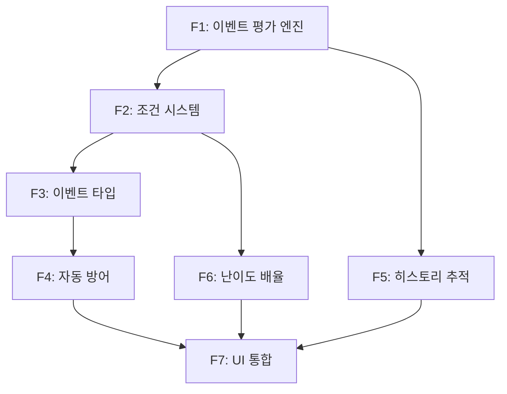

# EPIC-03: 동적 이벤트 시스템

## 목표

게임 진행 중 유저의 게임 상태(유저 수, 자금, 신뢰도, 인프라)에 따라 예상치 못한 **동적 이벤트**가 발생하여, 리플레이 가치를 높이고 AWS 아키텍처 학습 경험을 강화한다.

---

## 배경

### 현재 문제점
- **결정론적 게임 흐름**: 25개 턴, 253개 선택지가 모두 사전 정의되어 동일한 선택 시 항상 동일한 결과
- **상태 기반 반응 부재**: 게임 상태(users, cash, trust)가 변해도 시장에서 아무 반응 없음
- **리플레이 가치 부족**: 한 번 최적 경로 발견 시 반복 플레이 가치 감소
- **긴장감 부족**: 예측 가능한 진행으로 서프라이즈 요소 부재

### 해결 방안
기존 25턴 시스템을 유지하면서, **이벤트 레이어**를 추가하여:
- 턴 시작 시 게임 상태에 따라 랜덤 이벤트 발생
- AWS 장애, 투자 기회, 시장 변화 등 실제 스타트업이 겪는 상황 재현
- 이벤트 대응 선택지를 통해 AWS 아키텍처 학습 강화

---

## 성공 기준

- [ ] 매 턴 이벤트 발생 확률 25-40% (난이도별 차등)
- [ ] 동일 선택 시에도 30% 이상 다른 결과 경로 제공
- [ ] 5가지 이벤트 타입 모두 구현 (RANDOM, CHAIN, CRISIS, OPPORTUNITY, SEASONAL)
- [ ] 자동 방어 시스템 작동 (CloudFront, Aurora, DR 등)
- [ ] 이벤트 히스토리 저장 및 조회 가능
- [ ] 테스트 커버리지 90% 이상
- [ ] 기존 게임 플로우 정상 작동 (회귀 테스트 통과)

---

## Feature 분해

### Feature 1: 이벤트 평가 엔진 (Event Evaluation Engine)
- **설명**: 턴 시작 시 게임 상태를 기반으로 이벤트 발생 여부를 판단하는 핵심 로직
- **책임자**: Server AI
- **의존성**: None (독립 구현 가능)
- **예상 리스크**: 조건 매칭 로직 복잡도 증가, 성능 이슈 (많은 이벤트 풀 스캔)
- **구현 파일**:
  - `backend/src/event/event.service.ts` (핵심 로직)
  - `backend/src/database/entities/dynamic-event.entity.ts`
  - `backend/src/database/entities/event-state.entity.ts`

### Feature 2: 이벤트 조건 시스템 (Trigger Condition System)
- **설명**: 다양한 조건(턴, 유저 수, 자금, 인프라 등)을 평가하여 이벤트 발생 적격성 판단
- **책임자**: Server AI + Designer AI (수치 밸런스)
- **의존성**: Feature 1 완료 후
- **예상 리스크**: 조건 조합 복잡도, 밸런스 조정 어려움
- **주요 조건**:
  - 턴 범위 (`minTurn`, `maxTurn`)
  - 게임 상태 (`minUsers`, `maxUsers`, `minCash`, `maxCash`, `minTrust`, `maxTrust`)
  - 인프라 조건 (`requireInfra`, `excludeInfra`)
  - 확률 (`baseProbability`)
  - 이전 이벤트 의존성 (`requirePreviousEvent`)

### Feature 3: 이벤트 타입 시스템 (Event Type System)
- **설명**: 5가지 이벤트 타입 (RANDOM, CHAIN, CRISIS, OPPORTUNITY, SEASONAL) 구현
- **책임자**: Designer AI (이벤트 설계) + Server AI (타입별 로직)
- **의존성**: Feature 2 완료 후
- **예상 리스크**: 타입별 우선순위 충돌, 연쇄 이벤트 루프
- **타입별 특성**:
  - **RANDOM**: 조건 충족 시 확률적 발생
  - **CHAIN**: 이전 이벤트에 의존하여 연쇄 발생
  - **CRISIS**: 높은 우선순위, 부정적 영향
  - **OPPORTUNITY**: 중간 우선순위, 긍정적 기회
  - **SEASONAL**: 특정 시즌/메타 이벤트

### Feature 4: 자동 방어 시스템 (Auto-Defense System)
- **설명**: 특정 인프라(CloudFront, Aurora, DR)가 있을 경우 위기 이벤트 피해 자동 감소
- **책임자**: Server AI + Designer AI (감소율 밸런스)
- **의존성**: Feature 3 완료 후
- **예상 리스크**: 방어 효과 과도 시 게임 난이도 저하
- **방어 메커니즘**:
  - CloudFront: DDoS 공격 피해 50% 감소
  - Aurora Global DB: 리전 장애 피해 70% 감소
  - DR (Disaster Recovery): 모든 장애 피해 30% 감소
  - Multi-region: 지역별 장애 완전 무효화

### Feature 5: 이벤트 히스토리 추적 (Event History Tracking)
- **설명**: 게임별 이벤트 발생 이력 저장, 중복 방지, 통계 조회
- **책임자**: Server AI
- **의존성**: Feature 1 완료 후 (병렬 가능)
- **예상 리스크**: DB 부하, 히스토리 쿼리 성능
- **구현 사항**:
  - EventHistory 엔티티 생성
  - 이벤트 발생 시 자동 기록
  - 중복 이벤트 방지 (같은 이벤트 연속 발생 금지)
  - 게임별 이벤트 통계 조회 API

### Feature 6: 난이도별 이벤트 배율 (Difficulty-based Event Multiplier)
- **설명**: 난이도(EASY/NORMAL/HARD)에 따라 이벤트 확률 및 효과 조정
- **책임자**: Designer AI (밸런스) + Server AI (구현)
- **의존성**: Feature 1, 2 완료 후
- **예상 리스크**: 난이도별 밸런스 조정 복잡
- **배율 설정**:
  - EASY: 이벤트 확률 0.7배, 피해 0.7배, 보상 1.3배
  - NORMAL: 이벤트 확률 1.0배, 피해 1.0배, 보상 1.0배
  - HARD: 이벤트 확률 1.3배, 피해 1.5배, 보상 0.8배

### Feature 7: 이벤트 UI 통합 (Event UI Integration)
- **설명**: Frontend에서 이벤트 발생 시 팝업 표시 및 선택지 제공
- **책임자**: Client AI
- **의존성**: Feature 1-6 완료 후
- **예상 리스크**: 모바일 반응형, 애니메이션 성능
- **구현 사항**:
  - EventPopup 컴포넌트 생성
  - 이벤트 타입별 아이콘 및 색상 차별화
  - 선택지 카드 UI (ChoiceCard 재사용)
  - 이벤트 히스토리 뷰어

---

## 의존성 맵

**Critical Path**: F1 → F2 → F3 → F4 → F7

---

## 릴리즈 전략

### Phase 1: Backend 핵심 (Week 1-2) ✅ **완료**
- **포함 Feature**: F1 (평가 엔진), F2 (조건 시스템), F5 (히스토리)
- **현재 상태**:
  - ✅ EventService 구현 완료
  - ✅ DynamicEvent, EventState, EventHistory 엔티티 생성
  - ✅ 조건 평가 로직 구현
  - ✅ Seeded Random (seedrandom 패키지) 적용
  - ✅ 테스트 코드 31개 작성 (event.service.spec.ts)
- **릴리즈 기준**: Unit Test 통과, API 응답 < 200ms
- **Rollback 조건**: 기존 게임 플로우 회귀 이슈

### Phase 2: 고급 기능 (Week 3) ✅ **완료**
- **포함 Feature**: F3 (이벤트 타입), F4 (자동 방어), F6 (난이도 배율)
- **현재 상태**:
  - ✅ 5가지 이벤트 타입 구현
  - ✅ 자동 방어 시스템 구현 (CloudFront, Aurora, DR, Multi-region)
  - ✅ 연쇄 이벤트 로직 구현
  - ✅ 난이도별 배율 시스템 구현
  - ✅ 통합 테스트 12개 작성 (event-integration.spec.ts)
  - ✅ Edge Case 테스트 33개 작성 (event-edge-cases.spec.ts)
- **릴리즈 기준**: Integration Test 통과, 이벤트 우선순위 정상 작동
- **Rollback 조건**: 이벤트 무한 루프, 게임 불가능 상태

### Phase 3: UI 통합 및 콘텐츠 (Week 4) ⚠️ **진행 중**
- **포함 Feature**: F7 (UI 통합)
- **현재 상태**:
  - ⬜ EventPopup 컴포넌트 미완성
  - ⬜ 이벤트 데이터 풀 비어있음 (실제 이벤트 콘텐츠 필요)
  - ⬜ Frontend API 연동 필요
- **필요 작업**:
  - EventPopup.tsx 컴포넌트 생성
  - 이벤트 타입별 UI 디자인
  - 이벤트 콘텐츠 작성 (최소 20개)
  - E2E 테스트
- **릴리즈 기준**: E2E Test 통과, 모바일 반응형 확인
- **Rollback 조건**: UI 렌더링 실패, 이벤트 선택 불가

### Phase 4: 콘텐츠 확장 (Week 5+) 📋 **계획**
- **목표**: 이벤트 풀 확장 (20개 → 50개+)
- **이벤트 카테고리**:
  - AWS 장애 이벤트 10개 (리전 장애, DDoS, 보안 침해 등)
  - 투자 기회 이벤트 10개 (긴급 투자, 제휴 제안, 인재 영입 등)
  - 시장 변화 이벤트 10개 (경쟁사 등장, 규제 변화, 트렌드 전환 등)
  - 연쇄 이벤트 10개 (스토리 라인 연결)
  - 시즌 이벤트 10개 (특별 이벤트)

---

## 리스크 관리

| 리스크 | 영향도 | 확률 | 대응 방안 | 우회 방안 |
|--------|--------|------|-----------|-----------|
| 이벤트 매칭 로직 복잡도 증가 | High | Medium | 조건 평가 순서 최적화, 단순 조건 먼저 평가 | 조건 개수 제한 (최대 10개) |
| 이벤트 풀 로딩 성능 저하 | Medium | Low | 메모리 캐싱, 턴별 인덱싱 | Redis 캐싱 (Phase 1+) |
| 연쇄 이벤트 무한 루프 | High | Low | 최대 연쇄 깊이 제한 (3단계), 순환 검증 | 연쇄 이벤트 카운터 추가 |
| 자동 방어 과도로 게임 쉬워짐 | Medium | Medium | 방어율 밸런스 조정 (테스트 필요) | 방어 조건 강화 (고급 인프라만) |
| 이벤트 콘텐츠 부족 | High | High | 외부 작가 섭외, LLM 활용 콘텐츠 생성 | 기존 턴 이벤트 재활용 |
| UI 성능 이슈 (모바일) | Medium | Medium | 애니메이션 최적화, 번들 크기 축소 | 애니메이션 비활성화 옵션 |
| 기존 게임 플로우 회귀 | Critical | Low | 철저한 회귀 테스트, 기존 API 호환성 유지 | Feature Flag로 이벤트 비활성화 |

---

## 조율 포인트

### Designer AI와 조율
- [ ] 이벤트 발생 확률 밸런스 (25-40% 목표)
- [ ] 이벤트 효과 수치 밸런스 (users, cash, trust)
- [ ] 난이도별 배율 조정
- [ ] 자동 방어 감소율 결정
- [ ] 이벤트 콘텐츠 작성 (최소 20개)

### Client AI와 조율
- [ ] EventPopup 컴포넌트 UI/UX 설계
- [ ] 이벤트 타입별 아이콘 및 색상
- [ ] 이벤트 히스토리 뷰어 레이아웃
- [ ] 모바일 반응형 디자인
- [ ] API 응답 구조 확인 (randomEventTriggered, randomEventData)

### Server AI와 조율
- [ ] API 엔드포인트 추가 필요 여부 (현재는 기존 executeChoice 활용)
- [ ] 이벤트 데이터 저장 형식 (JSON vs DB)
- [ ] 성능 최적화 전략 (캐싱, 인덱싱)
- [ ] 보안 고려사항 (시드 조작 방지)

### QA AI와 조율
- [ ] 회귀 테스트 범위: 기존 25턴 시스템 전체
- [ ] Edge Case 우선순위: 중복 이벤트, 무한 루프, 게임 종료 조건
- [ ] 성능 테스트: 이벤트 매칭 속도 < 100ms
- [ ] 재현성 테스트: Seeded Random 검증

---

## 구현 현황 (2026-02-04 기준)

### ✅ 완료된 항목
1. **EventService 핵심 로직**
   - checkRandomEvent() - 이벤트 발생 여부 판단
   - evaluateTriggerCondition() - 조건 평가
   - filterEligibleEvents() - 적격 이벤트 필터링
   - prioritizeEvents() - 우선순위 정렬

2. **Database Entities**
   - DynamicEvent (이벤트 정의)
   - EventState (게임별 이벤트 상태)
   - EventHistory (이벤트 발생 이력)
   - Game 엔티티 확장 (eventSeed, activeEvents, completedEvents, eventFlags)

3. **고급 기능**
   - Seeded Random (seedrandom 패키지)
   - 자동 방어 시스템 (CloudFront, Aurora, DR, Multi-region)
   - 연쇄 이벤트 로직
   - 난이도별 배율 시스템
   - 중복 이벤트 방지

4. **테스트 코드**
   - Unit Test: 31개 (event.service.spec.ts)
   - Integration Test: 12개 (event-integration.spec.ts)
   - Edge Case Test: 33개 (event-edge-cases.spec.ts)
   - **총 76개 테스트 케이스**

5. **문서화**
   - EVENT_SYSTEM_DESIGN.md (설계 문서)
   - EVENT_SYSTEM_TEST_STRATEGY.md (테스트 전략)
   - event-system-refactoring.md (리팩토링 가이드)
   - event-type-hierarchy.md (이벤트 타입 계층)
   - README.md (개발 가이드)

### ⚠️ 진행 중인 항목
1. **Frontend UI 통합** (Feature 7)
   - EventPopup 컴포넌트 미완성
   - API 응답 구조 Frontend 반영 필요

2. **이벤트 콘텐츠** (Feature 4)
   - 실제 이벤트 데이터 비어있음
   - 최소 20개 이벤트 작성 필요

### ⬜ 계획 단계
1. **성능 최적화**
   - 메모리 캐싱 (이벤트 풀)
   - 턴별 인덱싱 (O(n) → O(1) 조회)

2. **운영 기능**
   - 어드민 페이지 (이벤트 관리)
   - 이벤트 통계 대시보드

---

## 기술 스택

- **Backend**: NestJS + TypeScript + TypeORM
- **Database**: SQLite (dev) → Aurora MySQL (prod)
- **Random**: seedrandom (Seeded RNG)
- **Security**: SecureRandomService (crypto 기반)
- **Testing**: Jest (Unit/Integration/E2E)
- **Frontend**: Next.js + TypeScript + TailwindCSS (Phase 3)

---

## 참고 문서

- **PRD**: `/home/cto-game/docs/dynamic-event-system-prd.md`
- **Part 2**: `/home/cto-game/docs/dynamic-event-system-prd-part2.md`
- **Part 3**: `/home/cto-game/docs/dynamic-event-system-prd-part3.md`
- **설계 문서**: `/home/cto-game/backend/docs/EVENT_SYSTEM_DESIGN.md`
- **테스트 전략**: `/home/cto-game/backend/docs/EVENT_SYSTEM_TEST_STRATEGY.md`
- **코드**: `/home/cto-game/backend/src/event/`

---

## 다음 단계 (Next Actions)

### 즉시 (이번 주)
1. **EventPopup 컴포넌트 생성** (Client AI)
   - 위치: `frontend/components/EventPopup.tsx`
   - 기능: 이벤트 타입별 UI, 선택지 표시, 애니메이션

2. **이벤트 콘텐츠 작성** (Designer AI)
   - 최소 20개 이벤트 작성
   - 이벤트 타입별 균등 분배 (각 타입 4개씩)
   - AWS 교육 요소 포함

3. **Frontend API 연동** (Client AI)
   - GameResponse DTO의 randomEventTriggered 처리
   - 이벤트 선택 시 API 호출 로직

### 단기 (이번 달)
4. **E2E 테스트** (QA AI)
   - 이벤트 발생 → 선택 → 효과 적용 전체 플로우
   - 회귀 테스트 (기존 게임 플로우)

5. **성능 최적화** (Server AI)
   - 이벤트 풀 메모리 캐싱
   - 턴별 인덱싱

### 중기 (3개월)
6. **이벤트 콘텐츠 확장** (Designer AI + 외부 작가)
   - 50개 이벤트로 확장
   - 연쇄 이벤트 스토리 라인

7. **LLM 동적 이벤트 생성** (Phase 2)
   - Bedrock 연동
   - 게임 상태 기반 실시간 이벤트 생성

---

**작성자**: Producer AI
**작성일**: 2026-02-04
**검토자**: {PO 이름} (검토 대기)
**상태**: Draft (초안 작성 완료)

---

**버전 이력**:
- v1.0 (2026-02-04): 초안 작성, 구현 현황 반영
