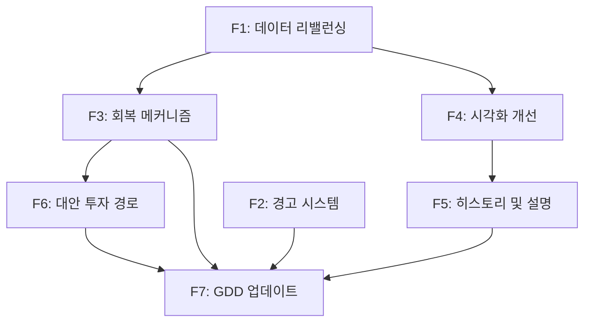

# EPIC-04: 신뢰도 시스템 점검 및 개선

## 목표

게임의 핵심 메트릭인 신뢰도(Trust) 시스템의 밸런스를 개선하고, 플레이어가 신뢰도의 의미와 영향을 명확히 이해할 수 있도록 UX를 강화하며, 교육적 가치를 높인다.

## 배경

### 현재 상황

신뢰도 시스템은 Phase 0에서 기본 구현되었으며, Phase 3에서 자연 회복 메커니즘이 추가되었습니다. 그러나 심층 분석 결과 다음과 같은 문제점이 발견되었습니다:

**데이터 불일치 문제**:
- GDD 명세(초기값 50)와 실제 구현(NORMAL 40) 불일치
- 선택지 효과의 90%가 긍정적(+3~+5)으로 획일화
- 턴별 신뢰도 획득 기회가 초반에 집중됨

**게임 밸런스 문제**:
- 용량 초과 페널티(-8)가 회복 속도(+1~2/턴)에 비해 과도함
- 초기 투자 피칭 실패 시 trust 50% 감소로 이후 회복 불가능
- 연속 용량 초과 시 게임 오버까지의 여유 시간이 부족함

**플레이어 경험 문제**:
- 신뢰도가 "투자자 + 시장 + 팀"을 단일 수치로 표현하여 의미 모호
- 실시간 피드백 부족 (턴 종료 후에야 확인)
- 위기 상황 인지가 어려움
- 신뢰도 변화의 맥락 설명 부족

**교육적 가치 문제**:
- 인프라 장애 → 신뢰도 감소의 논리적 연결이 약함
- 실제 스타트업의 "위기 극복 → 신뢰 상승" 패턴이 반영되지 않음
- 신뢰도 회복 전략이 제한적

### 왜 지금 필요한가

Phase 1(Frontend + 고급 기능) 진행 중인 현재, 신뢰도 시스템은 게임의 핵심 메커니즘이자 승패를 결정하는 중요한 지표입니다. Frontend 구현 전에 Backend의 신뢰도 로직을 개선하고, Frontend에서 이를 효과적으로 시각화할 수 있는 기반을 마련해야 합니다.

또한, 현재 게임의 교육적 목표("실리콘밸리 CTO의 경험")를 달성하기 위해서는 신뢰도가 단순한 수치가 아닌, 실제 비즈니스 의사결정의 결과로 인식되어야 합니다.

## 성공 기준

- [ ] GDD 명세와 구현 간 불일치 해소 (초기값, 임계값, 공식)
- [ ] game_choices_db.json의 trust 효과 재조정 (긍정 70%, 중립 15%, 부정 15% 비율)
- [ ] 용량 초과 1회차 경고 시스템 구현 (페널티 50% 감소)
- [ ] 신뢰도 회복 메커니즘 3가지 이상 추가 (안정 운영 보너스, 장애 극복 보너스, 투명성 보너스)
- [ ] Frontend 신뢰도 게이지 UI 구현 (구간별 색상, 임계값 표시)
- [ ] 신뢰도 변화 히스토리 차트 구현
- [ ] 대안 투자 경로 2개 추가 (브릿지 파이낸싱, 정부 지원금)
- [ ] Unit Test 커버리지 > 80% (신뢰도 관련 로직)
- [ ] 플레이테스트 결과 신뢰도 이해도 80% 이상 (설문)

---

## Feature 분해

### Feature 1: 신뢰도 데이터 리밸런싱
- **설명**: game_choices_db.json의 trust 효과를 재조정하고, GDD 명세와 구현 간 불일치를 해소
- **책임자**: Designer AI (데이터 설계) + Server AI (constants 조정)
- **의존성**: None (독립 실행 가능)
- **예상 리스크**: 기존 게임 밸런스 변경으로 인한 회귀 테스트 필요

**세부 작업**:
- GDD 초기값 50 vs 구현 40 → 합의 후 통일
- 선택지 trust 효과 다양화 (현재 90% 긍정 → 70% 긍정, 15% 중립, 15% 부정)
- 턴별 trust 획득 기회 균등화 (초반 집중 → 전체 분산)
- 단일 대박 선택지(턴 2, +20) → 다수의 전략적 선택지로 분산

### Feature 2: 용량 초과 경고 시스템 구현
- **설명**: 첫 번째 용량 초과 시 경고만 표시하고 페널티를 50% 감소, 두 번째부터 전체 페널티 적용
- **책임자**: Server AI
- **의존성**: None
- **예상 리스크**: 기존 capacityExceededCount 로직과 충돌 가능성

**세부 작업**:
- Game Entity에 `capacityWarningActive` 필드 추가
- GameService에 경고 로직 구현
- 경고 메시지 및 회복 가이드 추가
- 단위 테스트 작성 (연속 용량 초과 시나리오)

### Feature 3: 신뢰도 회복 메커니즘 강화
- **설명**: 장애 극복 보너스, 안정 운영 보너스, 투명성 보너스 등 다양한 회복 메커니즘 추가
- **책임자**: Designer AI (규칙 설계) + Server AI (구현)
- **의존성**: Feature 1 완료 후 (리밸런싱 기준 필요)
- **예상 리스크**: 회복 속도가 너무 빠르면 신뢰도가 게임에 영향을 주지 않을 수 있음

**세부 작업**:
- 장애 극복 보너스 강화 (기존 +3 → +5)
- 안정 운영 보너스 추가 (3턴 연속 용량 80% 이하 → +3 trust)
- 투명성 보너스 추가 (장애 후 고객 소통 선택 시 회복 1.5배)
- 밸런스 시뮬레이션 (최적/중간/위기 경로)

### Feature 4: 신뢰도 시각화 개선
- **설명**: Frontend에 신뢰도 게이지, 구간별 상태 표시, 임계값 마커 추가
- **책임자**: Client AI
- **의존성**: Feature 1 완료 후 (임계값 확정 필요)
- **예상 리스크**: 모바일 반응형 처리

**세부 작업**:
- MetricsPanel에 TrustGauge 컴포넌트 추가
- 구간별 색상 및 상태 메시지 (안정적/보통/주의/위기/즉시 대응)
- 투자 임계값 마커 표시 (Series A/B/C 목표, 게임 오버 선)
- 애니메이션 효과 (trust 변화 시 부드러운 전환)

### Feature 5: 신뢰도 히스토리 및 설명 추가
- **설명**: 신뢰도 변화 히스토리 차트 및 변화 요인 설명 기능 구현
- **책임자**: Client AI (UI) + Server AI (히스토리 API)
- **의존성**: Feature 4 완료 후 (시각화 기반 필요)
- **예상 리스크**: 히스토리 데이터 저장 용량

**세부 작업**:
- Backend: TrustHistory Entity 추가 (턴별 trust 값, 변화 요인)
- Backend: GET /api/game/:gameId/trust-history API 구현
- Frontend: TrustHistoryChart 컴포넌트 (Line chart with annotations)
- Frontend: TrustChangeExplanation 컴포넌트 (턴 종료 시 변화 요인 설명)
- 교육적 메시지 추가 ("💡 교훈: ...")

### Feature 6: 대안 투자 경로 추가
- **설명**: Series 투자 미달 시 브릿지 파이낸싱, 정부 지원금 등 대안 경로 제공
- **책임자**: Designer AI (경로 설계) + Server AI (로직 구현)
- **의존성**: Feature 3 완료 후 (회복 메커니즘 기반 필요)
- **예상 리스크**: 게임 밸런스 변화, 난이도 하락 가능성

**세부 작업**:
- 브릿지 파이낸싱 선택지 추가 (소규모 투자, 추가 equity 희석)
- 정부 지원금 선택지 추가 (중규모 지원, equity 희석 없음, 조건부)
- 투자 미달 시 동적 선택지 생성 로직
- 대안 경로 선택 시 스토리 텍스트

### Feature 7: GDD 문서 업데이트 및 테스트
- **설명**: 변경된 신뢰도 시스템을 GDD에 반영하고 회귀 테스트 수행
- **책임자**: Designer AI (문서) + QA AI (테스트)
- **의존성**: Feature 1-6 완료 후
- **예상 리스크**: None

**세부 작업**:
- `.ai/context/gdd.md` 업데이트 (신뢰도 시스템 섹션)
- 신뢰도 시스템 밸런스 문서 작성 (`.ai/context/trust-balance.md`)
- 회귀 테스트 시나리오 작성 및 실행
- 플레이테스트 및 피드백 수집

---

## 의존성 맵

**Critical Path**: F1 → F4 → F5 → F7

**병렬 가능**:
- F1과 F2는 병렬 실행 가능 (독립적)
- F3과 F4는 F1 완료 후 병렬 실행 가능

---

## 릴리즈 전략

### Phase 1: Backend 리밸런싱 및 경고 시스템 (Week 1)
- **포함 Feature**: F1 (데이터 리밸런싱), F2 (경고 시스템)
- **릴리즈 기준**:
  - game_choices_db.json 리밸런싱 완료 (trust 효과 재조정)
  - game-constants.ts 수정 완료 (GDD와 일치)
  - 용량 초과 경고 로직 구현 및 테스트 통과
  - Unit Test 커버리지 > 80%
- **Rollback 조건**:
  - 기존 게임 진행 불가 시
  - 신뢰도 계산 오류 발생 시

### Phase 2: 회복 메커니즘 및 대안 경로 (Week 2)
- **포함 Feature**: F3 (회복 메커니즘), F6 (대안 투자 경로)
- **릴리즈 기준**:
  - 3가지 회복 메커니즘 구현 (안정 운영, 장애 극복, 투명성)
  - 대안 투자 경로 2개 추가 (브릿지, 정부 지원)
  - Integration Test 통과 (전체 게임 플로우)
  - 밸런스 시뮬레이션 통과 (최적/중간/위기 경로 모두 승리 가능)
- **Rollback 조건**:
  - 밸런스 붕괴 (너무 쉽거나 너무 어려움)
  - 투자 로직 오류

### Phase 3: Frontend 시각화 (Week 3)
- **포함 Feature**: F4 (시각화), F5 (히스토리)
- **릴리즈 기준**:
  - TrustGauge UI 구현 (구간별 색상, 임계값 표시)
  - TrustHistoryChart 구현 (차트 + 주석)
  - TrustChangeExplanation 구현 (변화 요인 설명)
  - 모바일 반응형 확인
  - E2E Test 통과
- **Rollback 조건**:
  - UI 렌더링 실패
  - API 통신 오류
  - 차트 성능 이슈

### Phase 4: 문서화 및 최종 검증 (Week 4)
- **포함 Feature**: F7 (GDD 업데이트 및 테스트)
- **릴리즈 기준**:
  - GDD 문서 업데이트 완료
  - 회귀 테스트 100% 통과
  - 플레이테스트 신뢰도 이해도 80% 이상
  - Release Note 작성
- **Rollback 조건**: None (문서 작업)

---

## 리스크 관리

| 리스크 | 영향도 | 확률 | 대응 방안 | 우회 방안 |
|--------|--------|------|-----------|-----------|
| 밸런스 리밸런싱 시 게임이 너무 쉬워짐 | High | Medium | 시뮬레이션 도구로 사전 검증, A/B 테스트 | 난이도별 다른 수치 적용 (EASY/NORMAL/HARD) |
| 회복 메커니즘이 너무 강력해서 신뢰도가 의미 없어짐 | High | Low | 회복 속도 점진적 조정, 플레이테스트 반복 | 회복 조건을 까다롭게 설정 (3턴 연속 안정 등) |
| 히스토리 데이터 저장으로 DB 용량 증가 | Medium | Low | TrustHistory는 25턴만 저장 (제한적) | 필요 시 요약 데이터만 저장 |
| Frontend 차트 렌더링 성능 이슈 | Medium | Low | Canvas 대신 경량 SVG 사용, 최대 25개 데이터포인트 | 차트 대신 테이블로 fallback |
| GDD와 구현 통일 시 기존 플레이어 혼란 | Low | Medium | Release Note에 명확히 설명, Migration 가이드 | 기존 게임에는 적용 안 함 (새 게임만) |
| 대안 투자 경로 추가로 투자 타이밍 전략 무의미해짐 | Medium | Medium | 대안 경로의 조건을 까다롭게 설정 (trust 15-25 구간만) | 대안 경로 제공 횟수 제한 (게임당 1회) |

---

## 조율 포인트

### Designer AI
- [ ] game_choices_db.json 리밸런싱 기준 협의 (긍정/중립/부정 비율)
- [ ] 회복 메커니즘 규칙 설계 (보너스 수치, 조건)
- [ ] 대안 투자 경로 설계 (금액, equity 희석, 조건)
- [ ] 신뢰도 교육적 메시지 작성 ("💡 교훈: ...")
- [ ] GDD 문서 업데이트 내용 검토

### Server AI
- [ ] game-constants.ts 수정 범위 협의 (초기값, 임계값)
- [ ] 용량 초과 경고 로직 구현 방법 검토
- [ ] TrustHistory Entity 스키마 설계
- [ ] GET /api/game/:gameId/trust-history API 스펙
- [ ] 회복 메커니즘 로직 구현 (턴 시작 시 처리 위치)
- [ ] Unit Test 전략 (시나리오별 테스트 케이스)

### Client AI
- [ ] TrustGauge 컴포넌트 디자인 협의 (색상, 레이아웃)
- [ ] TrustHistoryChart 라이브러리 선택 (Recharts, Chart.js, etc.)
- [ ] 모바일 반응형 전략 (차트 축소 vs 테이블 전환)
- [ ] 선택지 미리보기 툴팁 UI/UX
- [ ] TrustChangeExplanation 표시 타이밍 (턴 종료 모달? 사이드 패널?)

### QA AI
- [ ] 회귀 테스트 범위: 기존 게임 플로우 전체 (25턴 시나리오 3개)
- [ ] Edge Case:
  - 연속 용량 초과 5회
  - trust 0 도달 후 회복
  - 모든 대안 투자 경로 사용
  - 히스토리 데이터 25턴 전체 조회
- [ ] 성능 테스트: 히스토리 차트 렌더링 1000회
- [ ] 플레이테스트 설문 문항 설계 (신뢰도 이해도 측정)

---

**작성자**: Producer AI
**작성일**: 2026-02-04
**검토자**: {PO/PM 이름}
**상태**: Draft

---

## 참고 자료

- 신뢰도 시스템 분석 보고서 (Agent ada3660)
- `.ai/context/gdd.md` - 게임 디자인 문서
- `.ai/context/vision.md` - 게임 비전
- `backend/src/game/game.service.ts` - 현재 신뢰도 구현
- `game_choices_db.json` - 게임 데이터
