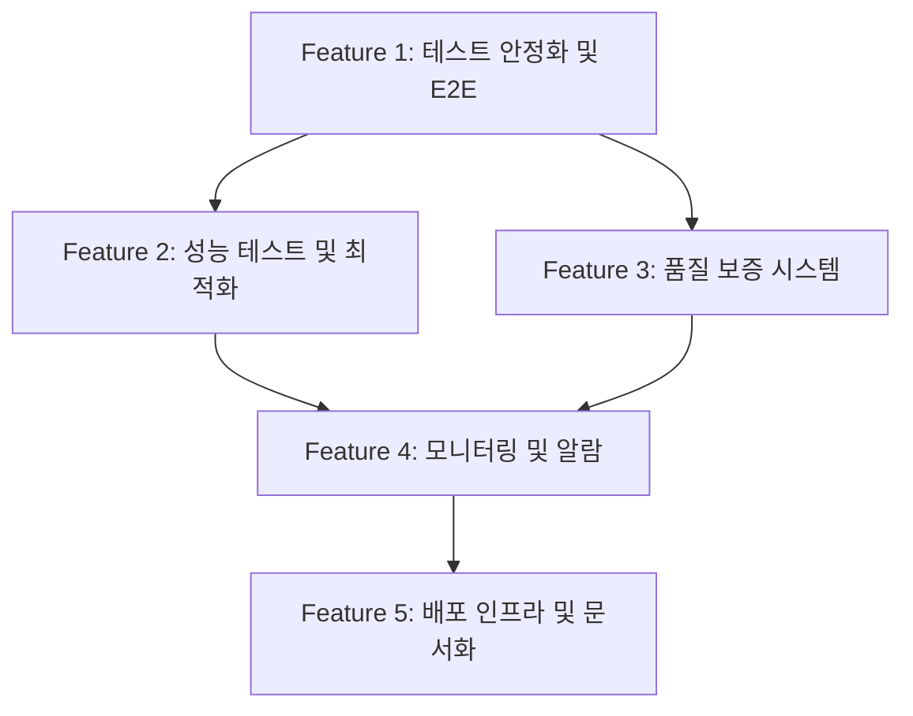

# EPIC-06: LLM Event System - Production Readiness

## 목표

LLM 동적 이벤트 생성 시스템(EPIC-05)을 프로덕션 환경에 배포 가능한 수준으로 완성한다. 테스트 안정화, 성능 검증, 품질 보증, 모니터링 체계를 구축하여 실제 플레이어가 안정적으로 AI 생성 이벤트를 경험하고, 운영팀이 시스템을 효과적으로 관리할 수 있도록 한다.

## 배경

EPIC-05에서 LLM 동적 이벤트 생성 시스템의 핵심 모듈(vLLM 클라이언트, 프롬프트 빌더, 캐싱, 검증)이 구현되었으나, 프로덕션 배포를 위한 준비가 미완료 상태이다:

- Unit Test 11개 실패 (273/284 통과, 96% → 100% 목표)
- E2E Test 미구현 (vLLM + Redis + Backend 통합 검증 필요)
- 성능 검증 미완료 (p95 <3s, 캐시 hit rate >60% 달성 확인 필요)
- 품질 보증 프로세스 부재 (생성 이벤트의 게임 밸런스 및 콘텐츠 품질 검증)
- 프로덕션 모니터링 체계 부재 (메트릭 대시보드, 알람 규칙 미설정)
- 배포 인프라 미구축 (vLLM 도커화, Redis 설정, 환경 변수 관리)

## 성공 기준

- [ ] 모든 Unit Test 통과 (284/284, 100%)
- [ ] E2E Test 구현 완료 (vLLM + Redis 통합 시나리오 5개 이상)
- [ ] 성능 목표 달성 (p95 <3s, 평균 <1.5s, 캐시 hit rate >60%)
- [ ] 생성 이벤트 품질 스코어 평균 >80점 (20개 샘플 수동 리뷰)
- [ ] 모니터링 대시보드 구축 (생성 시간, 캐시 hit rate, 실패율, 품질 스코어)
- [ ] 프로덕션 배포 성공 (vLLM + Redis + Backend 전체 스택)
- [ ] 운영 문서 작성 완료 (API 가이드, 트러블슈팅, 롤백 절차)

---

## Feature 분해

### Feature 1: 테스트 안정화 및 E2E 테스트 구현
- **설명**: 실패 중인 Unit Test 11개를 수정하여 100% 통과율 달성. vLLM + Redis + Backend를 통합하는 E2E 테스트 시나리오 5개 이상 구현.
- **책임자**: Server AI (Unit Test), QA AI (E2E Test)
- **의존성**: None
- **예상 리스크**: vLLM 서비스 불안정 시 E2E 테스트 실패 가능 → Mock 서버 대안 준비

### Feature 2: 성능 테스트 및 최적화
- **설명**: 100 requests 부하 테스트 실행하여 p95 <3s, 평균 <1.5s 달성 검증. 캐시 hit rate >60% 달성. 성능 병목 발견 시 최적화.
- **책임자**: Server AI
- **의존성**: Feature 1 완료 후 (E2E 테스트 환경 필요)
- **예상 리스크**: vLLM 응답 시간이 3s 초과 시 목표 미달성 → 프롬프트 최적화, 캐시 전략 조정

### Feature 3: 품질 보증 시스템 구축
- **설명**: 생성된 이벤트의 품질을 자동/수동으로 평가하는 시스템 구축. 품질 스코어링 알고리즘 구현(일관성, 밸런스, 재미, 교육성). 20개 샘플 수동 리뷰하여 평균 >80점 달성.
- **책임자**: Designer AI (품질 기준 정의), QA AI (리뷰 프로세스)
- **의존성**: Feature 1 완료 후
- **예상 리스크**: 주관적 품질 평가 → 명확한 평가 기준 및 체크리스트 필요

### Feature 4: 모니터링 및 알람 설정
- **설명**: LLM 이벤트 생성 메트릭 대시보드 구축 (생성 시간, 캐시 hit rate, 실패율, 품질 스코어, vLLM/Redis 상태). 알람 규칙 설정 (생성 실패율 >10%, p95 >5s, 캐시 hit rate <40%).
- **책임자**: LiveOps AI (대시보드, 알람), Server AI (메트릭 API)
- **의존성**: Feature 2, 3 완료 후 (성능 및 품질 메트릭 수집 필요)
- **예상 리스크**: 메트릭 수집 오버헤드 → 비동기 처리 또는 샘플링

### Feature 5: 배포 인프라 구축 및 문서화
- **설명**: vLLM 서비스 도커화 및 배포 스크립트 작성. Redis 설정 및 환경 변수 관리. 운영 문서 작성 (API 사용 가이드, 트러블슈팅 가이드, 롤백 절차).
- **책임자**: LiveOps AI
- **의존성**: Feature 4 완료 후
- **예상 리스크**: vLLM 모델 로딩 시간 → 헬스 체크 타임아웃 설정

---

## 의존성 맵

**Critical Path**: F1 → F2 → F4 → F5 (또는 F1 → F3 → F4 → F5)

---

## 릴리즈 전략

### Phase 1: 테스트 및 성능 검증
- **포함 Feature**: F1 (테스트 안정화), F2 (성능 테스트)
- **릴리즈 기준**:
  - Unit Test 100% 통과
  - E2E Test 5개 이상 통과
  - 성능 목표 달성 (p95 <3s, 캐시 hit rate >60%)
- **Rollback 조건**: 성능 목표 미달성 시 프롬프트 또는 캐시 전략 재조정

### Phase 2: 품질 보증 및 모니터링
- **포함 Feature**: F3 (품질 보증), F4 (모니터링)
- **릴리즈 기준**:
  - 품질 스코어 평균 >80점
  - 모니터링 대시보드 구축 완료
  - 알람 규칙 테스트 완료
- **Rollback 조건**: 품질 스코어 <70점 시 품질 검증 로직 강화

### Phase 3: 프로덕션 배포
- **포함 Feature**: F5 (배포 인프라)
- **릴리즈 기준**:
  - vLLM + Redis + Backend 전체 스택 배포 성공
  - 운영 문서 작성 완료
  - Staging 환경 72시간 안정성 확인
- **Rollback 조건**: 프로덕션 에러율 >5% 시 즉시 Feature Flag 비활성화

---

## 리스크 관리

| 리스크 | 영향도 | 확률 | 대응 방안 | 우회 방안 |
|--------|--------|------|-----------|-----------|
| vLLM 서비스 불안정 | High | Medium | Mock 서버 준비, Health Check 강화 | Feature Flag로 Static Event 전환 |
| 성능 목표 미달성 (p95 >3s) | High | Medium | 프롬프트 최적화, 캐시 전략 조정 | Timeout 5s로 완화 |
| 생성 이벤트 품질 저하 | Medium | Medium | Validation 로직 강화, Few-shot 예제 추가 | 품질 스코어 <60점 이벤트 자동 폐기 |
| Redis 장애 | Medium | Low | 캐시 없이 직접 LLM 호출 (성능 저하 감수) | Feature Flag로 Static Event 전환 |
| 프로덕션 배포 실패 | High | Low | Staging 환경 충분한 테스트, Rollback 스크립트 준비 | 이전 버전으로 즉시 롤백 |

---

## 조율 포인트

### Designer AI
- [ ] 품질 평가 기준 정의 (일관성, 밸런스, 재미, 교육성)
- [ ] 20개 샘플 이벤트 수동 리뷰 및 피드백

### Server AI
- [ ] Unit Test 11개 실패 원인 분석 및 수정
- [ ] 성능 병목 분석 및 최적화
- [ ] 메트릭 API 엔드포인트 구현

### QA AI
- [ ] E2E 테스트 시나리오 설계 (5개 이상)
- [ ] 성능 테스트 자동화 스크립트 작성
- [ ] 품질 리뷰 프로세스 정의

### LiveOps AI
- [ ] vLLM 도커화 및 배포 스크립트 작성
- [ ] Redis 설정 및 환경 변수 관리
- [ ] 모니터링 대시보드 구축 (CloudWatch, Grafana 등)
- [ ] 알람 규칙 설정 및 테스트
- [ ] 운영 문서 작성 (API 가이드, 트러블슈팅, 롤백)

---

## 기술적 세부사항

### 성능 목표
- **응답 시간**: 평균 <1.5s, p95 <3s, p99 <5s
- **캐시 성능**: Hit rate >60%, TTL 5분
- **처리량**: 10 req/s (게임 특성상 동시 접속 낮음)
- **가용성**: 99% (Feature Flag로 Static Event 즉시 전환 가능)

### 품질 평가 기준
1. **일관성** (25점): 이벤트 설명과 선택지 효과가 논리적으로 일치
2. **밸런스** (25점): 효과 범위가 게임 밸런스 내 (cash: ±50-200M, users: ±1K-5K, trust: ±3-10)
3. **재미** (25점): 흥미로운 시나리오, 명확한 트레이드오프
4. **교육성** (25점): AWS 인프라 개념 학습 요소 포함

### 모니터링 메트릭
- `llm.generation.duration_ms` (p50, p95, p99)
- `llm.cache.hit_rate` (ratio, 0-1)
- `llm.validation.failure_rate` (ratio, 0-1)
- `llm.quality.average_score` (0-100)
- `vllm.health_status` (healthy/unhealthy)
- `redis.connection_status` (connected/disconnected)

### 알람 규칙
- **Critical**: 생성 실패율 >10% for 5min → Slack 알림 + Feature Flag 비활성화
- **High**: p95 >5s for 10min → Slack 알림
- **Medium**: 캐시 hit rate <40% for 15min → Slack 알림
- **Low**: 품질 스코어 <70점 5회 연속 → Slack 알림

---

## 배포 계획

### Staging 환경
1. vLLM 서비스 배포 (Docker)
2. Redis 배포 (ElastiCache 또는 Docker)
3. Backend 배포 (환경 변수: `LLM_EVENTS_ENABLED=true`)
4. 72시간 안정성 테스트

### Production 환경
1. **Canary 배포**: 10% 트래픽에만 LLM 이벤트 활성화 (24시간)
2. **모니터링**: 에러율, 응답 시간, 품질 스코어 확인
3. **점진적 확대**: 25% → 50% → 100% (각 단계 24시간)
4. **Rollback 계획**: Feature Flag 비활성화 → Static Event로 즉시 전환

---

## 산출물

### Feature 1 산출물
- Unit Test 수정 사항 문서
- E2E Test 시나리오 5개
- E2E Test 코드 (`backend/src/llm/tests/e2e/`)

### Feature 2 산출물
- 성능 테스트 스크립트 (`backend/src/llm/tests/performance/`)
- 성능 테스트 리포트 (응답 시간 분포, 캐시 hit rate)
- 최적화 적용 사항 문서

### Feature 3 산출물
- 품질 평가 기준 문서 (`docs/features/epic-06/quality-criteria.md`)
- 품질 스코어링 코드 (`backend/src/llm/validators/quality-scorer.service.ts`)
- 20개 샘플 리뷰 리포트

### Feature 4 산출물
- 메트릭 API 엔드포인트 (`GET /api/llm/metrics`)
- 모니터링 대시보드 설정 파일 (Grafana JSON 또는 CloudWatch Dashboard)
- 알람 규칙 설정 파일

### Feature 5 산출물
- vLLM Dockerfile 및 docker-compose.yml
- Redis 설정 파일
- 환경 변수 템플릿 (`.env.example`)
- 운영 가이드 (`docs/implementations/epic-06/operations-guide.md`)
- 트러블슈팅 가이드 (`docs/implementations/epic-06/troubleshooting.md`)
- 롤백 절차 (`docs/implementations/epic-06/rollback-procedure.md`)

---

**작성자**: Producer AI
**작성일**: 2026-02-04
**검토자**: {PO 이름}
**상태**: Draft
