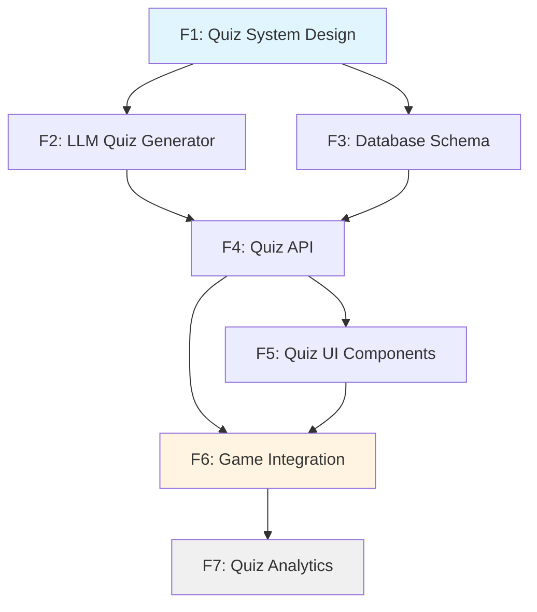

# EPIC-07: LLM 기반 AWS 퀴즈 시스템 (교육 게임 요소)

## 목표

게임에 AWS 지식 학습 요소를 추가하여 플레이어가 게임을 즐기며 자연스럽게 AWS 아키텍처를 학습하도록 한다. LLM을 활용하여 게임 상황에 맞는 AWS 퀴즈를 생성하고, 한 게임당 5개의 퀴즈를 랜덤 턴에 출제한다. 정답률에 따라 최종 점수 보너스를 부여하여 게임의 교육적 가치를 극대화한다.

## 배경

현재 게임은 선택지를 통해 AWS 인프라를 간접적으로 학습하지만, 명시적인 지식 평가 요소가 없어 교육 효과가 제한적이다. AWS 인증 시험 준비나 실무 지식 습득을 원하는 플레이어를 위해 게임 내 퀴즈 시스템을 도입한다. 이를 통해:
1. **교육 가치 극대화**: 게임의 핵심 원칙인 "Educational Value" 강화
2. **지식 검증**: 플레이어가 AWS 개념을 제대로 이해했는지 확인
3. **보상 메커니즘**: 정답 시 점수 보너스로 학습 동기 부여
4. **리플레이 가치**: 다양한 난이도의 문제로 반복 학습 효과

## 성공 기준

- [ ] 플레이어가 한 게임당 5개의 AWS 퀴즈를 경험 (랜덤 턴에 출제)
- [ ] 퀴즈 난이도가 게임 진행도에 따라 자동 조정 (턴 1-10: 쉬움, 11-20: 중간, 21-25: 어려움)
- [ ] LLM이 생성한 퀴즈의 품질이 검증됨 (정답 유일성, 문법 정확성)
- [ ] 정답률에 따라 최종 점수 보너스 부여 (5개 정답: +50점, 4개: +30점, 3개: +15점, 2개: +5점)
- [ ] 퀴즈 히스토리가 DB에 저장되고 플레이어가 결과를 조회 가능
- [ ] 4지선다 객관식과 OX 퀴즈 두 가지 유형 지원
- [ ] 퀴즈 정답률 통계 수집 (문제별, 플레이어별)

---

## Feature 분해

### Feature 1: Quiz System Design (퀴즈 시스템 설계)
- **설명**: 퀴즈 발생 로직, 난이도 체계, 보상 밸런스 설계
  - 랜덤 턴 선택 알고리즘 (5회, 중복 방지, 최소 간격 3턴)
  - 난이도 3단계 정의 (EASY: 턴 1-10, MEDIUM: 11-20, HARD: 21-25)
  - 점수 보너스 체계 (5개 정답: +50, 4개: +30, 3개: +15, 2개: +5, 1-0개: 0)
  - 문제 유형별 가중치 (4지선다 vs OX)
- **책임자**: Designer AI
- **의존성**: None
- **예상 리스크**: 보상이 너무 크면 게임 밸런스 붕괴 가능성

### Feature 2: LLM Quiz Generator (LLM 퀴즈 생성기)
- **설명**: vLLM을 사용하여 AWS 관련 퀴즈 문제 자동 생성
  - Context7 통합 (최신 AWS 문서 참조)
  - 난이도별 프롬프트 템플릿 (EASY/MEDIUM/HARD)
  - 문제 유형별 템플릿 (4지선다, OX)
  - 품질 검증 로직 (정답 유일성, 오답 그럴듯함, 문법 체크)
  - 현재 인프라 스택 기반 문제 생성 (EC2 있으면 EC2 문제, EKS 있으면 EKS 문제)
- **책임자**: Server AI
- **의존성**: Feature 1 완료 후 (난이도 기준 필요)
- **예상 리스크**:
  - LLM 생성 문제의 품질 불안정 (정답 모호성, 한국어 어색함)
  - Context7 API 호출 실패 시 fallback 필요

### Feature 3: Quiz Database Schema (퀴즈 DB 스키마)
- **설명**: Quiz, QuizHistory, QuizAnswer 엔티티 설계 및 구현
  - **Quiz Entity**: quizId, type (MULTIPLE_CHOICE/OX), difficulty (EASY/MEDIUM/HARD), question, options[], correctAnswer, explanation, infraContext, turnRange
  - **QuizHistory Entity**: historyId, gameId, quizId, turnNumber, playerAnswer, isCorrect, timestamp, timeTaken
  - **QuizAnswer Entity**: answerId, quizHistoryId, selectedOption, reasoning (optional)
  - 인덱스 설계 (gameId, difficulty, turnNumber)
- **책임자**: Server AI
- **의존성**: Feature 1 완료 후 (데이터 모델 정의 필요)
- **예상 리스크**: 퀴즈 데이터가 많아지면 쿼리 성능 저하 (Redis 캐싱 필요)

### Feature 4: Quiz API (퀴즈 API 엔드포인트)
- **설명**: Backend API 구현
  - `POST /api/quiz/generate` - 난이도/유형/인프라 기반 퀴즈 생성 요청 (LLM 호출)
  - `GET /api/game/:gameId/quiz/next` - 다음 퀴즈 가져오기 (랜덤 턴 로직 적용)
  - `POST /api/game/:gameId/quiz/:quizId/answer` - 답변 제출 및 정답 검증
  - `GET /api/game/:gameId/quiz-summary` - 게임별 퀴즈 통계 (정답률, 획득 보너스)
  - `GET /api/quiz/statistics` - 전체 퀴즈 통계 (문제별 정답률)
- **책임자**: Server AI
- **의존성**: Feature 2 (Generator), Feature 3 (Schema) 완료 후
- **예상 리스크**:
  - LLM 생성 시간이 길어 API 응답 지연 (비동기 생성 + 캐싱 필요)
  - 동시 요청 처리 (Redis lock)

### Feature 5: Quiz UI Components (퀴즈 UI 컴포넌트)
- **설명**: Frontend 퀴즈 인터페이스 구현
  - **QuizPopup.tsx**: 퀴즈 팝업 컴포넌트 (Framer Motion 애니메이션)
  - **MultipleChoiceQuiz.tsx**: 4지선다 문제 UI (선택지 A/B/C/D)
  - **OXQuiz.tsx**: OX 퀴즈 UI (O/X 버튼)
  - **QuizResult.tsx**: 정답/오답 피드백 (해설 표시)
  - **QuizSummary.tsx**: 게임 종료 시 퀴즈 결과 요약 (5문제 정답률, 보너스 점수)
  - **QuizTimer.tsx**: 제한 시간 표시 (optional, 30초)
- **책임자**: Client AI
- **의존성**: Feature 4 (API) 완료 후
- **예상 리스크**:
  - 모바일 화면에서 4지선다 버튼 배치 어려움
  - 한국어 긴 문장 줄바꿈 처리

### Feature 6: Game Integration (게임 통합)
- **설명**: 게임 플로우에 퀴즈 통합
  - 게임 시작 시 5개 랜덤 턴 선정 (중복 방지, 최소 간격 3턴)
  - 선정된 턴에 도달 시 QuizPopup 자동 표시
  - 답변 제출 후 게임 계속 진행
  - 게임 종료 시 퀴즈 보너스 점수를 최종 점수에 합산
  - GameService에 퀴즈 로직 통합
  - 리더보드에 퀴즈 점수 별도 표시
- **책임자**: Server AI (게임 로직) + Client AI (UI 연동)
- **의존성**: Feature 4 (API), Feature 5 (UI) 완료 후
- **예상 리스크**:
  - 기존 게임 플로우와 충돌 (이벤트와 퀴즈가 동시 발생)
  - 퀴즈를 건너뛰는 경우 처리 (타임아웃 후 자동 오답)

### Feature 7: Quiz Analytics (퀴즈 분석)
- **설명**: 퀴즈 통계 및 학습 진행도 추적
  - 문제별 정답률 통계 (어려운 문제 식별)
  - 플레이어별 학습 곡선 (게임마다 정답률 변화)
  - 난이도별 정답률 비교
  - 인프라 스택별 문제 정답률 (EC2, Aurora, EKS 등)
  - 통계 기반 난이도 자동 조정 (정답률 80% 이상이면 난이도 상향)
  - Admin 대시보드 (문제 품질 모니터링)
- **책임자**: Server AI
- **의존성**: Feature 6 (Integration) 완료 후 (데이터 수집 필요)
- **예상 리스크**: 초기 데이터 부족으로 통계 신뢰성 낮음

---

## 의존성 맵

**Critical Path**: F1 → F2 → F4 → F5 → F6 → F7

**병렬 가능**: F2와 F3는 F1 이후 동시 진행 가능

---

## 릴리즈 전략

### Phase 1: Backend Core (2주 예상)
- **포함 Feature**: F1 (Design), F2 (LLM Generator), F3 (Schema), F4 (API)
- **릴리즈 기준**:
  - LLM이 3가지 난이도의 퀴즈를 생성 가능
  - Quiz API 엔드포인트 5개 구현 완료
  - Unit Test 커버리지 > 85%
  - LLM 생성 퀴즈의 품질 평가 점수 > 75/100
  - API 응답 시간 p95 < 3초 (LLM 호출 포함)
- **Rollback 조건**:
  - LLM 생성 퀴즈의 정답 오류율 > 10%
  - API 에러율 > 5%

### Phase 2: Frontend & Integration (1주 예상)
- **포함 Feature**: F5 (UI Components), F6 (Game Integration)
- **릴리즈 기준**:
  - QuizPopup이 게임 플로우에서 정상 작동
  - 4지선다, OX 퀴즈 UI 구현 완료
  - E2E Test 시나리오 통과 (게임 시작 → 퀴즈 5개 풀기 → 게임 종료)
  - 모바일 반응형 확인 (iPhone, Android)
  - 퀴즈 보너스 점수가 리더보드에 반영
- **Rollback 조건**:
  - 퀴즈 팝업이 게임 진행을 방해하는 버그
  - UI 렌더링 실패 > 1%

### Phase 3: Analytics (1주 예상)
- **포함 Feature**: F7 (Quiz Analytics)
- **릴리즈 기준**:
  - 문제별 정답률 통계 수집 완료
  - Admin 대시보드에서 통계 조회 가능
  - 난이도 자동 조정 로직 작동
- **Rollback 조건**:
  - 통계 수집이 게임 성능에 영향 (p95 지연 > 10%)

---

## 리스크 관리

| 리스크 | 영향도 | 확률 | 대응 방안 | 우회 방안 |
|--------|--------|------|-----------|-----------|
| LLM 생성 퀴즈의 품질 불안정 | High | High | 3단계 검증 (구조, 밸런스, 내용) + 사람 검수 풀 준비 | 사전 생성된 퀴즈 풀 100개 준비 (fallback) |
| Context7 API 장애 | Medium | Low | Retry 로직 + fallback to cached docs | 최신 AWS 문서 로컬 캐싱 |
| LLM 응답 시간 지연 (>5초) | High | Medium | 비동기 생성 + Redis 캐싱 (난이도별 10개씩 미리 생성) | 사전 생성 퀴즈 풀 사용 |
| 퀴즈와 이벤트 동시 발생 충돌 | Medium | Low | 우선순위 설정 (이벤트 먼저, 퀴즈는 다음 턴으로 연기) | 퀴즈를 이벤트 없는 턴에만 배치 |
| 보너스 점수가 게임 밸런스 붕괴 | Medium | Medium | Designer AI와 밸런스 테스트 (시뮬레이션 100게임) | 보너스 점수 하향 (최대 +30점) |
| 한국어 문제 품질 (어색한 표현) | High | High | 한국어 전문 프롬프트 엔지니어링 + 품질 평가 | 영어 문제 생성 후 번역 (DeepL API) |
| 문제 유출 (같은 문제 반복) | Low | Medium | 퀴즈 풀 크기 최소 500개 유지 | 플레이어별 문제 히스토리 추적 (중복 방지) |

---

## 조율 포인트

### Designer AI
- [ ] 퀴즈 발생 빈도 및 타이밍이 게임 몰입을 방해하지 않는지 검증
- [ ] 보너스 점수 체계가 게임 밸런스를 깨지 않는지 시뮬레이션
- [ ] 난이도 3단계의 구분이 명확한지 (EASY: 기본 개념, MEDIUM: 실무 응용, HARD: 고급 아키텍처)
- [ ] 퀴즈 제한 시간 필요성 논의 (30초 vs 무제한)

### Server AI
- [ ] LLM Quiz Generator의 프롬프트 템플릿 설계
- [ ] Context7 API 통합 방안 (mcp__context7__query-docs 사용)
- [ ] Quiz API 스펙 설계 (request/response 구조)
- [ ] DB 스키마 최적화 (인덱스, 쿼리 성능)
- [ ] 비동기 퀴즈 생성 아키텍처 (Job Queue 필요성)
- [ ] Redis 캐싱 전략 (난이도별 풀 크기, TTL)

### Client AI
- [ ] QuizPopup UI/UX 디자인 (EventPopup과 일관성 유지)
- [ ] 4지선다 vs OX 퀴즈의 UI 차별화
- [ ] 정답/오답 피드백 애니메이션 (Framer Motion)
- [ ] 모바일 반응형 레이아웃 (선택지 버튼 크기)
- [ ] 퀴즈 타이머 UI (optional)

### QA AI
- [ ] 회귀 테스트 범위: 기존 게임 플로우 (퀴즈 추가로 인한 영향)
- [ ] Edge Case:
  - 퀴즈 생성 실패 시 게임 진행 가능 여부
  - 동일 턴에 이벤트 + 퀴즈 발생 시 처리
  - 플레이어가 퀴즈를 건너뛰는 경우
  - 네트워크 끊김 중 답변 제출 시 처리
- [ ] 성능 테스트: LLM 호출 동시성 (10명이 동시에 퀴즈 요청)
- [ ] 품질 테스트: 생성된 퀴즈 100개 샘플 검수 (정답 정확성, 한국어 자연스러움)

---

## 기술 스택

### Backend
- **LLM**: vLLM (gpt-oss-20b) - 기존 EPIC-06 인프라 재사용
- **Context7**: mcp__context7__resolve-library-id, mcp__context7__query-docs
- **Database**: SQLite (dev) → Aurora MySQL (prod)
- **Caching**: Redis (난이도별 퀴즈 풀 캐싱)
- **Validation**: LLMResponseValidatorService 확장

### Frontend
- **UI Library**: Framer Motion (애니메이션)
- **State**: Redux Toolkit (퀴즈 상태 관리)
- **Components**: QuizPopup, MultipleChoiceQuiz, OXQuiz, QuizResult, QuizSummary

---

## 예상 산출물

### Backend
- `backend/src/quiz/quiz.module.ts`
- `backend/src/quiz/quiz.service.ts`
- `backend/src/quiz/quiz.controller.ts`
- `backend/src/quiz/llm-quiz-generator.service.ts`
- `backend/src/quiz/quiz-validator.service.ts`
- `backend/src/database/entities/quiz.entity.ts`
- `backend/src/database/entities/quiz-history.entity.ts`
- `backend/src/quiz/templates/quiz-prompt.template.ts`
- `backend/src/quiz/quiz.service.spec.ts` (Unit Tests)

### Frontend
- `frontend/components/quiz/QuizPopup.tsx`
- `frontend/components/quiz/MultipleChoiceQuiz.tsx`
- `frontend/components/quiz/OXQuiz.tsx`
- `frontend/components/quiz/QuizResult.tsx`
- `frontend/components/quiz/QuizSummary.tsx`
- `frontend/store/slices/quizSlice.ts`
- `frontend/e2e/quiz.spec.ts` (E2E Tests)

### Documentation
- `docs/features/epic-07/FEATURE-1-quiz-design.md`
- `docs/features/epic-07/FEATURE-2-llm-generator.md`
- `docs/implementations/EPIC-07-quiz-api-spec.md`
- `docs/verification/EPIC-07-quality-verification.md`

---

## 참고 자료

- **Context7 MCP**: AWS 문서 쿼리용
- **EPIC-06**: LLM 시스템 (vLLM + Redis) 재사용
- **EPIC-03**: EventPopup 컴포넌트 구조 참고
- **GDD**: `.ai/context/gdd.md` (게임 밸런스 규칙)

---

**작성자**: Producer AI
**작성일**: 2026-02-05
**검토자**: PO
**상태**: Draft → Review 대기

**다음 단계**: Designer AI가 Feature 1 (Quiz System Design) 시작
