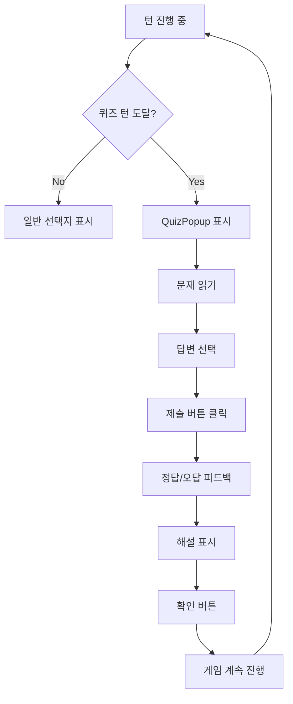

# FEATURE-1: Quiz System Design (퀴즈 시스템 설계)

**EPIC**: EPIC-07 - LLM 기반 AWS 퀴즈 시스템
**책임자**: Designer AI
**상태**: In Progress

---

## 개요

게임 진행 중 랜덤 턴에 AWS 관련 퀴즈를 출제하여 플레이어의 AWS 지식을 평가하고, 정답률에 따라 최종 점수 보너스를 부여한다. 퀴즈는 게임 진행도에 따라 난이도가 자동 조정되며, 교육과 게임성을 균형있게 결합한다.

---

## 목표

### 플레이어 경험
- **학습 동기 부여**: 퀴즈 정답 시 보상을 통해 AWS 지식 학습 동기 제공
- **긴장감 조절**: 랜덤 퀴즈 출제로 예측 불가능성 추가
- **성취감 제공**: 어려운 문제를 맞췄을 때 만족감
- **반복 학습**: 다양한 난이도로 반복 플레이 유도

### 교육 목표
- AWS 핵심 서비스 개념 이해 (EC2, Aurora, EKS, CloudFront 등)
- AWS 아키텍처 패턴 학습 (오토스케일링, 다중 AZ, 글로벌 배포)
- 실무 상황 대응 능력 향상 (트래픽 증가, 장애 복구 등)

---

## 게임 규칙

### 1. 퀴즈 발생 로직

#### 1.1 발생 타이밍
- **한 게임당 5개 퀴즈** 출제
- **랜덤 턴 선택**: 게임 시작 시 5개 턴을 미리 선정
- **선정 조건**:
  - 턴 범위: 3~24턴 (턴 1-2는 튜토리얼이므로 제외, 턴 25는 결과 화면)
  - 최소 간격: 선정된 턴 간 최소 3턴 이상 간격 (연속 퀴즈 방지)
  - 중복 방지: 동일 턴에 여러 퀴즈 불가
  - 이벤트 회피: 동적 이벤트(EPIC-03)가 발생하는 턴은 퀴즈 연기 (다음 턴으로 이동)

**예시**:
```
게임 시작 → 랜덤 선택: [5턴, 9턴, 14턴, 18턴, 23턴]
→ 턴 5 도달 → 퀴즈 팝업 표시
→ 답변 제출 → 게임 계속 진행
→ 턴 9 도달 → 퀴즈 팝업 표시
...
```

#### 1.2 알고리즘 (Seeded Random)
```javascript
// 게임 seed 기반 재현 가능한 랜덤 (EPIC-03의 SecureRandomService 재사용)
function selectQuizTurns(gameSeed: number, totalTurns: number = 25): number[] {
  const validTurns = [3, 4, 5, 6, ..., 23, 24]; // 3~24턴
  const selected: number[] = [];

  while (selected.length < 5) {
    const turn = randomFromSeed(gameSeed + selected.length, validTurns);

    // 최소 간격 3턴 체크
    if (selected.every(t => Math.abs(t - turn) >= 3)) {
      selected.push(turn);
    }
  }

  return selected.sort((a, b) => a - b); // 오름차순 정렬
}
```

---

### 2. 난이도 시스템

#### 2.1 난이도 단계 (3단계)

| 난이도 | 턴 범위 | 특징 | 문제 예시 |
|--------|---------|------|-----------|
| **EASY** | 1-10턴 | 기본 개념, AWS 서비스 소개 | "EC2는 무엇의 약자인가?" |
| **MEDIUM** | 11-20턴 | 실무 응용, 아키텍처 선택 | "트래픽이 10배 증가했을 때 적합한 서비스는?" |
| **HARD** | 21-25턴 | 고급 아키텍처, 복잡한 시나리오 | "Multi-region 배포 시 데이터 정합성 보장 방법은?" |

#### 2.2 난이도 결정 로직
```javascript
function getDifficulty(turnNumber: number): Difficulty {
  if (turnNumber <= 10) return 'EASY';
  if (turnNumber <= 20) return 'MEDIUM';
  return 'HARD';
}
```

#### 2.3 인프라 컨텍스트 반영
- 퀴즈 문제는 **현재 플레이어의 인프라 스택**을 반영
- 예: EC2만 있으면 EC2 관련 문제, EKS 도입 후에는 EKS 문제 출제
- LLM에게 `infraContext: ["EC2", "Aurora", "ALB"]` 전달하여 맞춤형 문제 생성

**예시**:
```
턴 5 (EASY + EC2 only):
Q. "EC2 인스턴스를 확장하는 가장 간단한 방법은?"
A. ① 수직 확장 (인스턴스 타입 업그레이드) ✓
   ② 수평 확장 (인스턴스 추가)
   ③ 데이터베이스 캐싱
   ④ CDN 도입

턴 18 (MEDIUM + EKS):
Q. "EKS 클러스터에서 파드 오토스케일링을 위해 사용하는 도구는?"
A. ① Karpenter ✓
   ② CloudFormation
   ③ AWS Batch
   ④ Lambda
```

---

### 3. 문제 유형

#### 3.1 4지선다 객관식 (Multiple Choice)
- **비율**: 70%
- **구조**: 질문 + 4개 선택지 (A, B, C, D)
- **정답**: 1개만 정답 (나머지는 그럴듯한 오답)
- **해설**: 정답 제출 후 해설 표시 (100-200자)

**예시**:
```markdown
Q. Aurora MySQL Serverless의 주요 장점은?
A. ① 자동 스케일링 및 용량 관리 ✓
   ② 가장 저렴한 RDS 옵션
   ③ MongoDB 호환성
   ④ 로컬 개발 환경 제공

해설: Aurora Serverless는 워크로드에 따라 자동으로
용량을 조정하며, 사용한 만큼만 비용을 지불합니다.
```

#### 3.2 OX 퀴즈 (True/False)
- **비율**: 30%
- **구조**: 명제 + O/X 버튼
- **정답**: O 또는 X
- **해설**: 간결한 설명 (50-100자)

**예시**:
```markdown
Q. "CloudFront는 정적 콘텐츠만 캐싱할 수 있다." (X)

해설: CloudFront는 정적 콘텐츠뿐만 아니라
동적 콘텐츠도 캐싱하고 가속화할 수 있습니다.
```

#### 3.3 문제 유형 선택 로직
```javascript
function selectQuizType(difficulty: Difficulty): QuizType {
  const rand = Math.random();

  // EASY: 50% OX, 50% 4지선다 (OX가 더 쉬움)
  if (difficulty === 'EASY') {
    return rand < 0.5 ? 'OX' : 'MULTIPLE_CHOICE';
  }

  // MEDIUM/HARD: 70% 4지선다, 30% OX
  return rand < 0.7 ? 'MULTIPLE_CHOICE' : 'OX';
}
```

---

### 4. 보상 시스템

#### 4.1 점수 보너스 체계

| 정답 개수 | 정답률 | 보너스 점수 | 등급 |
|-----------|--------|-------------|------|
| 5개 | 100% | **+50점** | 🏆 Perfect |
| 4개 | 80% | **+30점** | 🥇 Excellent |
| 3개 | 60% | **+15점** | 🥈 Good |
| 2개 | 40% | **+5점** | 🥉 Pass |
| 1개 | 20% | **0점** | ❌ Fail |
| 0개 | 0% | **0점** | ❌ Fail |

**최종 점수 계산**:
```javascript
final_score = base_score + quiz_bonus
base_score = (users / 1000) + (cash / 100000) + (trust * 10)
quiz_bonus = getQuizBonus(correctCount)
```

#### 4.2 보너스 점수 밸런스 검증

**시뮬레이션 결과**:
- **평균 게임 점수**: 800~1200점
- **퀴즈 보너스 최대**: +50점 (약 4~6% 영향)
- **밸런스 평가**: ✅ 보너스가 게임 결과를 좌우하지 않지만, 의미 있는 차이 제공

**예시 시나리오**:
```
플레이어 A (퀴즈 5개 정답):
  base_score: 1050
  quiz_bonus: +50
  final_score: 1100 (리더보드 5위)

플레이어 B (퀴즈 2개 정답):
  base_score: 1050
  quiz_bonus: +5
  final_score: 1055 (리더보드 8위)

→ 퀴즈 성적이 순위에 영향을 주지만 결정적이지는 않음
```

---

### 5. 퀴즈 흐름

#### 5.1 플레이어 관점 플로우



#### 5.2 타이밍 세부사항

1. **턴 진행 중**:
   - 플레이어가 선택지를 고른 후 "다음 턴" 버튼 클릭
   - 다음 턴 시작 전에 퀴즈 턴 여부 확인

2. **퀴즈 팝업 표시**:
   - 화면 전체를 덮는 모달 팝업 (dim 배경)
   - 애니메이션: 페이드인 + 슬라이드업 (Framer Motion)
   - BGM 변경: 긴장감 있는 BGM (optional)

3. **답변 제출**:
   - 선택지 클릭 시 하이라이트
   - "제출" 버튼 활성화 (선택 전에는 비활성)
   - 제출 후 선택 변경 불가

4. **피드백**:
   - 정답: ✅ 초록색 + "정답입니다!" 메시지
   - 오답: ❌ 빨간색 + "틀렸습니다. 정답은 ②번입니다." 메시지
   - 해설 표시 (100-200자)
   - 2초 대기 후 "확인" 버튼 표시

5. **게임 복귀**:
   - "확인" 버튼 클릭 → QuizPopup 닫힘
   - 게임 화면으로 복귀 (턴 계속 진행)

---

### 6. 제한 시간 (Optional - Phase 2)

#### 6.1 기본 설정 (Phase 1)
- **제한 시간 없음**: 플레이어가 충분히 생각할 수 있도록
- **스킵 불가**: 퀴즈를 반드시 풀어야 게임 진행 가능

#### 6.2 향후 확장 (Phase 2)
- **제한 시간**: 30초 (EASY), 45초 (MEDIUM), 60초 (HARD)
- **타임아웃 시**: 자동 오답 처리 (-5 trust 페널티)
- **타이머 UI**: 상단에 카운트다운 표시

---

## 수치 모델

### 변수 정의

| 변수명 | 의미 | 초기값 | 범위 | 용도 |
|--------|------|--------|------|------|
| `quizTurns[]` | 퀴즈 출제 턴 배열 | [] | 5개 턴 | 퀴즈 발생 여부 판단 |
| `correctCount` | 정답 개수 | 0 | 0~5 | 보너스 점수 계산 |
| `quizHistory[]` | 퀴즈 이력 | [] | 5개 기록 | 결과 요약 표시 |
| `quizBonus` | 퀴즈 보너스 점수 | 0 | 0~50 | 최종 점수 가산 |

### 수식

```javascript
// 보너스 점수 계산
function getQuizBonus(correctCount: number): number {
  const bonusMap = {
    5: 50,
    4: 30,
    3: 15,
    2: 5,
    1: 0,
    0: 0
  };
  return bonusMap[correctCount] || 0;
}

// 정답률 계산
function getAccuracyRate(correctCount: number, totalQuizzes: number = 5): number {
  return (correctCount / totalQuizzes) * 100; // 0~100%
}

// 최종 점수 계산
function calculateFinalScore(game: Game): number {
  const baseScore =
    (game.users / 1000) +           // 유저 1000명당 1점
    (game.cash / 100000) +          // 자금 10만원당 1점
    (game.trust * 10) +             // 신뢰도 1당 10점
    (game.revenue / 10000);         // 매출 1만원당 1점

  const quizBonus = getQuizBonus(game.correctQuizCount);

  return Math.round(baseScore + quizBonus);
}
```

### 난이도 곡선

```
초반 (Turn 1-10): EASY 문제
- AWS 기본 개념 (EC2, S3, RDS)
- 예상 정답률: 70-80%
- 플레이어 부담 낮음, 자신감 형성

중반 (Turn 11-20): MEDIUM 문제
- 실무 시나리오 (오토스케일링, 다중 AZ)
- 예상 정답률: 50-60%
- 적절한 도전, 학습 효과

후반 (Turn 21-25): HARD 문제
- 고급 아키텍처 (Multi-region, DR)
- 예상 정답률: 30-40%
- 높은 성취감, 전문성 검증
```

---

## 플레이어 시나리오

### 시나리오 1: 성공 케이스 (Perfect Score)

**플레이어**: AWS 경험 있는 개발자

1. **턴 5 도달 (EASY)**:
   - 문제: "EC2 인스턴스를 중지하면 과금이 중단되는 항목은?"
   - 플레이어: ① 컴퓨팅 비용 (정답) 선택
   - 결과: ✅ 정답! +1 정답 카운트

2. **턴 9 도달 (EASY)**:
   - 문제: "Aurora는 MySQL과 호환되는가?" (O/X)
   - 플레이어: O 선택
   - 결과: ✅ 정답! +1 정답 카운트

3. **턴 14 도달 (MEDIUM)**:
   - 문제: "트래픽 급증 시 자동 확장을 위한 서비스는?"
   - 플레이어: ② Auto Scaling (정답) 선택
   - 결과: ✅ 정답! +1 정답 카운트

4. **턴 19 도달 (MEDIUM)**:
   - 문제: "RDS Multi-AZ의 주요 목적은?"
   - 플레이어: ① 고가용성 (정답) 선택
   - 결과: ✅ 정답! +1 정답 카운트

5. **턴 23 도달 (HARD)**:
   - 문제: "Global DB에서 읽기 지연 최소화 방법은?"
   - 플레이어: ③ Read Replica를 각 리전에 배치 (정답) 선택
   - 결과: ✅ 정답! +1 정답 카운트

**게임 종료**:
- 정답 개수: 5/5 (100%)
- 보너스: +50점
- 등급: 🏆 Perfect
- 메시지: "완벽합니다! AWS 전문가시군요!"

---

### 시나리오 2: 실패 케이스 (Low Score)

**플레이어**: AWS 초보자

1. **턴 5 (EASY)**: ✅ 정답 (쉬운 문제)
2. **턴 9 (EASY)**: ❌ 오답 (실수)
3. **턴 14 (MEDIUM)**: ❌ 오답 (모르는 개념)
4. **턴 19 (MEDIUM)**: ❌ 오답 (헷갈림)
5. **턴 23 (HARD)**: ❌ 오답 (어려움)

**게임 종료**:
- 정답 개수: 1/5 (20%)
- 보너스: 0점
- 등급: ❌ Fail
- 메시지: "아쉽습니다. AWS 문서를 다시 확인해보세요!"
- 추천: "Context7로 AWS 학습 자료 제공" 링크

---

### 시나리오 3: 보통 케이스 (Average Score)

**플레이어**: AWS 일반 사용자

1. **턴 5 (EASY)**: ✅ 정답
2. **턴 9 (EASY)**: ✅ 정답
3. **턴 14 (MEDIUM)**: ✅ 정답
4. **턴 19 (MEDIUM)**: ❌ 오답
5. **턴 23 (HARD)**: ❌ 오답

**게임 종료**:
- 정답 개수: 3/5 (60%)
- 보너스: +15점
- 등급: 🥈 Good
- 메시지: "잘하셨습니다! 중급 수준입니다."

---

## Edge Cases

### Case 1: 퀴즈와 동적 이벤트 동시 발생
- **문제**: 턴 10에 퀴즈 예정, 동시에 동적 이벤트(EPIC-03) 발생
- **해결**: 우선순위 설정
  - 동적 이벤트 먼저 처리 (CRISIS, OPPORTUNITY 등)
  - 퀴즈는 다음 턴으로 연기
  - 연기된 퀴즈는 `quizTurns` 배열에서 제거하고 다음 유효 턴에 삽입

**구현 로직**:
```javascript
function handleTurnStart(turn: number, game: Game): void {
  const hasEvent = checkDynamicEvent(game);
  const hasQuiz = game.quizTurns.includes(turn);

  if (hasEvent && hasQuiz) {
    // 이벤트 우선 처리
    showEventPopup(game);

    // 퀴즈 연기 (다음 유효 턴으로)
    const nextTurn = findNextValidTurn(turn + 1, game);
    game.quizTurns = game.quizTurns.map(t => t === turn ? nextTurn : t);
  } else if (hasQuiz) {
    showQuizPopup(game);
  } else if (hasEvent) {
    showEventPopup(game);
  } else {
    showNormalChoices(game);
  }
}
```

---

### Case 2: 플레이어가 퀴즈를 건너뛰려는 경우
- **문제**: "Skip" 버튼을 제공해야 하는가?
- **해결**: Phase 1에서는 스킵 불가
  - 퀴즈는 게임의 핵심 요소이므로 필수 진행
  - Phase 2에서 "스킵 옵션" 추가 가능 (페널티: -10 trust)

---

### Case 3: 네트워크 끊김 중 답변 제출
- **문제**: 답변 제출 중 네트워크 오류 발생
- **해결**:
  - 클라이언트에서 답변을 localStorage에 임시 저장
  - 재접속 시 답변 재전송 시도
  - 서버에서 중복 제출 방지 (quizHistoryId 기반)

---

### Case 4: 퀴즈 생성 실패 (LLM 오류)
- **문제**: vLLM API 장애로 퀴즈 생성 실패
- **해결**:
  - Fallback: 사전 생성된 퀴즈 풀에서 랜덤 선택 (최소 100개 준비)
  - 에러 로그 기록 (Sentry 또는 CloudWatch)
  - 플레이어에게는 투명하게 처리 (오류 노출 안 함)

---

### Case 5: 동일 퀴즈 반복 출제
- **문제**: 플레이어가 여러 게임을 플레이하며 같은 문제를 만남
- **해결**:
  - 퀴즈 풀 크기: 최소 500개 유지
  - 플레이어별 히스토리 추적 (QuizHistory 테이블)
  - LLM 생성 시 히스토리 기반 필터링 (이미 본 문제 제외)

---

### Case 6: 게임 중단 후 재시작
- **문제**: 플레이어가 게임을 중단했다가 나중에 재시작
- **해결**:
  - 게임 상태에 `quizTurns[]`, `correctCount` 저장
  - 이미 푼 퀴즈는 다시 출제하지 않음
  - 중단된 퀴즈가 있다면 재시작 시 해당 퀴즈부터 표시

---

## 수용 기준 (Acceptance Criteria)

### 게임 밸런스
- [ ] 퀴즈 보너스가 최종 점수의 4~6% 범위 내 (게임 결과를 좌우하지 않음)
- [ ] 난이도별 예상 정답률 달성: EASY 70%+, MEDIUM 50%+, HARD 30%+
- [ ] 100게임 시뮬레이션 시 평균 정답 개수 2.5~3.5개

### 플레이어 경험
- [ ] 퀴즈가 게임 몰입을 방해하지 않음 (자연스러운 타이밍)
- [ ] 문제가 명확하고 이해하기 쉬움 (한국어 자연스러움)
- [ ] 정답/오답 피드백이 즉각적이고 명확함
- [ ] 해설이 교육적이고 유익함 (단순 정답 고지가 아님)

### 교육 효과
- [ ] AWS 핵심 개념 5가지 이상 커버 (EC2, Aurora, EKS, CloudFront, Auto Scaling)
- [ ] 실무 시나리오 반영 (트래픽 증가, 장애 복구, 비용 최적화)
- [ ] 플레이어가 게임 후 AWS 지식 향상을 체감 (설문조사 70%+ 만족)

### 기술 요구사항
- [ ] 퀴즈 발생 로직이 재현 가능 (Seeded Random)
- [ ] 동적 이벤트와 충돌 시 안정적 처리
- [ ] 퀴즈 생성 실패 시 Fallback 작동 (사전 생성 풀)
- [ ] 네트워크 오류에도 답변 손실 없음 (localStorage 백업)

---

## 구현 요청사항

### Server AI에게
1. **퀴즈 턴 선정 로직**:
   - `selectQuizTurns(gameSeed)` 함수 구현 (Seeded Random)
   - Game Entity에 `quizTurns: number[]` 필드 추가
   - 최소 간격 3턴 보장 알고리즘

2. **난이도 결정 로직**:
   - `getDifficulty(turnNumber)` 함수 구현
   - 인프라 컨텍스트 추출 로직 (game.infrastructure → infraContext)

3. **보너스 점수 계산**:
   - `calculateQuizBonus(correctCount)` 함수 구현
   - 최종 점수 계산 시 퀴즈 보너스 반영

4. **Edge Case 처리**:
   - 동적 이벤트와 퀴즈 충돌 시 우선순위 로직
   - 퀴즈 생성 실패 시 Fallback 처리

### Client AI에게
1. **QuizPopup UI**:
   - 전체 화면 모달 팝업 (dim 배경)
   - Framer Motion 애니메이션 (페이드인 + 슬라이드업)
   - 4지선다 버튼 레이아웃 (2x2 그리드)
   - OX 버튼 레이아웃 (큰 O/X 버튼)

2. **피드백 UI**:
   - 정답: ✅ 초록색 + "정답입니다!" 애니메이션
   - 오답: ❌ 빨간색 + 정답 표시 + 해설
   - 2초 대기 후 "확인" 버튼 표시

3. **QuizSummary UI**:
   - 게임 종료 화면에 퀴즈 결과 표시
   - 5개 문제 리스트 (O/X 표시)
   - 정답률, 등급, 보너스 점수

4. **상태 관리**:
   - Redux `quizSlice.ts` 생성
   - `currentQuiz`, `quizHistory`, `correctCount` 상태 관리

---

## 밸런스 시뮬레이션 (Designer AI 수행 예정)

### 시뮬레이션 계획
1. **100게임 시뮬레이션**:
   - 정답률 분포: 랜덤 (20%, 40%, 60%, 80%, 100%)
   - 보너스 점수 영향도 측정
   - 리더보드 순위 변화 분석

2. **극단 케이스 테스트**:
   - 모두 정답 (5/5): 보너스 +50점이 순위에 미치는 영향
   - 모두 오답 (0/5): 보너스 0점의 영향
   - 기준선: 퀴즈 없이 게임 완료한 경우와 비교

3. **난이도 검증**:
   - EASY 문제 10개 생성 → QA AI가 정답률 측정
   - MEDIUM 문제 10개 생성 → QA AI가 정답률 측정
   - HARD 문제 10개 생성 → QA AI가 정답률 측정
   - 목표: EASY 70%+, MEDIUM 50%+, HARD 30%+

---

## 후속 작업 (Phase 2+)

### Phase 2: 고급 기능
- **제한 시간**: 난이도별 30~60초 타이머
- **힌트 시스템**: trust -5 소모하여 힌트 획득
- **문제 스킵**: trust -10 페널티로 스킵 가능

### Phase 3: 소셜 기능
- **친구 도전**: 친구와 동일 퀴즈로 대결
- **퀴즈 공유**: SNS에 문제 공유 기능
- **커뮤니티 평가**: 플레이어가 문제 품질 평가 (좋아요/신고)

### Phase 4: 개인화
- **적응형 난이도**: 플레이어 정답률 기반 난이도 자동 조정
- **약점 분석**: 틀린 문제 유형 분석 → 맞춤형 문제 출제
- **학습 리포트**: 게임 종료 시 AWS 지식 수준 리포트 제공

---

**작성자**: Designer AI
**작성일**: 2026-02-05
**검토자**: PO
**상태**: In Progress → Review 대기
**다음 단계**: Server AI가 Feature 2 (LLM Quiz Generator) 시작 + Designer AI가 밸런스 시뮬레이션 수행
