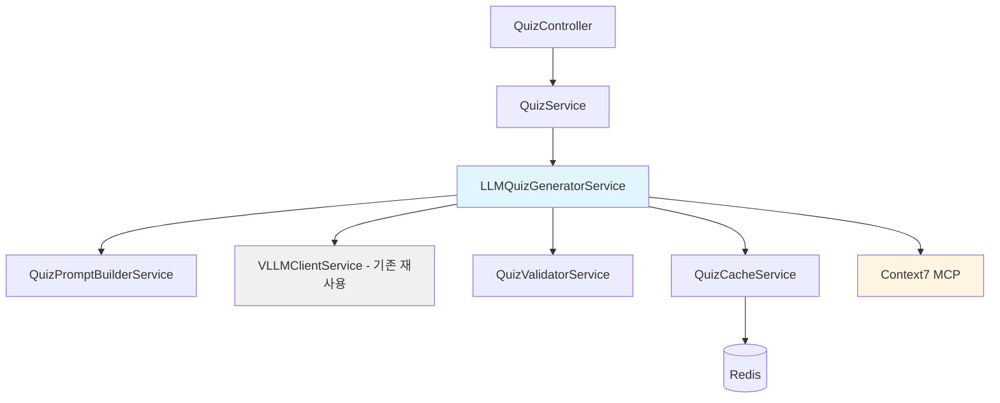

# Implementation Plan: Feature 2 - LLM Quiz Generator

**EPIC**: EPIC-07 - LLM 기반 AWS 퀴즈 시스템
**Feature**: Feature 2 - LLM Quiz Generator
**담당**: Server AI
**상태**: In Progress
**작성일**: 2026-02-05

---

## 목표

vLLM과 Context7를 활용하여 게임 상황에 맞는 AWS 퀴즈를 자동으로 생성하고, 품질 검증을 통해 교육적 가치와 게임 밸런스를 보장한다.

---

## 요구사항 (Feature Spec 기반)

### Functional Requirements
1. **난이도별 퀴즈 생성**: EASY, MEDIUM, HARD 3단계
2. **문제 유형 지원**: 4지선다 객관식, OX 퀴즈
3. **인프라 컨텍스트 반영**: 현재 플레이어의 인프라 스택 기반 문제
4. **Context7 통합**: 최신 AWS 문서 참조
5. **품질 검증**: 정답 유일성, 오답 그럴듯함, 문법 체크
6. **Fallback 처리**: LLM 생성 실패 시 사전 생성 풀 사용

### Non-Functional Requirements
- **성능**: 퀴즈 생성 p95 < 3초 (LLM 호출 포함)
- **품질**: 생성 퀴즈 품질 평가 > 75/100
- **캐싱**: Redis 캐싱으로 응답 시간 단축 (난이도별 풀 10개씩)
- **안정성**: LLM 장애 시에도 게임 진행 가능 (Fallback)

---

## 아키텍처 설계

### 1. 모듈 구조

```
backend/src/quiz/
├── quiz.module.ts                    # QuizModule (새 모듈)
├── quiz.controller.ts                # Quiz API Controller
├── quiz.service.ts                   # Quiz 비즈니스 로직
├── llm-quiz-generator.service.ts    # LLM 퀴즈 생성 오케스트레이터 (NEW)
├── quiz-prompt-builder.service.ts   # 퀴즈 프롬프트 생성 (NEW)
├── quiz-validator.service.ts        # 퀴즈 품질 검증 (NEW)
├── quiz-cache.service.ts            # Redis 캐싱 (NEW)
├── dto/
│   ├── generate-quiz.dto.ts         # 퀴즈 생성 요청 DTO
│   ├── quiz-response.dto.ts         # 퀴즈 응답 DTO
│   └── quiz-answer.dto.ts           # 답변 제출 DTO
├── templates/
│   ├── quiz-prompt-easy.template.ts    # EASY 프롬프트
│   ├── quiz-prompt-medium.template.ts  # MEDIUM 프롬프트
│   └── quiz-prompt-hard.template.ts    # HARD 프롬프트
├── fallback/
│   └── pre-generated-quiz-pool.json # 사전 생성 퀴즈 100개
└── tests/
    ├── llm-quiz-generator.service.spec.ts
    ├── quiz-prompt-builder.service.spec.ts
    └── quiz-validator.service.spec.ts
```

### 2. 의존성



---

## 상세 설계

### 1. LLMQuizGeneratorService (오케스트레이터)

**책임**: 퀴즈 생성 프로세스 전체 조율

```typescript
// backend/src/quiz/llm-quiz-generator.service.ts
import { Injectable } from '@nestjs/common';
import { VLLMClientService } from '../llm/services/vllm-client.service';
import { QuizPromptBuilderService } from './quiz-prompt-builder.service';
import { QuizValidatorService } from './quiz-validator.service';
import { QuizCacheService } from './quiz-cache.service';

export interface QuizGenerationRequest {
  difficulty: 'EASY' | 'MEDIUM' | 'HARD';
  quizType: 'MULTIPLE_CHOICE' | 'OX';
  infraContext: string[];  // ['EC2', 'Aurora', 'ALB']
  turnNumber: number;
}

export interface GeneratedQuiz {
  quizId: string;
  type: 'MULTIPLE_CHOICE' | 'OX';
  difficulty: 'EASY' | 'MEDIUM' | 'HARD';
  question: string;
  options?: string[];  // 4지선다일 때만
  correctAnswer: string | boolean;
  explanation: string;
  infraContext: string[];
  qualityScore: number;
  source: 'LLM' | 'FALLBACK';
}

@Injectable()
export class LLMQuizGeneratorService {
  constructor(
    private vllmClient: VLLMClientService,
    private promptBuilder: QuizPromptBuilderService,
    private validator: QuizValidatorService,
    private cache: QuizCacheService,
  ) {}

  async generateQuiz(request: QuizGenerationRequest): Promise<GeneratedQuiz> {
    // 1. 캐시 확인
    const cached = await this.cache.getQuiz(request.difficulty, request.quizType);
    if (cached) {
      return { ...cached, source: 'CACHE' };
    }

    try {
      // 2. Context7에서 AWS 문서 검색
      const awsDocs = await this.fetchAWSDocumentation(request.infraContext);

      // 3. 프롬프트 생성
      const prompt = this.promptBuilder.buildPrompt({
        difficulty: request.difficulty,
        quizType: request.quizType,
        infraContext: request.infraContext,
        awsDocs,
      });

      // 4. vLLM 호출
      const llmResponse = await this.vllmClient.generate(prompt, {
        temperature: 0.7,
        max_tokens: 500,
        top_p: 0.9,
      });

      // 5. 응답 파싱
      const parsedQuiz = this.parseQuizResponse(llmResponse, request);

      // 6. 품질 검증 (3단계)
      const validationResult = await this.validator.validate(parsedQuiz);
      if (!validationResult.isValid) {
        throw new Error(`Quiz validation failed: ${validationResult.errors.join(', ')}`);
      }

      // 7. 품질 평가
      const qualityScore = await this.evaluateQuality(parsedQuiz);
      if (qualityScore < 75) {
        throw new Error(`Quality score too low: ${qualityScore}`);
      }

      const quiz: GeneratedQuiz = {
        ...parsedQuiz,
        qualityScore,
        source: 'LLM',
      };

      // 8. 캐시 저장
      await this.cache.saveQuiz(quiz);

      return quiz;

    } catch (error) {
      // 9. Fallback: 사전 생성 퀴즈 풀
      console.warn(`LLM generation failed, using fallback: ${error.message}`);
      return this.getFallbackQuiz(request);
    }
  }

  private async fetchAWSDocumentation(infraContext: string[]): Promise<string> {
    // Context7 MCP 사용
    const docs: string[] = [];

    for (const service of infraContext) {
      try {
        // mcp__context7__resolve-library-id
        const libraryId = await this.resolveAWSLibrary(service);

        // mcp__context7__query-docs
        const doc = await this.queryAWSDoc(libraryId, service);
        docs.push(doc);
      } catch (error) {
        console.warn(`Failed to fetch docs for ${service}: ${error.message}`);
      }
    }

    return docs.join('\n\n');
  }

  private parseQuizResponse(llmResponse: string, request: QuizGenerationRequest): Partial<GeneratedQuiz> {
    // LLM 응답을 JSON으로 파싱
    const json = JSON.parse(llmResponse);

    if (request.quizType === 'MULTIPLE_CHOICE') {
      return {
        type: 'MULTIPLE_CHOICE',
        difficulty: request.difficulty,
        question: json.question,
        options: json.options,  // ['A', 'B', 'C', 'D']
        correctAnswer: json.correctAnswer,  // 'A'
        explanation: json.explanation,
        infraContext: request.infraContext,
      };
    } else {
      return {
        type: 'OX',
        difficulty: request.difficulty,
        question: json.question,
        correctAnswer: json.correctAnswer,  // true or false
        explanation: json.explanation,
        infraContext: request.infraContext,
      };
    }
  }

  private async evaluateQuality(quiz: Partial<GeneratedQuiz>): Promise<number> {
    // EPIC-06의 EventQualityScorerService 패턴 재사용
    let score = 0;

    // 1. 일관성 (25점)
    if (this.isQuestionClear(quiz.question)) score += 25;

    // 2. 밸런스 (25점) - 오답이 그럴듯한가?
    if (quiz.type === 'MULTIPLE_CHOICE') {
      if (this.areDistractorsPlausible(quiz.options, quiz.correctAnswer)) score += 25;
    } else {
      score += 25;  // OX는 자동 통과
    }

    // 3. 교육성 (25점)
    if (this.isExplanationInformative(quiz.explanation)) score += 25;

    // 4. 난이도 적합성 (25점)
    if (this.isDifficultyAppropriate(quiz.question, quiz.difficulty)) score += 25;

    return score;
  }

  private getFallbackQuiz(request: QuizGenerationRequest): GeneratedQuiz {
    // pre-generated-quiz-pool.json에서 랜덤 선택
    const pool = require('./fallback/pre-generated-quiz-pool.json');
    const filtered = pool.filter((q: any) =>
      q.difficulty === request.difficulty &&
      q.type === request.quizType
    );

    const quiz = filtered[Math.floor(Math.random() * filtered.length)];

    return {
      ...quiz,
      source: 'FALLBACK',
    };
  }
}
```

---

### 2. QuizPromptBuilderService

**책임**: 난이도/유형별 프롬프트 생성

```typescript
// backend/src/quiz/quiz-prompt-builder.service.ts
import { Injectable } from '@nestjs/common';

@Injectable()
export class QuizPromptBuilderService {
  buildPrompt(params: {
    difficulty: 'EASY' | 'MEDIUM' | 'HARD';
    quizType: 'MULTIPLE_CHOICE' | 'OX';
    infraContext: string[];
    awsDocs: string;
  }): string {
    const { difficulty, quizType, infraContext, awsDocs } = params;

    if (quizType === 'MULTIPLE_CHOICE') {
      return this.buildMultipleChoicePrompt(difficulty, infraContext, awsDocs);
    } else {
      return this.buildOXPrompt(difficulty, infraContext, awsDocs);
    }
  }

  private buildMultipleChoicePrompt(
    difficulty: string,
    infraContext: string[],
    awsDocs: string,
  ): string {
    const difficultyGuide = this.getDifficultyGuide(difficulty);

    return `
당신은 AWS 전문가이자 교육 콘텐츠 제작자입니다.
다음 조건에 맞는 AWS 퀴즈 문제를 생성해주세요.

## 조건
- **난이도**: ${difficulty} (${difficultyGuide})
- **인프라 컨텍스트**: ${infraContext.join(', ')}
- **문제 유형**: 4지선다 객관식
- **언어**: 한국어 (자연스러운 표현)

## AWS 문서 참조
${awsDocs}

## 출력 형식 (JSON)
{
  "question": "문제 텍스트 (명확하고 간결하게)",
  "options": ["선택지 A", "선택지 B", "선택지 C", "선택지 D"],
  "correctAnswer": "A",
  "explanation": "해설 (100-200자, 정답인 이유와 오답인 이유 설명)"
}

## 주의사항
1. 정답은 1개만 (나머지는 그럴듯한 오답)
2. 오답은 완전히 틀린 것이 아니라 미묘하게 다른 것
3. 문제는 실무 시나리오 기반으로 작성
4. 해설은 교육적이고 유익하게 작성
5. ${infraContext.join(', ')} 서비스와 관련된 문제만 출제

JSON 형식으로만 응답하세요.
`;
  }

  private buildOXPrompt(
    difficulty: string,
    infraContext: string[],
    awsDocs: string,
  ): string {
    const difficultyGuide = this.getDifficultyGuide(difficulty);

    return `
당신은 AWS 전문가이자 교육 콘텐츠 제작자입니다.
다음 조건에 맞는 AWS OX 퀴즈 문제를 생성해주세요.

## 조건
- **난이도**: ${difficulty} (${difficultyGuide})
- **인프라 컨텍스트**: ${infraContext.join(', ')}
- **문제 유형**: OX 퀴즈 (True/False)
- **언어**: 한국어

## AWS 문서 참조
${awsDocs}

## 출력 형식 (JSON)
{
  "question": "명제 텍스트 (단정적으로 작성)",
  "correctAnswer": true,  // 또는 false
  "explanation": "해설 (50-100자, 간결하게)"
}

## 주의사항
1. 명제는 명확하고 단정적으로 작성 ("~이다", "~할 수 있다")
2. 너무 쉽거나 너무 어렵지 않게 (${difficultyGuide})
3. 해설은 간결하게 (OX 이유만)
4. ${infraContext.join(', ')} 서비스와 관련된 명제

JSON 형식으로만 응답하세요.
`;
  }

  private getDifficultyGuide(difficulty: string): string {
    const guides = {
      EASY: 'AWS 기본 개념, 서비스 소개 수준 (정답률 70-80% 목표)',
      MEDIUM: '실무 응용, 아키텍처 선택 수준 (정답률 50-60% 목표)',
      HARD: '고급 아키텍처, 복잡한 시나리오 (정답률 30-40% 목표)',
    };
    return guides[difficulty] || guides['MEDIUM'];
  }
}
```

---

### 3. QuizValidatorService

**책임**: 생성된 퀴즈 품질 검증 (3단계)

```typescript
// backend/src/quiz/quiz-validator.service.ts
import { Injectable } from '@nestjs/common';

export interface ValidationResult {
  isValid: boolean;
  errors: string[];
  warnings: string[];
}

@Injectable()
export class QuizValidatorService {
  async validate(quiz: any): Promise<ValidationResult> {
    const errors: string[] = [];
    const warnings: string[] = [];

    // Stage 1: 구조 검증
    const structureErrors = this.validateStructure(quiz);
    errors.push(...structureErrors);

    // Stage 2: 밸런스 검증
    const balanceErrors = this.validateBalance(quiz);
    errors.push(...balanceErrors);

    // Stage 3: 콘텐츠 검증
    const contentWarnings = this.validateContent(quiz);
    warnings.push(...contentWarnings);

    return {
      isValid: errors.length === 0,
      errors,
      warnings,
    };
  }

  private validateStructure(quiz: any): string[] {
    const errors: string[] = [];

    // 필수 필드 확인
    if (!quiz.question || quiz.question.length < 10) {
      errors.push('Question is too short (min 10 characters)');
    }

    if (!quiz.correctAnswer) {
      errors.push('Correct answer is missing');
    }

    if (!quiz.explanation || quiz.explanation.length < 20) {
      errors.push('Explanation is too short (min 20 characters)');
    }

    // 4지선다 검증
    if (quiz.type === 'MULTIPLE_CHOICE') {
      if (!quiz.options || quiz.options.length !== 4) {
        errors.push('Multiple choice must have exactly 4 options');
      }

      if (!['A', 'B', 'C', 'D'].includes(quiz.correctAnswer)) {
        errors.push('Correct answer must be A, B, C, or D');
      }

      // 정답 유일성 확인
      const answerIndex = ['A', 'B', 'C', 'D'].indexOf(quiz.correctAnswer);
      if (!quiz.options[answerIndex]) {
        errors.push('Correct answer option is missing');
      }
    }

    // OX 검증
    if (quiz.type === 'OX') {
      if (typeof quiz.correctAnswer !== 'boolean') {
        errors.push('OX quiz correct answer must be boolean');
      }
    }

    return errors;
  }

  private validateBalance(quiz: any): string[] {
    const errors: string[] = [];

    // 문제 길이 제한
    if (quiz.question.length > 200) {
      errors.push('Question is too long (max 200 characters)');
    }

    // 해설 길이 제한
    if (quiz.type === 'MULTIPLE_CHOICE' && quiz.explanation.length > 300) {
      errors.push('Explanation is too long for multiple choice (max 300)');
    }

    if (quiz.type === 'OX' && quiz.explanation.length > 150) {
      errors.push('Explanation is too long for OX (max 150)');
    }

    // 4지선다: 선택지 길이 균형
    if (quiz.type === 'MULTIPLE_CHOICE') {
      const lengths = quiz.options.map((opt: string) => opt.length);
      const maxLength = Math.max(...lengths);
      const minLength = Math.min(...lengths);

      if (maxLength / minLength > 3) {
        errors.push('Option lengths are too imbalanced');
      }
    }

    return errors;
  }

  private validateContent(quiz: any): string[] {
    const warnings: string[] = [];

    // 한국어 체크 (간단한 휴리스틱)
    const koreanChars = quiz.question.match(/[가-힣]/g) || [];
    if (koreanChars.length < quiz.question.length * 0.3) {
      warnings.push('Question may not be in Korean');
    }

    // 금지어 체크 (비속어, 부적절한 표현)
    const profanityList = ['ㅅㅂ', 'ㅆㅂ', '씨발'];  // 예시
    for (const word of profanityList) {
      if (quiz.question.includes(word) || quiz.explanation.includes(word)) {
        warnings.push(`Contains profanity: ${word}`);
      }
    }

    // 문법 체크 (간단한 휴리스틱)
    if (!quiz.question.endsWith('?') && !quiz.question.endsWith('.')) {
      warnings.push('Question should end with ? or .');
    }

    return warnings;
  }
}
```

---

### 4. QuizCacheService

**책임**: Redis 캐싱으로 성능 최적화

```typescript
// backend/src/quiz/quiz-cache.service.ts
import { Injectable } from '@nestjs/common';
import { Redis } from 'ioredis';

@Injectable()
export class QuizCacheService {
  private redis: Redis;
  private readonly TTL = 300; // 5분
  private readonly POOL_SIZE = 10; // 난이도별 10개씩 미리 생성

  constructor() {
    this.redis = new Redis({
      host: process.env.REDIS_HOST || 'localhost',
      port: parseInt(process.env.REDIS_PORT) || 6379,
    });
  }

  async getQuiz(difficulty: string, quizType: string): Promise<any | null> {
    const key = `quiz:${difficulty}:${quizType}`;
    const cached = await this.redis.lpop(key);

    if (cached) {
      return JSON.parse(cached);
    }

    return null;
  }

  async saveQuiz(quiz: any): Promise<void> {
    const key = `quiz:${quiz.difficulty}:${quiz.type}`;
    await this.redis.rpush(key, JSON.stringify(quiz));
    await this.redis.expire(key, this.TTL);
  }

  async preWarmCache(difficulty: string, quizType: string): Promise<void> {
    const key = `quiz:${difficulty}:${quizType}`;
    const currentSize = await this.redis.llen(key);

    // 풀 크기가 POOL_SIZE 미만이면 채우기
    if (currentSize < this.POOL_SIZE) {
      // 백그라운드 작업으로 퀴즈 생성 요청
      console.log(`Pre-warming cache for ${difficulty} ${quizType}`);
    }
  }
}
```

---

## Context7 통합

### MCP 함수 사용

```typescript
// Context7 라이브러리 ID 조회
async resolveAWSLibrary(serviceName: string): Promise<string> {
  // mcp__context7__resolve-library-id 호출
  const result = await this.mcpClient.call('mcp__context7__resolve-library-id', {
    libraryName: `aws ${serviceName}`,
    query: `AWS ${serviceName} documentation`,
  });

  return result.libraryId;  // 예: '/aws/ec2'
}

// AWS 문서 쿼리
async queryAWSDoc(libraryId: string, serviceName: string): Promise<string> {
  // mcp__context7__query-docs 호출
  const result = await this.mcpClient.call('mcp__context7__query-docs', {
    libraryId,
    query: `What is ${serviceName}? Key features and use cases.`,
  });

  return result.content;
}
```

---

## API 설계 (일부)

```typescript
// POST /api/quiz/generate
@Post('generate')
async generateQuiz(
  @Body() dto: GenerateQuizDto,
): Promise<QuizResponseDto> {
  const quiz = await this.quizGeneratorService.generateQuiz({
    difficulty: dto.difficulty,
    quizType: dto.quizType,
    infraContext: dto.infraContext,
    turnNumber: dto.turnNumber,
  });

  return {
    quizId: quiz.quizId,
    type: quiz.type,
    question: quiz.question,
    options: quiz.options,
    // correctAnswer는 제외 (클라이언트에 노출 안 함)
  };
}
```

---

## 성능 최적화

1. **비동기 생성**: 퀴즈 생성을 비동기로 처리 (Job Queue)
2. **Redis 캐싱**: 난이도별 10개씩 미리 생성
3. **Fallback 풀**: 최소 100개 사전 생성 퀴즈 준비
4. **Context7 캐싱**: AWS 문서를 로컬 캐싱 (1일 TTL)

**목표**: p95 < 3초

---

## 보안 고려사항

1. **입력 검증**: DTO validation (class-validator)
2. **LLM 출력 검증**: JSON 파싱 오류 처리, XSS 방지
3. **Rate Limiting**: 퀴즈 생성 API에 rate limit (1분당 10회)
4. **정답 노출 방지**: 클라이언트에 정답 전송 안 함 (서버에서만 검증)

---

## 테스트 전략

### Unit Tests
- QuizPromptBuilderService: 프롬프트 생성 로직
- QuizValidatorService: 검증 3단계
- LLMQuizGeneratorService: Fallback 로직

### Integration Tests
- vLLM 통합 테스트 (Mock 서버)
- Context7 통합 테스트 (Mock MCP)
- Redis 캐싱 테스트

### E2E Tests
- 퀴즈 생성 → 답변 제출 → 결과 확인 전체 플로우

**목표 커버리지**: 85%+

---

## Fallback: Pre-generated Quiz Pool

```json
// backend/src/quiz/fallback/pre-generated-quiz-pool.json
[
  {
    "quizId": "fallback-001",
    "type": "MULTIPLE_CHOICE",
    "difficulty": "EASY",
    "question": "EC2 인스턴스를 중지하면 과금이 중단되는 항목은?",
    "options": [
      "컴퓨팅 비용",
      "스토리지 비용",
      "네트워크 비용",
      "전체 비용"
    ],
    "correctAnswer": "A",
    "explanation": "EC2 인스턴스를 중지하면 컴퓨팅 비용은 중단되지만, EBS 스토리지와 Elastic IP는 계속 과금됩니다.",
    "infraContext": ["EC2"],
    "qualityScore": 85
  },
  {
    "quizId": "fallback-002",
    "type": "OX",
    "difficulty": "EASY",
    "question": "Aurora는 MySQL과 PostgreSQL 모두와 호환된다.",
    "correctAnswer": true,
    "explanation": "Aurora는 MySQL과 PostgreSQL 두 가지 엔진을 모두 지원합니다.",
    "infraContext": ["Aurora"],
    "qualityScore": 90
  }
  // ... 98개 더
]
```

**사전 생성 계획**:
- EASY: 40개 (4지선다 30개, OX 10개)
- MEDIUM: 40개 (4지선다 30개, OX 10개)
- HARD: 20개 (4지선다 15개, OX 5개)

---

## 다음 단계

1. **Task #3 (Quiz DB Schema)** 병렬 진행 가능
2. Feature 2 구현 완료 후 **Task #4 (Quiz API)** 시작
3. Designer AI가 사전 생성 퀴즈 100개 작성 (별도 Task)

---

**작성자**: Server AI
**검토자**: Tech Lead
**상태**: In Progress → 구현 대기
