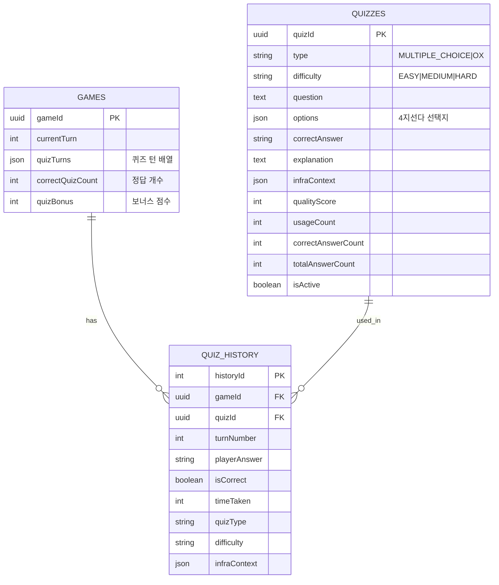

# Implementation Plan: Feature 3 - Quiz Database Schema

**EPIC**: EPIC-07 - LLM 기반 AWS 퀴즈 시스템
**Feature**: Feature 3 - Quiz Database Schema
**담당**: Server AI
**상태**: Completed
**작성일**: 2026-02-05

---

## 목표

퀴즈 시스템을 지원하는 데이터베이스 스키마를 설계하고, Quiz, QuizHistory 엔티티를 구현한다.

---

## 요구사항

### Functional Requirements
1. **퀴즈 저장**: LLM 생성 및 사전 작성 퀴즈 저장
2. **퀴즈 이력 추적**: 게임별 퀴즈 풀이 이력 기록
3. **통계 수집**: 문제별 정답률, 사용 횟수 추적
4. **게임 상태 저장**: 퀴즈 턴, 정답 개수, 보너스 점수

### Non-Functional Requirements
- **성능**: 퀴즈 조회 p95 < 50ms (인덱스 최적화)
- **확장성**: 퀴즈 풀 최소 500개 저장 가능
- **데이터 무결성**: 외래키 제약조건, 트랜잭션 보장

---

## 스키마 설계

### 1. Quiz Entity

**테이블명**: `quizzes`

**설명**: AWS 퀴즈 문제 정보를 저장합니다.

```typescript
@Entity('quizzes')
@Index(['difficulty', 'type'])
@Index(['source'])
export class Quiz {
  quizId: string;              // UUID (PK)
  type: QuizType;              // 'MULTIPLE_CHOICE' or 'OX'
  difficulty: QuizDifficulty;  // 'EASY', 'MEDIUM', 'HARD'
  question: string;            // 문제 텍스트
  options: string[];           // ['A', 'B', 'C', 'D'] - 4지선다만
  correctAnswer: string;       // 'A', 'B', 'C', 'D' or 'true', 'false'
  explanation: string;         // 해설
  infraContext: string[];      // ['EC2', 'Aurora'] - 관련 AWS 서비스
  turnRangeStart: number;      // 적합한 턴 범위 시작 (예: 1)
  turnRangeEnd: number;        // 적합한 턴 범위 끝 (예: 10)
  source: QuizSource;          // 'LLM', 'FALLBACK', 'MANUAL'
  qualityScore: number;        // 0-100 (품질 평가 점수)
  usageCount: number;          // 사용 횟수 (통계)
  correctAnswerCount: number;  // 정답 맞춘 플레이어 수
  totalAnswerCount: number;    // 총 답변 수
  isActive: boolean;           // 활성화 여부
  createdAt: Date;
  updatedAt: Date;
}
```

**인덱스**:
- `(difficulty, type)`: 난이도+유형별 퀴즈 조회
- `(source)`: LLM/Fallback 필터링

**통계 계산**:
```typescript
get accuracyRate(): number {
  return (this.correctAnswerCount / this.totalAnswerCount) * 100;
}
```

---

### 2. QuizHistory Entity

**테이블명**: `quiz_history`

**설명**: 게임별 퀴즈 이력을 추적합니다.

```typescript
@Entity('quiz_history')
@Index(['gameId', 'turnNumber'])
@Index(['gameId', 'quizId'])
@Index(['quizId'])
export class QuizHistory {
  historyId: number;        // Auto-increment (PK)
  gameId: string;           // FK to games.gameId
  quizId: string;           // FK to quizzes.quizId
  turnNumber: number;       // 퀴즈가 출제된 턴
  playerAnswer: string;     // 플레이어 답변
  isCorrect: boolean;       // 정답 여부
  timeTaken: number;        // 답변 소요 시간 (초) - Phase 2
  quizType: string;         // 'MULTIPLE_CHOICE' or 'OX'
  difficulty: string;       // 'EASY', 'MEDIUM', 'HARD'
  infraContext: string[];   // 퀴즈 당시 인프라 컨텍스트
  createdAt: Date;
}
```

**인덱스**:
- `(gameId, turnNumber)`: 게임별 턴별 조회
- `(gameId, quizId)`: 게임별 퀴즈별 조회
- `(quizId)`: 퀴즈별 통계 집계

---

### 3. Game Entity 확장

**추가 필드**:

```typescript
// EPIC-07: Quiz System fields
@Column({ type: 'simple-json', default: '[]' })
quizTurns: number[];          // 퀴즈 출제 턴 배열 (5개)

@Column({ type: 'int', default: 0 })
correctQuizCount: number;     // 정답 개수 (0-5)

@Column({ type: 'int', default: 0 })
quizBonus: number;            // 퀴즈 보너스 점수 (0-50)
```

**위치**: `backend/src/database/entities/game.entity.ts`

---

## ERD (Entity Relationship Diagram)



---

## 마이그레이션 전략

### Phase 1: Quiz & QuizHistory 테이블 생성

```typescript
// backend/src/database/migrations/1738723200000-CreateQuizTables.ts
import { MigrationInterface, QueryRunner, Table, TableIndex } from 'typeorm';

export class CreateQuizTables1738723200000 implements MigrationInterface {
  public async up(queryRunner: QueryRunner): Promise<void> {
    // 1. quizzes 테이블 생성
    await queryRunner.createTable(
      new Table({
        name: 'quizzes',
        columns: [
          {
            name: 'quizId',
            type: 'varchar',
            length: '36',
            isPrimary: true,
          },
          {
            name: 'type',
            type: 'varchar',
            length: '20',
            default: "'MULTIPLE_CHOICE'",
          },
          {
            name: 'difficulty',
            type: 'varchar',
            length: '10',
            default: "'MEDIUM'",
          },
          {
            name: 'question',
            type: 'text',
          },
          {
            name: 'options',
            type: 'text',
            isNullable: true,
          },
          {
            name: 'correctAnswer',
            type: 'varchar',
            length: '10',
          },
          {
            name: 'explanation',
            type: 'text',
          },
          {
            name: 'infraContext',
            type: 'text',
            default: "'[]'",
          },
          {
            name: 'turnRangeStart',
            type: 'int',
            isNullable: true,
          },
          {
            name: 'turnRangeEnd',
            type: 'int',
            isNullable: true,
          },
          {
            name: 'source',
            type: 'varchar',
            length: '20',
            default: "'LLM'",
          },
          {
            name: 'qualityScore',
            type: 'int',
            isNullable: true,
          },
          {
            name: 'usageCount',
            type: 'int',
            default: '0',
          },
          {
            name: 'correctAnswerCount',
            type: 'int',
            default: '0',
          },
          {
            name: 'totalAnswerCount',
            type: 'int',
            default: '0',
          },
          {
            name: 'isActive',
            type: 'boolean',
            default: 'true',
          },
          {
            name: 'createdAt',
            type: 'datetime',
            default: 'CURRENT_TIMESTAMP',
          },
          {
            name: 'updatedAt',
            type: 'datetime',
            default: 'CURRENT_TIMESTAMP',
          },
        ],
      }),
      true,
    );

    // 인덱스 생성
    await queryRunner.createIndex(
      'quizzes',
      new TableIndex({
        name: 'IDX_QUIZ_DIFFICULTY_TYPE',
        columnNames: ['difficulty', 'type'],
      }),
    );

    await queryRunner.createIndex(
      'quizzes',
      new TableIndex({
        name: 'IDX_QUIZ_SOURCE',
        columnNames: ['source'],
      }),
    );

    // 2. quiz_history 테이블 생성
    await queryRunner.createTable(
      new Table({
        name: 'quiz_history',
        columns: [
          {
            name: 'historyId',
            type: 'int',
            isPrimary: true,
            isGenerated: true,
            generationStrategy: 'increment',
          },
          {
            name: 'gameId',
            type: 'varchar',
            length: '36',
          },
          {
            name: 'quizId',
            type: 'varchar',
            length: '36',
          },
          {
            name: 'turnNumber',
            type: 'int',
          },
          {
            name: 'playerAnswer',
            type: 'varchar',
            length: '10',
          },
          {
            name: 'isCorrect',
            type: 'boolean',
          },
          {
            name: 'timeTaken',
            type: 'int',
            isNullable: true,
          },
          {
            name: 'quizType',
            type: 'varchar',
            length: '20',
          },
          {
            name: 'difficulty',
            type: 'varchar',
            length: '10',
          },
          {
            name: 'infraContext',
            type: 'text',
            isNullable: true,
          },
          {
            name: 'createdAt',
            type: 'datetime',
            default: 'CURRENT_TIMESTAMP',
          },
        ],
        foreignKeys: [
          {
            columnNames: ['gameId'],
            referencedTableName: 'games',
            referencedColumnNames: ['gameId'],
            onDelete: 'CASCADE',
          },
          {
            columnNames: ['quizId'],
            referencedTableName: 'quizzes',
            referencedColumnNames: ['quizId'],
            onDelete: 'CASCADE',
          },
        ],
      }),
      true,
    );

    // 인덱스 생성
    await queryRunner.createIndex(
      'quiz_history',
      new TableIndex({
        name: 'IDX_QUIZ_HISTORY_GAME_TURN',
        columnNames: ['gameId', 'turnNumber'],
      }),
    );

    await queryRunner.createIndex(
      'quiz_history',
      new TableIndex({
        name: 'IDX_QUIZ_HISTORY_GAME_QUIZ',
        columnNames: ['gameId', 'quizId'],
      }),
    );

    await queryRunner.createIndex(
      'quiz_history',
      new TableIndex({
        name: 'IDX_QUIZ_HISTORY_QUIZ',
        columnNames: ['quizId'],
      }),
    );
  }

  public async down(queryRunner: QueryRunner): Promise<void> {
    await queryRunner.dropTable('quiz_history');
    await queryRunner.dropTable('quizzes');
  }
}
```

### Phase 2: Game 테이블 필드 추가

```typescript
// backend/src/database/migrations/1738723300000-AddQuizFieldsToGame.ts
import { MigrationInterface, QueryRunner, TableColumn } from 'typeorm';

export class AddQuizFieldsToGame1738723300000 implements MigrationInterface {
  public async up(queryRunner: QueryRunner): Promise<void> {
    await queryRunner.addColumn(
      'games',
      new TableColumn({
        name: 'quizTurns',
        type: 'text',
        default: "'[]'",
      }),
    );

    await queryRunner.addColumn(
      'games',
      new TableColumn({
        name: 'correctQuizCount',
        type: 'int',
        default: '0',
      }),
    );

    await queryRunner.addColumn(
      'games',
      new TableColumn({
        name: 'quizBonus',
        type: 'int',
        default: '0',
      }),
    );
  }

  public async down(queryRunner: QueryRunner): Promise<void> {
    await queryRunner.dropColumn('games', 'quizBonus');
    await queryRunner.dropColumn('games', 'correctQuizCount');
    await queryRunner.dropColumn('games', 'quizTurns');
  }
}
```

---

## 쿼리 최적화

### 자주 사용되는 쿼리

#### 1. 난이도+유형별 랜덤 퀴즈 조회

```sql
SELECT * FROM quizzes
WHERE difficulty = 'EASY'
  AND type = 'MULTIPLE_CHOICE'
  AND isActive = true
ORDER BY RANDOM()
LIMIT 1;
```

**인덱스 활용**: `IDX_QUIZ_DIFFICULTY_TYPE`

---

#### 2. 게임별 퀴즈 이력 조회

```sql
SELECT * FROM quiz_history
WHERE gameId = 'some-uuid'
ORDER BY turnNumber ASC;
```

**인덱스 활용**: `IDX_QUIZ_HISTORY_GAME_TURN`

---

#### 3. 퀴즈별 정답률 통계

```sql
SELECT
  quizId,
  correctAnswerCount,
  totalAnswerCount,
  (correctAnswerCount * 100.0 / totalAnswerCount) as accuracyRate
FROM quizzes
WHERE totalAnswerCount > 10  -- 최소 10명 이상 답변
ORDER BY accuracyRate ASC
LIMIT 10;  -- 가장 어려운 문제 10개
```

**인덱스 활용**: PK `quizId`

---

## 데이터 시딩

### Fallback Quiz Pool (100개)

```typescript
// backend/src/database/seeds/quiz.seed.ts
import { Quiz, QuizDifficulty, QuizType, QuizSource } from '../entities/quiz.entity';

export const quizSeedData: Partial<Quiz>[] = [
  // EASY - MULTIPLE_CHOICE (30개)
  {
    type: QuizType.MULTIPLE_CHOICE,
    difficulty: QuizDifficulty.EASY,
    question: 'EC2 인스턴스를 중지하면 과금이 중단되는 항목은?',
    options: ['컴퓨팅 비용', '스토리지 비용', '네트워크 비용', '전체 비용'],
    correctAnswer: 'A',
    explanation: 'EC2 인스턴스를 중지하면 컴퓨팅 비용은 중단되지만, EBS 스토리지와 Elastic IP는 계속 과금됩니다.',
    infraContext: ['EC2'],
    turnRangeStart: 1,
    turnRangeEnd: 10,
    source: QuizSource.FALLBACK,
    qualityScore: 85,
    isActive: true,
  },
  {
    type: QuizType.MULTIPLE_CHOICE,
    difficulty: QuizDifficulty.EASY,
    question: 'RDS에서 지원하는 데이터베이스 엔진이 아닌 것은?',
    options: ['MySQL', 'PostgreSQL', 'MongoDB', 'MariaDB'],
    correctAnswer: 'C',
    explanation: 'RDS는 관계형 데이터베이스만 지원하며, MongoDB는 NoSQL이므로 지원하지 않습니다. MongoDB는 DocumentDB를 사용합니다.',
    infraContext: ['Aurora', 'RDS'],
    turnRangeStart: 1,
    turnRangeEnd: 10,
    source: QuizSource.FALLBACK,
    qualityScore: 90,
    isActive: true,
  },
  // ... 28개 더

  // EASY - OX (10개)
  {
    type: QuizType.OX,
    difficulty: QuizDifficulty.EASY,
    question: 'Aurora는 MySQL과 PostgreSQL 모두와 호환된다.',
    correctAnswer: 'true',
    explanation: 'Aurora는 MySQL과 PostgreSQL 두 가지 엔진을 모두 지원합니다.',
    infraContext: ['Aurora'],
    turnRangeStart: 1,
    turnRangeEnd: 10,
    source: QuizSource.FALLBACK,
    qualityScore: 90,
    isActive: true,
  },
  // ... 9개 더

  // MEDIUM - MULTIPLE_CHOICE (30개)
  // MEDIUM - OX (10개)
  // HARD - MULTIPLE_CHOICE (15개)
  // HARD - OX (5개)
];
```

---

## 성능 목표

| 작업 | 목표 시간 | 비고 |
|------|----------|------|
| 퀴즈 1개 조회 | < 10ms | 인덱스 활용 |
| 퀴즈 10개 조회 | < 50ms | 난이도+유형 필터 |
| 퀴즈 이력 저장 | < 20ms | 트랜잭션 |
| 게임별 이력 조회 (5개) | < 30ms | 복합 인덱스 |
| 퀴즈 통계 집계 | < 100ms | 집계 함수 |

---

## 보안 고려사항

1. **정답 노출 방지**: API 응답에 `correctAnswer` 제외
2. **외래키 제약**: `ON DELETE CASCADE` (게임 삭제 시 이력 자동 삭제)
3. **입력 검증**: DTO validation (playerAnswer 길이 제한)
4. **인덱스 남용 방지**: 필요한 인덱스만 생성 (쓰기 성능 고려)

---

## 테스트 전략

### Unit Tests
- Quiz Entity getter 메서드 (`accuracyRate`)
- QuizHistory Entity validation

### Integration Tests
- 퀴즈 CRUD 작업
- 외래키 제약 조건 (게임 삭제 시 이력 삭제)
- 인덱스 성능 검증

### Migration Tests
- Up/Down migration 정상 작동
- 롤백 가능성 검증

**목표 커버리지**: 90%+

---

## 다음 단계

1. **마이그레이션 실행**: `npm run migration:run`
2. **Seed 데이터 삽입**: 100개 Fallback 퀴즈 생성
3. **Task #4 (Quiz API)** 시작 (Task #2, #3 완료)

---

**작성자**: Server AI
**검토자**: Tech Lead
**상태**: Completed
**파일 생성**:
- `backend/src/database/entities/quiz.entity.ts`
- `backend/src/database/entities/quiz-history.entity.ts`
- `backend/src/database/entities/game.entity.ts` (수정)
