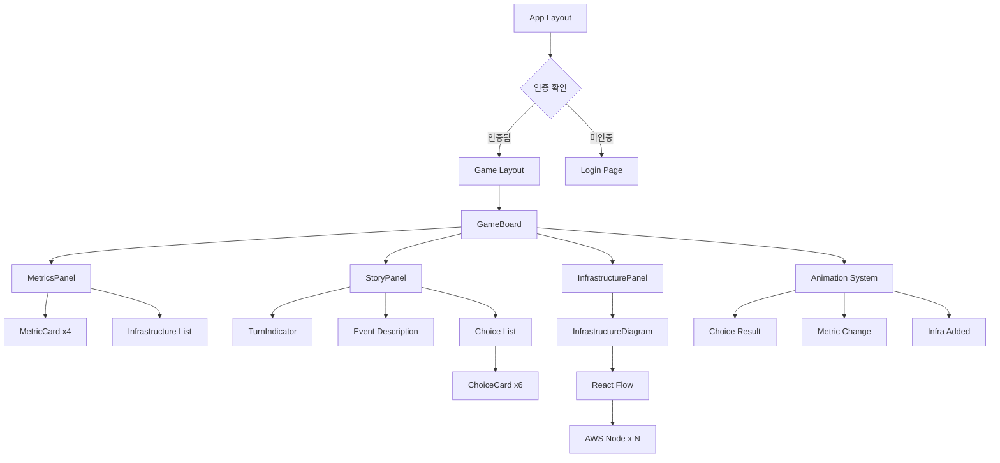
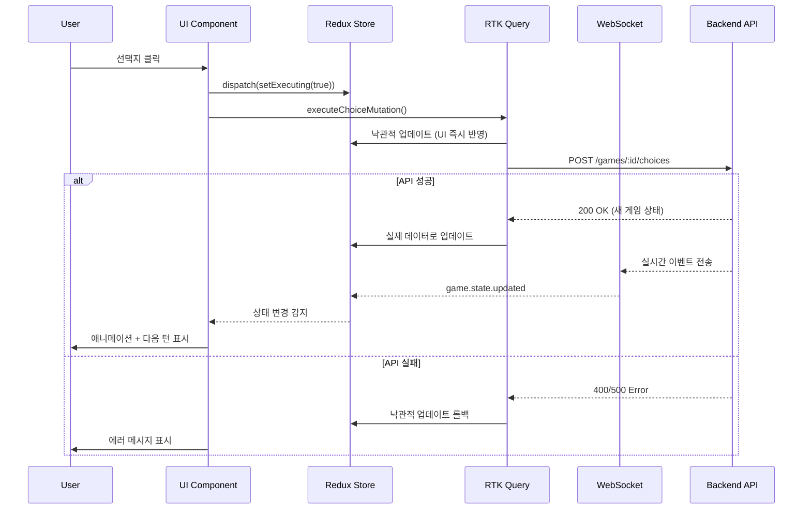

# 프론트엔드 아키텍처 설계서

## 문서 개요

- **프로젝트**: AWS 스타트업 타이쿤 (AWS Startup Tycoon)
- **목적**: 턴 기반 경영 시뮬레이션 게임의 프론트엔드 시스템 설계
- **대상 독자**: 프론트엔드 개발자, UI/UX 엔지니어
- **핵심 특징**: 3패널 반응형 레이아웃, 실시간 AWS 인프라 다이어그램, WebSocket 게임 상태 동기화

---

## 1. 기술 스택 및 아키텍처 결정

### 1.1 핵심 기술 스택

| 영역 | 기술 | 선택 근거 |
|------|------|----------|
| **프레임워크** | Next.js 14 (App Router) | SSR/SSG 지원, 최적화된 번들링, API Routes 통합 |
| **언어** | TypeScript 5.x | 타입 안정성, 백엔드와 타입 공유 가능 |
| **상태 관리** | Redux Toolkit + RTK Query | 복잡한 게임 상태 관리, 서버 상태 캐싱 |
| **스타일링** | TailwindCSS 3.x | 빠른 UI 개발, 일관된 디자인 시스템 |
| **다이어그램** | React Flow | AWS 인프라 시각화, 노드 기반 그래프 |
| **애니메이션** | Framer Motion | 선택지 결과 애니메이션, 부드러운 전환 효과 |
| **국제화** | next-intl | 한글 기본, 다국어 지원 확장 가능 |
| **WebSocket** | Socket.IO Client | 실시간 게임 상태 업데이트 |
| **HTTP 클라이언트** | Axios + RTK Query | 인터셉터 지원, 자동 재시도 로직 |
| **폼 검증** | React Hook Form + Zod | 타입 안전 폼 처리, 스키마 검증 |

### 1.2 Next.js App Router 선택 근거

**App Router 선택 이유**:
- **서버 컴포넌트**: 초기 로딩 성능 향상 (게임 데이터 사전 렌더링)
- **스트리밍 SSR**: 점진적 페이지 로딩으로 TTFB 개선
- **레이아웃 중첩**: 3패널 구조에 최적화된 레이아웃 공유
- **API Routes v2**: 백엔드 프록시로 CORS 문제 해결
- **이미지 최적화**: AWS 아이콘 자동 최적화 (WebP 변환)

**Pages Router 대비 장점**:
```typescript
// App Router - 서버 컴포넌트로 게임 데이터 프리페칭
// app/game/[gameId]/page.tsx
export default async function GamePage({ params }: { params: { gameId: string } }) {
  const gameState = await fetchGameState(params.gameId); // 서버에서 실행

  return <GameBoard initialState={gameState} />;
}

// Pages Router - 클라이언트에서만 데이터 페칭
// pages/game/[gameId].tsx
export default function GamePage() {
  const [gameState, setGameState] = useState(null);

  useEffect(() => {
    fetchGameState().then(setGameState); // 클라이언트에서 실행 (느림)
  }, []);
}
```

### 1.3 상태 관리 전략

**Redux Toolkit 선택 이유**:
- **게임 상태의 복잡성**: 유저 수, 자금, 인프라, 선택 히스토리 등 다층 상태
- **타임 트래블 디버깅**: Redux DevTools로 게임 턴 되돌리기 가능
- **예측 가능성**: 단방향 데이터 흐름으로 버그 추적 용이

**RTK Query 통합**:
- **서버 상태 캐싱**: 턴 정보는 정적 데이터로 24시간 캐싱
- **낙관적 업데이트**: 선택 실행 시 즉시 UI 반영, 실패 시 롤백
- **자동 재페칭**: WebSocket 이벤트 시 특정 쿼리 무효화

**상태 구조 설계**:
```typescript
// store/index.ts
interface RootState {
  game: GameState;           // 현재 게임 상태 (Redux)
  ui: UIState;               // UI 상태 (모달, 로딩)
  auth: AuthState;           // 인증 상태 (Cognito 토큰)
  api: ApiState;             // RTK Query 캐시 (서버 데이터)
}

interface GameState {
  gameId: string;
  currentTurn: number;
  metrics: {
    users: number;
    cash: number;
    revenue: number;
    trust: number;
  };
  infrastructure: string[];
  status: 'active' | 'won' | 'lost';
  history: ChoiceHistory[];
}
```

### 1.4 번들 최적화 전략

**Code Splitting**:
```typescript
// next.config.js
const nextConfig = {
  experimental: {
    optimizePackageImports: ['@aws-sdk', 'react-flow', 'framer-motion']
  },

  webpack: (config, { isServer }) => {
    if (!isServer) {
      // 클라이언트 번들에서 서버 전용 패키지 제외
      config.resolve.fallback = {
        ...config.resolve.fallback,
        fs: false,
        net: false,
        tls: false,
      };
    }

    // AWS 아이콘 SVG 최적화
    config.module.rules.push({
      test: /\.svg$/,
      use: ['@svgr/webpack']
    });

    return config;
  }
};
```

**Dynamic Import 전략**:
```typescript
// 무거운 컴포넌트는 동적 임포트
const InfrastructureDiagram = dynamic(
  () => import('@/components/InfrastructureDiagram'),
  {
    loading: () => <DiagramSkeleton />,
    ssr: false // 클라이언트 전용
  }
);

const AnimationSystem = dynamic(
  () => import('@/components/AnimationSystem'),
  { ssr: false }
);
```

**이미지 최적화**:
```typescript
// AWS 아이콘 최적화 설정
// next.config.js
images: {
  formats: ['image/webp', 'image/avif'],
  deviceSizes: [16, 32, 48, 64], // AWS 아이콘 사이즈
  minimumCacheTTL: 31536000, // 1년 캐싱 (정적 아이콘)

  remotePatterns: [
    {
      protocol: 'https',
      hostname: 'cdn.startup-tycoon.com',
      pathname: '/aws-icons/**',
    }
  ]
}
```

---

## 2. 프로젝트 구조

### 2.1 디렉토리 구조

```
src/
├── app/                          # Next.js App Router
│   ├── (auth)/                   # 인증 라우트 그룹
│   │   ├── login/
│   │   │   └── page.tsx
│   │   └── register/
│   │       └── page.tsx
│   ├── (game)/                   # 게임 라우트 그룹
│   │   ├── game/
│   │   │   └── [gameId]/
│   │   │       ├── page.tsx      # 게임 메인 화면
│   │   │       └── layout.tsx    # 3패널 레이아웃
│   │   ├── leaderboard/
│   │   │   └── page.tsx
│   │   └── history/
│   │       └── page.tsx
│   ├── api/                      # API Routes (프록시)
│   │   ├── auth/
│   │   │   └── route.ts
│   │   └── games/
│   │       └── route.ts
│   ├── layout.tsx                # 루트 레이아웃
│   └── page.tsx                  # 홈페이지
│
├── components/                   # React 컴포넌트
│   ├── game/                     # 게임 관련 컴포넌트
│   │   ├── GameBoard.tsx         # 3패널 메인 레이아웃
│   │   ├── MetricsPanel.tsx      # 좌측 상태 패널
│   │   ├── StoryPanel.tsx        # 중앙 이벤트/선택지
│   │   ├── InfrastructurePanel.tsx  # 우측 다이어그램
│   │   ├── ChoiceCard.tsx        # 선택지 카드
│   │   └── TurnIndicator.tsx     # 턴 표시기
│   ├── diagram/                  # 다이어그램 컴포넌트
│   │   ├── InfrastructureDiagram.tsx  # React Flow 다이어그램
│   │   ├── AWSNode.tsx           # AWS 서비스 노드
│   │   ├── ConnectionEdge.tsx    # 연결선
│   │   └── DiagramControls.tsx   # 줌/팬 컨트롤
│   ├── animation/                # 애니메이션 컴포넌트
│   │   ├── ChoiceResultAnimation.tsx  # 선택 결과 애니메이션
│   │   ├── MetricChangeAnimation.tsx  # 메트릭 변화 표시
│   │   └── InfraAddedAnimation.tsx    # 인프라 추가 효과
│   ├── ui/                       # 공통 UI 컴포넌트
│   │   ├── Button.tsx
│   │   ├── Card.tsx
│   │   ├── Modal.tsx
│   │   ├── LoadingSpinner.tsx
│   │   └── ErrorBoundary.tsx
│   └── layout/                   # 레이아웃 컴포넌트
│       ├── Header.tsx
│       ├── Navigation.tsx
│       └── Footer.tsx
│
├── features/                     # 기능별 모듈 (Slice)
│   ├── game/
│   │   ├── gameSlice.ts          # Redux slice
│   │   ├── gameApi.ts            # RTK Query API
│   │   ├── gameHooks.ts          # 커스텀 훅
│   │   └── gameSelectors.ts      # Reselect 셀렉터
│   ├── auth/
│   │   ├── authSlice.ts
│   │   ├── authApi.ts
│   │   └── authUtils.ts
│   └── leaderboard/
│       ├── leaderboardSlice.ts
│       └── leaderboardApi.ts
│
├── hooks/                        # 커스텀 훅
│   ├── useGameState.ts           # 게임 상태 훅
│   ├── useWebSocket.ts           # WebSocket 연결 훅
│   ├── useInfrastructure.ts      # 인프라 관리 훅
│   ├── useChoiceExecution.ts     # 선택 실행 훅
│   └── useAnimationSequence.ts   # 애니메이션 시퀀스 훅
│
├── lib/                          # 유틸리티 라이브러리
│   ├── api/
│   │   ├── axios.ts              # Axios 인스턴스
│   │   ├── endpoints.ts          # API 엔드포인트
│   │   └── interceptors.ts       # 요청/응답 인터셉터
│   ├── websocket/
│   │   ├── socket.ts             # Socket.IO 클라이언트
│   │   └── eventHandlers.ts      # 이벤트 핸들러
│   ├── diagram/
│   │   ├── layoutEngine.ts       # 다이어그램 레이아웃 엔진
│   │   ├── nodeFactory.ts        # AWS 노드 생성기
│   │   └── edgeFactory.ts        # 연결선 생성기
│   ├── auth/
│   │   ├── cognito.ts            # Cognito 인증
│   │   └── tokenManager.ts       # JWT 토큰 관리
│   └── utils/
│       ├── formatters.ts         # 숫자/날짜 포맷터
│       ├── validators.ts         # 검증 유틸
│       └── constants.ts          # 상수 정의
│
├── store/                        # Redux Store
│   ├── index.ts                  # Store 설정
│   ├── middleware.ts             # 커스텀 미들웨어
│   └── rootReducer.ts            # 루트 리듀서
│
├── types/                        # TypeScript 타입 정의
│   ├── game.ts                   # 게임 관련 타입
│   ├── api.ts                    # API 응답 타입
│   ├── diagram.ts                # 다이어그램 타입
│   └── common.ts                 # 공통 타입
│
├── styles/                       # 전역 스타일
│   ├── globals.css               # Tailwind 전역 스타일
│   ├── animations.css            # 커스텀 애니메이션
│   └── themes.css                # 테마 변수
│
├── public/                       # 정적 파일
│   ├── aws-icons/                # AWS 아이콘 (복사본)
│   ├── images/
│   └── fonts/
│
└── messages/                     # 국제화 메시지
    ├── ko.json                   # 한국어 (기본)
    ├── en.json                   # 영어
    └── ja.json                   # 일본어
```

### 2.2 모듈 의존성 규칙

```typescript
// 의존성 방향 규칙 (단방향)
app/ → features/ → components/ → hooks/ → lib/ → types/

// ❌ 금지: 하위 모듈이 상위 모듈 import
// components/GameBoard.tsx
import { useGameState } from '@/features/game/gameHooks'; // ❌

// ✅ 허용: 상위 모듈이 하위 모듈 import
// features/game/gameHooks.ts
import { useAppSelector } from '@/hooks/useAppSelector'; // ✅
```

---

## 3. 핵심 컴포넌트 설계

### 3.1 GameBoard (메인 레이아웃)

**역할**: 3패널 레이아웃 관리, WebSocket 연결, 전역 상태 동기화

```typescript
// components/game/GameBoard.tsx
'use client';

import { useEffect } from 'react';
import { useGameState } from '@/hooks/useGameState';
import { useWebSocket } from '@/hooks/useWebSocket';
import MetricsPanel from './MetricsPanel';
import StoryPanel from './StoryPanel';
import InfrastructurePanel from './InfrastructurePanel';

interface GameBoardProps {
  gameId: string;
  initialState?: GameState;
}

export default function GameBoard({ gameId, initialState }: GameBoardProps) {
  const { gameState, updateGameState } = useGameState(gameId, initialState);
  const { socket, isConnected } = useWebSocket(gameId);

  useEffect(() => {
    if (!socket) return;

    // WebSocket 이벤트 리스너
    socket.on('game.state.updated', (payload) => {
      updateGameState(payload);
    });

    socket.on('infrastructure.changed', (payload) => {
      // 인프라 변경 애니메이션 트리거
      updateGameState({ infrastructure: payload.added });
    });

    socket.on('game.ended', (payload) => {
      // 게임 종료 처리
      updateGameState({ status: payload.result });
    });

    return () => {
      socket.off('game.state.updated');
      socket.off('infrastructure.changed');
      socket.off('game.ended');
    };
  }, [socket]);

  if (!gameState) {
    return <GameBoardSkeleton />;
  }

  return (
    <div className="flex h-screen w-full bg-gray-50">
      {/* 좌측 패널 (메트릭스) */}
      <aside className="w-80 border-r border-gray-200 bg-white p-6">
        <MetricsPanel
          users={gameState.metrics.users}
          cash={gameState.metrics.cash}
          revenue={gameState.metrics.revenue}
          trust={gameState.metrics.trust}
          infrastructure={gameState.infrastructure}
        />
      </aside>

      {/* 중앙 패널 (스토리/선택지) */}
      <main className="flex-1 overflow-y-auto p-8">
        <StoryPanel
          gameId={gameId}
          currentTurn={gameState.currentTurn}
          status={gameState.status}
        />
      </main>

      {/* 우측 패널 (AWS 다이어그램) */}
      <aside className="w-96 border-l border-gray-200 bg-white p-6">
        <InfrastructurePanel
          infrastructure={gameState.infrastructure}
          isConnected={isConnected}
        />
      </aside>
    </div>
  );
}
```

### 3.2 MetricsPanel (상태 패널)

**역할**: 실시간 메트릭 표시, 변화 애니메이션

```typescript
// components/game/MetricsPanel.tsx
'use client';

import { motion, AnimatePresence } from 'framer-motion';
import { usePrevious } from '@/hooks/usePrevious';
import MetricChangeAnimation from '@/components/animation/MetricChangeAnimation';

interface MetricsPanelProps {
  users: number;
  cash: number;
  revenue: number;
  trust: number;
  infrastructure: string[];
}

export default function MetricsPanel({
  users,
  cash,
  revenue,
  trust,
  infrastructure
}: MetricsPanelProps) {
  const prevUsers = usePrevious(users);
  const prevCash = usePrevious(cash);
  const prevTrust = usePrevious(trust);

  return (
    <div className="space-y-6">
      <h2 className="text-xl font-bold text-gray-900">현재 상태</h2>

      {/* 유저 수 */}
      <MetricCard
        label="유저 수"
        value={users.toLocaleString()}
        previousValue={prevUsers}
        icon="👥"
        trend={users > (prevUsers || 0) ? 'up' : 'down'}
      />

      {/* 자금 */}
      <MetricCard
        label="자금"
        value={`₩${cash.toLocaleString()}`}
        previousValue={prevCash}
        icon="💰"
        trend={cash > (prevCash || 0) ? 'up' : 'down'}
      />

      {/* 신뢰도 */}
      <div className="relative">
        <MetricCard
          label="신뢰도"
          value={`${trust}%`}
          previousValue={prevTrust}
          icon="⭐"
          trend={trust > (prevTrust || 0) ? 'up' : 'down'}
        />
        <TrustMeter value={trust} />
      </div>

      {/* 인프라 목록 */}
      <div className="mt-8">
        <h3 className="text-sm font-semibold text-gray-700 mb-3">
          현재 인프라
        </h3>
        <AnimatePresence mode="popLayout">
          {infrastructure.map((infra) => (
            <motion.div
              key={infra}
              initial={{ opacity: 0, x: -20 }}
              animate={{ opacity: 1, x: 0 }}
              exit={{ opacity: 0, x: 20 }}
              className="flex items-center gap-2 p-2 bg-blue-50 rounded-lg mb-2"
            >
              <AWSIcon name={infra} size={24} />
              <span className="text-sm font-medium text-blue-900">
                {infra}
              </span>
            </motion.div>
          ))}
        </AnimatePresence>
      </div>
    </div>
  );
}

interface MetricCardProps {
  label: string;
  value: string;
  previousValue?: number;
  icon: string;
  trend: 'up' | 'down' | 'neutral';
}

function MetricCard({ label, value, previousValue, icon, trend }: MetricCardProps) {
  const delta = previousValue ? parseInt(value.replace(/\D/g, '')) - previousValue : 0;

  return (
    <motion.div
      layout
      className="bg-gradient-to-br from-blue-50 to-indigo-50 rounded-xl p-4 shadow-sm"
    >
      <div className="flex items-center justify-between mb-2">
        <span className="text-2xl">{icon}</span>
        {delta !== 0 && (
          <MetricChangeAnimation delta={delta} trend={trend} />
        )}
      </div>
      <div className="text-sm text-gray-600">{label}</div>
      <div className="text-2xl font-bold text-gray-900 mt-1">{value}</div>
    </motion.div>
  );
}
```

### 3.3 StoryPanel (선택지 패널)

**역할**: 턴 이벤트 표시, 선택지 렌더링, 선택 실행

```typescript
// components/game/StoryPanel.tsx
'use client';

import { useState } from 'react';
import { useTurnInfo } from '@/features/game/gameHooks';
import { useChoiceExecution } from '@/hooks/useChoiceExecution';
import ChoiceCard from './ChoiceCard';
import TurnIndicator from './TurnIndicator';

interface StoryPanelProps {
  gameId: string;
  currentTurn: number;
  status: 'active' | 'won' | 'lost';
}

export default function StoryPanel({ gameId, currentTurn, status }: StoryPanelProps) {
  const { data: turnInfo, isLoading } = useTurnInfo(currentTurn);
  const { executeChoice, isExecuting } = useChoiceExecution(gameId);
  const [selectedChoiceId, setSelectedChoiceId] = useState<number | null>(null);

  const handleChoiceSelect = async (choiceId: number) => {
    setSelectedChoiceId(choiceId);

    try {
      await executeChoice(choiceId);
      // 성공 시 자동으로 다음 턴으로 이동 (Redux 상태 업데이트)
    } catch (error) {
      console.error('선택 실행 실패:', error);
      setSelectedChoiceId(null);
    }
  };

  if (status === 'won') {
    return <VictoryScreen />;
  }

  if (status === 'lost') {
    return <GameOverScreen />;
  }

  if (isLoading || !turnInfo) {
    return <StoryPanelSkeleton />;
  }

  return (
    <div className="max-w-4xl mx-auto">
      {/* 턴 표시 */}
      <TurnIndicator currentTurn={currentTurn} totalTurns={25} />

      {/* 이벤트 설명 */}
      <motion.div
        initial={{ opacity: 0, y: 20 }}
        animate={{ opacity: 1, y: 0 }}
        className="bg-white rounded-2xl shadow-lg p-8 mb-8"
      >
        <h2 className="text-2xl font-bold text-gray-900 mb-4">
          턴 {currentTurn}
        </h2>
        <p className="text-gray-700 text-lg leading-relaxed">
          {turnInfo.event}
        </p>
      </motion.div>

      {/* 선택지 목록 */}
      <div className="grid grid-cols-1 md:grid-cols-2 gap-4">
        <AnimatePresence mode="wait">
          {turnInfo.choices.map((choice, index) => (
            <motion.div
              key={choice.id}
              initial={{ opacity: 0, y: 20 }}
              animate={{ opacity: 1, y: 0 }}
              transition={{ delay: index * 0.1 }}
            >
              <ChoiceCard
                choice={choice}
                onSelect={() => handleChoiceSelect(choice.id)}
                isSelected={selectedChoiceId === choice.id}
                isDisabled={isExecuting}
              />
            </motion.div>
          ))}
        </AnimatePresence>
      </div>

      {/* 로딩 오버레이 */}
      {isExecuting && (
        <motion.div
          initial={{ opacity: 0 }}
          animate={{ opacity: 1 }}
          className="fixed inset-0 bg-black bg-opacity-50 flex items-center justify-center z-50"
        >
          <LoadingSpinner size="large" />
          <p className="text-white text-xl ml-4">선택을 처리하는 중...</p>
        </motion.div>
      )}
    </div>
  );
}
```

### 3.4 InfrastructureDiagram (AWS 다이어그램)

**역할**: AWS 인프라 자동 시각화, React Flow 기반

```typescript
// components/diagram/InfrastructureDiagram.tsx
'use client';

import { useCallback, useEffect, useState } from 'react';
import ReactFlow, {
  Background,
  Controls,
  MiniMap,
  Node,
  Edge,
  useNodesState,
  useEdgesState,
  addEdge,
  Connection,
} from 'reactflow';
import 'reactflow/dist/style.css';

import { generateDiagramLayout } from '@/lib/diagram/layoutEngine';
import { createAWSNode } from '@/lib/diagram/nodeFactory';
import { createEdge } from '@/lib/diagram/edgeFactory';
import AWSNode from './AWSNode';

const nodeTypes = {
  awsService: AWSNode,
};

interface InfrastructureDiagramProps {
  infrastructure: string[];
  isConnected: boolean;
}

export default function InfrastructureDiagram({
  infrastructure,
  isConnected
}: InfrastructureDiagramProps) {
  const [nodes, setNodes, onNodesChange] = useNodesState([]);
  const [edges, setEdges, onEdgesChange] = useEdgesState([]);

  useEffect(() => {
    // 인프라 배열을 다이어그램 노드/엣지로 변환
    const layout = generateDiagramLayout(infrastructure);

    const newNodes: Node[] = layout.nodes.map((node) =>
      createAWSNode(node.id, node.type, node.position)
    );

    const newEdges: Edge[] = layout.edges.map((edge) =>
      createEdge(edge.source, edge.target, edge.type)
    );

    setNodes(newNodes);
    setEdges(newEdges);
  }, [infrastructure]);

  const onConnect = useCallback(
    (params: Connection) => setEdges((eds) => addEdge(params, eds)),
    [setEdges]
  );

  return (
    <div className="h-full bg-gray-50 rounded-lg relative">
      {/* 연결 상태 표시 */}
      <div className="absolute top-4 right-4 z-10 flex items-center gap-2 bg-white px-3 py-2 rounded-lg shadow-sm">
        <div className={`w-2 h-2 rounded-full ${isConnected ? 'bg-green-500' : 'bg-red-500'}`} />
        <span className="text-sm font-medium text-gray-700">
          {isConnected ? '실시간 동기화' : '연결 끊김'}
        </span>
      </div>

      <ReactFlow
        nodes={nodes}
        edges={edges}
        onNodesChange={onNodesChange}
        onEdgesChange={onEdgesChange}
        onConnect={onConnect}
        nodeTypes={nodeTypes}
        fitView
        attributionPosition="bottom-left"
      >
        <Background color="#e5e7eb" gap={16} />
        <Controls />
        <MiniMap
          nodeColor={(node) => {
            switch (node.type) {
              case 'compute': return '#3b82f6';
              case 'database': return '#10b981';
              case 'storage': return '#f59e0b';
              default: return '#6366f1';
            }
          }}
        />
      </ReactFlow>
    </div>
  );
}
```

### 3.5 ChoiceCard (선택지 카드)

**역할**: 선택지 표시, 효과 미리보기

```typescript
// components/game/ChoiceCard.tsx
'use client';

import { motion } from 'framer-motion';
import { Choice } from '@/types/game';
import { formatNumber } from '@/lib/utils/formatters';

interface ChoiceCardProps {
  choice: Choice;
  onSelect: () => void;
  isSelected: boolean;
  isDisabled: boolean;
}

export default function ChoiceCard({
  choice,
  onSelect,
  isSelected,
  isDisabled
}: ChoiceCardProps) {
  return (
    <motion.button
      onClick={onSelect}
      disabled={isDisabled}
      whileHover={{ scale: 1.02 }}
      whileTap={{ scale: 0.98 }}
      className={`
        w-full text-left p-6 rounded-xl border-2 transition-all
        ${isSelected
          ? 'border-blue-500 bg-blue-50 shadow-lg'
          : 'border-gray-200 bg-white hover:border-blue-300 hover:shadow-md'
        }
        ${isDisabled ? 'opacity-50 cursor-not-allowed' : 'cursor-pointer'}
      `}
    >
      {/* 선택지 텍스트 */}
      <h3 className="text-lg font-semibold text-gray-900 mb-4">
        {choice.text}
      </h3>

      {/* 효과 미리보기 */}
      <div className="space-y-2">
        {choice.preview.users !== 0 && (
          <EffectPreview
            icon="👥"
            label="유저"
            value={choice.preview.users}
            isPositive={choice.preview.users > 0}
          />
        )}

        {choice.preview.cash !== 0 && (
          <EffectPreview
            icon="💰"
            label="자금"
            value={choice.preview.cash}
            isPositive={choice.preview.cash > 0}
            formatter={(v) => `₩${formatNumber(v)}`}
          />
        )}

        {choice.preview.trust !== 0 && (
          <EffectPreview
            icon="⭐"
            label="신뢰도"
            value={choice.preview.trust}
            isPositive={choice.preview.trust > 0}
            formatter={(v) => `${v}%`}
          />
        )}

        {/* 추가되는 인프라 */}
        {choice.preview.infrastructure.length > 0 && (
          <div className="mt-4 pt-4 border-t border-gray-200">
            <p className="text-sm text-gray-600 mb-2">추가되는 인프라:</p>
            <div className="flex flex-wrap gap-2">
              {choice.preview.infrastructure.map((infra) => (
                <span
                  key={infra}
                  className="inline-flex items-center gap-1 px-2 py-1 bg-blue-100 text-blue-700 text-xs font-medium rounded"
                >
                  <AWSIcon name={infra} size={16} />
                  {infra}
                </span>
              ))}
            </div>
          </div>
        )}
      </div>
    </motion.button>
  );
}

interface EffectPreviewProps {
  icon: string;
  label: string;
  value: number;
  isPositive: boolean;
  formatter?: (value: number) => string;
}

function EffectPreview({ icon, label, value, isPositive, formatter }: EffectPreviewProps) {
  const formattedValue = formatter ? formatter(value) : formatNumber(value);
  const sign = value > 0 ? '+' : '';

  return (
    <div className="flex items-center justify-between">
      <div className="flex items-center gap-2">
        <span>{icon}</span>
        <span className="text-sm text-gray-600">{label}</span>
      </div>
      <span className={`text-sm font-semibold ${isPositive ? 'text-green-600' : 'text-red-600'}`}>
        {sign}{formattedValue}
      </span>
    </div>
  );
}
```

---

## 4. AWS 다이어그램 자동 생성

### 4.1 레이아웃 엔진

**역할**: 인프라 배열을 다이어그램 레이아웃으로 변환

```typescript
// lib/diagram/layoutEngine.ts
import { Node, Edge } from 'reactflow';

interface DiagramLayout {
  nodes: Array<{
    id: string;
    type: string;
    position: { x: number; y: number };
  }>;
  edges: Array<{
    source: string;
    target: string;
    type: string;
  }>;
}

export function generateDiagramLayout(infrastructure: string[]): DiagramLayout {
  const nodes: DiagramLayout['nodes'] = [];
  const edges: DiagramLayout['edges'] = [];

  // AWS 서비스 카테고리별 분류
  const categorized = categorizeServices(infrastructure);

  // 레이어별 배치 (계층 구조)
  const layers = {
    frontend: categorized.frontend,  // CloudFront, S3
    compute: categorized.compute,    // EC2, EKS, Lambda
    database: categorized.database,  // Aurora, RDS, Redis
    ai: categorized.ai,              // Bedrock, SageMaker
  };

  let yOffset = 0;

  // 프론트엔드 레이어
  if (layers.frontend.length > 0) {
    const frontendNodes = createLayerNodes(layers.frontend, 'frontend', yOffset);
    nodes.push(...frontendNodes);
    yOffset += 150;
  }

  // 컴퓨트 레이어
  if (layers.compute.length > 0) {
    const computeNodes = createLayerNodes(layers.compute, 'compute', yOffset);
    nodes.push(...computeNodes);

    // 프론트엔드 → 컴퓨트 연결
    if (layers.frontend.includes('CloudFront') && layers.compute.includes('EC2')) {
      edges.push({ source: 'CloudFront', target: 'EC2', type: 'http' });
    }

    yOffset += 150;
  }

  // 데이터베이스 레이어
  if (layers.database.length > 0) {
    const dbNodes = createLayerNodes(layers.database, 'database', yOffset);
    nodes.push(...dbNodes);

    // 컴퓨트 → 데이터베이스 연결
    if (layers.compute.includes('EKS') && layers.database.includes('Aurora')) {
      edges.push({ source: 'EKS', target: 'Aurora', type: 'database' });
    }

    yOffset += 150;
  }

  // AI 레이어
  if (layers.ai.length > 0) {
    const aiNodes = createLayerNodes(layers.ai, 'ai', yOffset);
    nodes.push(...aiNodes);

    // 컴퓨트 → AI 연결
    if (layers.compute.includes('EKS') && layers.ai.includes('Bedrock')) {
      edges.push({ source: 'EKS', target: 'Bedrock', type: 'api' });
    }
  }

  return { nodes, edges };
}

function categorizeServices(infrastructure: string[]) {
  return {
    frontend: infrastructure.filter(s => ['CloudFront', 'S3'].includes(s)),
    compute: infrastructure.filter(s => ['EC2', 'EKS', 'Lambda'].includes(s)),
    database: infrastructure.filter(s => ['Aurora', 'RDS', 'Redis', 'DynamoDB'].includes(s)),
    ai: infrastructure.filter(s => ['Bedrock', 'SageMaker'].includes(s)),
  };
}

function createLayerNodes(
  services: string[],
  category: string,
  yOffset: number
): Array<{ id: string; type: string; position: { x: number; y: number } }> {
  const nodeSpacing = 200;
  const startX = 100;

  return services.map((service, index) => ({
    id: service,
    type: category,
    position: {
      x: startX + (index * nodeSpacing),
      y: yOffset
    }
  }));
}
```

### 4.2 AWS 노드 컴포넌트

**역할**: AWS 서비스를 시각적 노드로 표현

```typescript
// components/diagram/AWSNode.tsx
import { memo } from 'react';
import { Handle, Position, NodeProps } from 'reactflow';
import Image from 'next/image';
import { getAWSIconPath } from '@/lib/utils/awsIcons';

interface AWSNodeData {
  service: string;
  category: 'compute' | 'database' | 'storage' | 'ai';
}

export default memo(function AWSNode({ data }: NodeProps<AWSNodeData>) {
  const iconPath = getAWSIconPath(data.service);
  const categoryColors = {
    compute: 'border-blue-500 bg-blue-50',
    database: 'border-green-500 bg-green-50',
    storage: 'border-yellow-500 bg-yellow-50',
    ai: 'border-purple-500 bg-purple-50',
  };

  return (
    <div className={`
      px-4 py-3 rounded-lg border-2 ${categoryColors[data.category]}
      shadow-md min-w-[150px]
    `}>
      {/* 상단 입력 핸들 */}
      <Handle
        type="target"
        position={Position.Top}
        className="w-3 h-3 bg-blue-500"
      />

      {/* AWS 아이콘 */}
      <div className="flex items-center gap-3">
        <Image
          src={iconPath}
          alt={data.service}
          width={32}
          height={32}
          className="object-contain"
        />
        <span className="text-sm font-semibold text-gray-900">
          {data.service}
        </span>
      </div>

      {/* 하단 출력 핸들 */}
      <Handle
        type="source"
        position={Position.Bottom}
        className="w-3 h-3 bg-blue-500"
      />
    </div>
  );
});
```

### 4.3 AWS 아이콘 유틸리티

**역할**: 공식 AWS 아이콘 경로 매핑

```typescript
// lib/utils/awsIcons.ts
const AWS_ICON_MAP: Record<string, string> = {
  // Compute
  'EC2': '/aws-icons/Arch_Compute/32/Arch_Amazon-EC2_32.svg',
  'EKS': '/aws-icons/Arch_Containers/32/Arch_Amazon-EKS_32.svg',
  'Lambda': '/aws-icons/Arch_Compute/32/Arch_AWS-Lambda_32.svg',

  // Database
  'Aurora': '/aws-icons/Arch_Database/32/Arch_Amazon-Aurora_32.svg',
  'RDS': '/aws-icons/Arch_Database/32/Arch_Amazon-RDS_32.svg',
  'Redis': '/aws-icons/Arch_Database/32/Arch_Amazon-ElastiCache_32.svg',
  'DynamoDB': '/aws-icons/Arch_Database/32/Arch_Amazon-DynamoDB_32.svg',

  // Storage
  'S3': '/aws-icons/Arch_Storage/32/Arch_Amazon-S3_32.svg',
  'CloudFront': '/aws-icons/Arch_Networking/32/Arch_Amazon-CloudFront_32.svg',

  // AI/ML
  'Bedrock': '/aws-icons/Arch_AI/32/Arch_Amazon-Bedrock_32.svg',
  'SageMaker': '/aws-icons/Arch_AI/32/Arch_Amazon-SageMaker_32.svg',
};

export function getAWSIconPath(serviceName: string): string {
  return AWS_ICON_MAP[serviceName] || '/aws-icons/default.svg';
}

export function preloadAWSIcons(services: string[]): void {
  services.forEach(service => {
    const link = document.createElement('link');
    link.rel = 'preload';
    link.as = 'image';
    link.href = getAWSIconPath(service);
    document.head.appendChild(link);
  });
}
```

---

## 5. 상태 관리 설계

### 5.1 Redux Store 구성

```typescript
// store/index.ts
import { configureStore } from '@reduxjs/toolkit';
import { setupListeners } from '@reduxjs/toolkit/query';
import gameReducer from '@/features/game/gameSlice';
import authReducer from '@/features/auth/authSlice';
import { gameApi } from '@/features/game/gameApi';
import { websocketMiddleware } from './middleware/websocket';

export const store = configureStore({
  reducer: {
    game: gameReducer,
    auth: authReducer,
    [gameApi.reducerPath]: gameApi.reducer,
  },
  middleware: (getDefaultMiddleware) =>
    getDefaultMiddleware()
      .concat(gameApi.middleware)
      .concat(websocketMiddleware),
});

setupListeners(store.dispatch);

export type RootState = ReturnType<typeof store.getState>;
export type AppDispatch = typeof store.dispatch;
```

### 5.2 Game Slice

```typescript
// features/game/gameSlice.ts
import { createSlice, PayloadAction } from '@reduxjs/toolkit';

interface GameState {
  gameId: string | null;
  currentTurn: number;
  metrics: {
    users: number;
    cash: number;
    revenue: number;
    trust: number;
  };
  infrastructure: string[];
  status: 'active' | 'won' | 'lost';
  history: ChoiceHistory[];
  isExecuting: boolean;
}

const initialState: GameState = {
  gameId: null,
  currentTurn: 1,
  metrics: {
    users: 0,
    cash: 0,
    revenue: 0,
    trust: 50,
  },
  infrastructure: [],
  status: 'active',
  history: [],
  isExecuting: false,
};

const gameSlice = createSlice({
  name: 'game',
  initialState,
  reducers: {
    initializeGame: (state, action: PayloadAction<{ gameId: string; initialState: GameState }>) => {
      return { ...action.payload.initialState, gameId: action.payload.gameId };
    },

    updateMetrics: (state, action: PayloadAction<Partial<GameState['metrics']>>) => {
      state.metrics = { ...state.metrics, ...action.payload };
    },

    addInfrastructure: (state, action: PayloadAction<string[]>) => {
      const newInfra = new Set([...state.infrastructure, ...action.payload]);
      state.infrastructure = Array.from(newInfra);
    },

    advanceTurn: (state, action: PayloadAction<number>) => {
      state.currentTurn = action.payload;
    },

    setGameStatus: (state, action: PayloadAction<'active' | 'won' | 'lost'>) => {
      state.status = action.payload;
    },

    addToHistory: (state, action: PayloadAction<ChoiceHistory>) => {
      state.history.push(action.payload);
    },

    setExecuting: (state, action: PayloadAction<boolean>) => {
      state.isExecuting = action.payload;
    },
  },
});

export const {
  initializeGame,
  updateMetrics,
  addInfrastructure,
  advanceTurn,
  setGameStatus,
  addToHistory,
  setExecuting,
} = gameSlice.actions;

export default gameSlice.reducer;
```

### 5.3 RTK Query API

```typescript
// features/game/gameApi.ts
import { createApi, fetchBaseQuery } from '@reduxjs/toolkit/query/react';
import type { GameState, TurnInfo, Choice } from '@/types/game';

export const gameApi = createApi({
  reducerPath: 'gameApi',
  baseQuery: fetchBaseQuery({
    baseUrl: '/api/v1',
    prepareHeaders: (headers, { getState }) => {
      const token = (getState() as RootState).auth.token;
      if (token) {
        headers.set('authorization', `Bearer ${token}`);
      }
      return headers;
    },
  }),
  tagTypes: ['Game', 'Turn', 'Leaderboard'],
  endpoints: (builder) => ({
    // 게임 시작
    startGame: builder.mutation<GameState, void>({
      query: () => ({
        url: '/games',
        method: 'POST',
      }),
      invalidatesTags: ['Game'],
    }),

    // 게임 상태 조회
    getGameState: builder.query<GameState, string>({
      query: (gameId) => `/games/${gameId}`,
      providesTags: (result, error, gameId) => [{ type: 'Game', id: gameId }],
    }),

    // 턴 정보 조회 (캐싱 24시간)
    getTurnInfo: builder.query<TurnInfo, number>({
      query: (turnId) => `/turns/${turnId}`,
      providesTags: (result, error, turnId) => [{ type: 'Turn', id: turnId }],
      // 24시간 캐싱
      keepUnusedDataFor: 86400,
    }),

    // 선택 실행 (낙관적 업데이트)
    executeChoice: builder.mutation<GameState, { gameId: string; choiceId: number }>({
      query: ({ gameId, choiceId }) => ({
        url: `/games/${gameId}/choices`,
        method: 'POST',
        body: { choiceId },
      }),
      // 낙관적 업데이트
      async onQueryStarted({ gameId, choiceId }, { dispatch, queryFulfilled, getState }) {
        const patchResult = dispatch(
          gameApi.util.updateQueryData('getGameState', gameId, (draft) => {
            // 즉시 UI 반영 (실제 효과는 서버 응답 후 적용)
            draft.isExecuting = true;
          })
        );

        try {
          const { data } = await queryFulfilled;
          // 성공 시 실제 데이터로 업데이트
          dispatch(
            gameApi.util.updateQueryData('getGameState', gameId, (draft) => {
              Object.assign(draft, data);
            })
          );
        } catch {
          // 실패 시 롤백
          patchResult.undo();
        }
      },
      invalidatesTags: (result, error, { gameId }) => [{ type: 'Game', id: gameId }],
    }),

    // 리더보드 조회
    getLeaderboard: builder.query<LeaderboardEntry[], number>({
      query: (limit = 10) => `/leaderboard/top/${limit}`,
      providesTags: ['Leaderboard'],
      // 5분 캐싱
      keepUnusedDataFor: 300,
    }),
  }),
});

export const {
  useStartGameMutation,
  useGetGameStateQuery,
  useGetTurnInfoQuery,
  useExecuteChoiceMutation,
  useGetLeaderboardQuery,
} = gameApi;
```

---

## 6. API 통신 계층

### 6.1 Axios 인스턴스 설정

```typescript
// lib/api/axios.ts
import axios, { AxiosError, AxiosRequestConfig } from 'axios';
import { getToken, refreshToken } from '@/lib/auth/tokenManager';

const axiosInstance = axios.create({
  baseURL: process.env.NEXT_PUBLIC_API_BASE_URL || 'http://localhost:3000/api/v1',
  timeout: 10000,
  headers: {
    'Content-Type': 'application/json',
  },
});

// 요청 인터셉터 (JWT 토큰 자동 첨부)
axiosInstance.interceptors.request.use(
  (config) => {
    const token = getToken();
    if (token) {
      config.headers.Authorization = `Bearer ${token}`;
    }
    return config;
  },
  (error) => Promise.reject(error)
);

// 응답 인터셉터 (토큰 갱신, 에러 처리)
axiosInstance.interceptors.response.use(
  (response) => response,
  async (error: AxiosError) => {
    const originalRequest = error.config as AxiosRequestConfig & { _retry?: boolean };

    // 401 에러 시 토큰 갱신 시도
    if (error.response?.status === 401 && !originalRequest._retry) {
      originalRequest._retry = true;

      try {
        const newToken = await refreshToken();
        if (newToken && originalRequest.headers) {
          originalRequest.headers.Authorization = `Bearer ${newToken}`;
          return axiosInstance(originalRequest);
        }
      } catch (refreshError) {
        // 토큰 갱신 실패 시 로그아웃
        window.location.href = '/login';
        return Promise.reject(refreshError);
      }
    }

    // 에러 메시지 표준화
    const errorMessage = error.response?.data?.error?.message || '알 수 없는 오류가 발생했습니다.';

    return Promise.reject({
      ...error,
      message: errorMessage,
    });
  }
);

export default axiosInstance;
```

### 6.2 WebSocket 연결 관리

```typescript
// lib/websocket/socket.ts
import { io, Socket } from 'socket.io-client';
import { getToken } from '@/lib/auth/tokenManager';

let socket: Socket | null = null;

export function connectWebSocket(gameId: string): Socket {
  if (socket?.connected) {
    return socket;
  }

  const token = getToken();

  socket = io(process.env.NEXT_PUBLIC_WS_URL || 'http://localhost:3000', {
    auth: { token },
    query: { gameId },
    transports: ['websocket', 'polling'],
    reconnection: true,
    reconnectionAttempts: 5,
    reconnectionDelay: 1000,
  });

  socket.on('connect', () => {
    console.log('WebSocket 연결 성공:', socket?.id);
    socket?.emit('subscribe', { gameId });
  });

  socket.on('disconnect', (reason) => {
    console.log('WebSocket 연결 해제:', reason);
  });

  socket.on('connect_error', (error) => {
    console.error('WebSocket 연결 오류:', error);
  });

  return socket;
}

export function disconnectWebSocket(): void {
  if (socket) {
    socket.disconnect();
    socket = null;
  }
}

export function getSocket(): Socket | null {
  return socket;
}
```

### 6.3 WebSocket 훅

```typescript
// hooks/useWebSocket.ts
import { useEffect, useState, useCallback } from 'react';
import { useDispatch } from 'react-redux';
import { Socket } from 'socket.io-client';
import { connectWebSocket, disconnectWebSocket } from '@/lib/websocket/socket';
import { updateMetrics, addInfrastructure, setGameStatus } from '@/features/game/gameSlice';

export function useWebSocket(gameId: string) {
  const [socket, setSocket] = useState<Socket | null>(null);
  const [isConnected, setIsConnected] = useState(false);
  const dispatch = useDispatch();

  useEffect(() => {
    const ws = connectWebSocket(gameId);
    setSocket(ws);

    ws.on('connect', () => setIsConnected(true));
    ws.on('disconnect', () => setIsConnected(false));

    // 게임 상태 업데이트 이벤트
    ws.on('game.state.updated', (payload: any) => {
      dispatch(updateMetrics(payload.metrics));
    });

    // 인프라 변경 이벤트
    ws.on('infrastructure.changed', (payload: any) => {
      dispatch(addInfrastructure(payload.added));
    });

    // 게임 종료 이벤트
    ws.on('game.ended', (payload: any) => {
      dispatch(setGameStatus(payload.result));
    });

    return () => {
      disconnectWebSocket();
    };
  }, [gameId, dispatch]);

  const emit = useCallback((event: string, data: any) => {
    socket?.emit(event, data);
  }, [socket]);

  return { socket, isConnected, emit };
}
```

---

## 7. 인증 및 라우팅

### 7.1 Cognito 로그인 플로우

```typescript
// lib/auth/cognito.ts
import {
  CognitoUserPool,
  CognitoUser,
  AuthenticationDetails,
  CognitoUserSession,
} from 'amazon-cognito-identity-js';

const userPool = new CognitoUserPool({
  UserPoolId: process.env.NEXT_PUBLIC_COGNITO_USER_POOL_ID!,
  ClientId: process.env.NEXT_PUBLIC_COGNITO_CLIENT_ID!,
});

export function signIn(email: string, password: string): Promise<CognitoUserSession> {
  return new Promise((resolve, reject) => {
    const authenticationDetails = new AuthenticationDetails({
      Username: email,
      Password: password,
    });

    const cognitoUser = new CognitoUser({
      Username: email,
      Pool: userPool,
    });

    cognitoUser.authenticateUser(authenticationDetails, {
      onSuccess: (session) => {
        resolve(session);
      },
      onFailure: (err) => {
        reject(err);
      },
      newPasswordRequired: (userAttributes) => {
        reject(new Error('새 비밀번호 필요'));
      },
    });
  });
}

export function signOut(): Promise<void> {
  return new Promise((resolve) => {
    const cognitoUser = userPool.getCurrentUser();
    if (cognitoUser) {
      cognitoUser.signOut();
    }
    resolve();
  });
}

export function getCurrentUser(): CognitoUser | null {
  return userPool.getCurrentUser();
}

export function getSession(): Promise<CognitoUserSession> {
  return new Promise((resolve, reject) => {
    const cognitoUser = getCurrentUser();

    if (!cognitoUser) {
      reject(new Error('사용자 없음'));
      return;
    }

    cognitoUser.getSession((err: Error | null, session: CognitoUserSession | null) => {
      if (err || !session) {
        reject(err);
      } else {
        resolve(session);
      }
    });
  });
}
```

### 7.2 JWT 토큰 관리

```typescript
// lib/auth/tokenManager.ts
import Cookies from 'js-cookie';
import { getSession } from './cognito';

const TOKEN_KEY = 'auth_token';
const REFRESH_TOKEN_KEY = 'refresh_token';

export function setToken(token: string): void {
  // httpOnly cookie는 서버에서만 설정 가능
  // 클라이언트에서는 secure cookie 사용
  Cookies.set(TOKEN_KEY, token, {
    expires: 7, // 7일
    secure: process.env.NODE_ENV === 'production',
    sameSite: 'strict',
  });
}

export function getToken(): string | undefined {
  return Cookies.get(TOKEN_KEY);
}

export function removeToken(): void {
  Cookies.remove(TOKEN_KEY);
  Cookies.remove(REFRESH_TOKEN_KEY);
}

export async function refreshToken(): Promise<string | null> {
  try {
    const session = await getSession();
    const newToken = session.getIdToken().getJwtToken();
    setToken(newToken);
    return newToken;
  } catch (error) {
    console.error('토큰 갱신 실패:', error);
    return null;
  }
}

export function isTokenExpired(): boolean {
  const token = getToken();
  if (!token) return true;

  try {
    const payload = JSON.parse(atob(token.split('.')[1]));
    const exp = payload.exp * 1000; // 밀리초 변환
    return Date.now() >= exp;
  } catch {
    return true;
  }
}
```

### 7.3 Protected Routes 구현

```typescript
// app/(game)/layout.tsx
'use client';

import { useEffect } from 'react';
import { useRouter } from 'next/navigation';
import { useSelector } from 'react-redux';
import { RootState } from '@/store';

export default function GameLayout({ children }: { children: React.ReactNode }) {
  const router = useRouter();
  const isAuthenticated = useSelector((state: RootState) => state.auth.isAuthenticated);

  useEffect(() => {
    if (!isAuthenticated) {
      router.push('/login');
    }
  }, [isAuthenticated, router]);

  if (!isAuthenticated) {
    return (
      <div className="flex items-center justify-center h-screen">
        <LoadingSpinner size="large" />
      </div>
    );
  }

  return <>{children}</>;
}
```

### 7.4 세션 지속성

```typescript
// hooks/useAuthPersistence.ts
import { useEffect } from 'react';
import { useDispatch } from 'react-redux';
import { setUser, setAuthenticated } from '@/features/auth/authSlice';
import { getSession } from '@/lib/auth/cognito';
import { setToken } from '@/lib/auth/tokenManager';

export function useAuthPersistence() {
  const dispatch = useDispatch();

  useEffect(() => {
    // 페이지 로드 시 세션 복구 시도
    getSession()
      .then((session) => {
        const idToken = session.getIdToken();
        const payload = idToken.decodePayload();

        dispatch(setUser({
          userId: payload.sub,
          email: payload.email,
          username: payload['cognito:username'],
        }));
        dispatch(setAuthenticated(true));
        setToken(idToken.getJwtToken());
      })
      .catch(() => {
        // 세션 없음 - 로그인 필요
        dispatch(setAuthenticated(false));
      });
  }, [dispatch]);
}
```

---

## 8. 성능 최적화

### 8.1 메모이제이션 전략

```typescript
// components/game/MetricsPanel.tsx (최적화 버전)
import { memo, useMemo } from 'react';

export default memo(function MetricsPanel({
  users,
  cash,
  revenue,
  trust,
  infrastructure
}: MetricsPanelProps) {
  // 계산 비용이 높은 작업은 useMemo로 캐싱
  const formattedMetrics = useMemo(() => ({
    users: users.toLocaleString('ko-KR'),
    cash: `₩${cash.toLocaleString('ko-KR')}`,
    revenue: `₩${revenue.toLocaleString('ko-KR')}`,
    trust: `${trust}%`,
  }), [users, cash, revenue, trust]);

  const infraCount = useMemo(() =>
    infrastructure.length,
    [infrastructure]
  );

  return (
    <div className="space-y-6">
      {/* ... */}
    </div>
  );
}, (prevProps, nextProps) => {
  // 커스텀 비교 함수 - 깊은 비교 방지
  return (
    prevProps.users === nextProps.users &&
    prevProps.cash === nextProps.cash &&
    prevProps.trust === nextProps.trust &&
    prevProps.infrastructure.length === nextProps.infrastructure.length
  );
});
```

### 8.2 Virtual Scrolling (선택지 많을 때)

```typescript
// components/game/ChoiceList.tsx
import { useVirtualizer } from '@tanstack/react-virtual';
import { useRef } from 'react';

interface ChoiceListProps {
  choices: Choice[];
  onSelect: (choiceId: number) => void;
}

export default function ChoiceList({ choices, onSelect }: ChoiceListProps) {
  const parentRef = useRef<HTMLDivElement>(null);

  const virtualizer = useVirtualizer({
    count: choices.length,
    getScrollElement: () => parentRef.current,
    estimateSize: () => 200, // 예상 카드 높이
    overscan: 5, // 화면 밖 렌더링 개수
  });

  return (
    <div ref={parentRef} className="h-[600px] overflow-auto">
      <div
        style={{
          height: `${virtualizer.getTotalSize()}px`,
          width: '100%',
          position: 'relative',
        }}
      >
        {virtualizer.getVirtualItems().map((virtualItem) => {
          const choice = choices[virtualItem.index];

          return (
            <div
              key={virtualItem.key}
              style={{
                position: 'absolute',
                top: 0,
                left: 0,
                width: '100%',
                height: `${virtualItem.size}px`,
                transform: `translateY(${virtualItem.start}px)`,
              }}
            >
              <ChoiceCard
                choice={choice}
                onSelect={() => onSelect(choice.id)}
              />
            </div>
          );
        })}
      </div>
    </div>
  );
}
```

### 8.3 이미지 최적화

```typescript
// components/ui/AWSIcon.tsx
import Image from 'next/image';
import { getAWSIconPath } from '@/lib/utils/awsIcons';

interface AWSIconProps {
  name: string;
  size?: 16 | 32 | 48 | 64;
  priority?: boolean;
}

export default function AWSIcon({ name, size = 32, priority = false }: AWSIconProps) {
  const iconPath = getAWSIconPath(name, size);

  return (
    <Image
      src={iconPath}
      alt={name}
      width={size}
      height={size}
      priority={priority} // LCP 이미지는 priority 설정
      loading={priority ? undefined : 'lazy'}
      quality={90}
      placeholder="blur"
      blurDataURL="data:image/svg+xml;base64,..." // 블러 플레이스홀더
    />
  );
}
```

### 8.4 코드 스플리팅

```typescript
// app/(game)/game/[gameId]/page.tsx
import dynamic from 'next/dynamic';

// 초기 로딩에 불필요한 컴포넌트는 동적 임포트
const InfrastructureDiagram = dynamic(
  () => import('@/components/diagram/InfrastructureDiagram'),
  {
    loading: () => <DiagramSkeleton />,
    ssr: false, // 다이어그램은 클라이언트 전용
  }
);

const AnimationSystem = dynamic(
  () => import('@/components/animation/AnimationSystem'),
  { ssr: false }
);

const Leaderboard = dynamic(
  () => import('@/components/game/Leaderboard'),
  {
    loading: () => <LeaderboardSkeleton />,
  }
);

export default async function GamePage({ params }: { params: { gameId: string } }) {
  const gameState = await fetchGameState(params.gameId);

  return (
    <GameBoard gameId={params.gameId} initialState={gameState}>
      <InfrastructureDiagram infrastructure={gameState.infrastructure} />
      <AnimationSystem />
      <Leaderboard />
    </GameBoard>
  );
}
```

---

## 9. 애니메이션 및 UX

### 9.1 선택 결과 애니메이션 시퀀스

```typescript
// components/animation/ChoiceResultAnimation.tsx
import { motion, AnimatePresence } from 'framer-motion';
import { useEffect, useState } from 'react';

interface ChoiceResultAnimationProps {
  effects: {
    users: number;
    cash: number;
    trust: number;
    infrastructure: string[];
  };
  onComplete: () => void;
}

export default function ChoiceResultAnimation({
  effects,
  onComplete
}: ChoiceResultAnimationProps) {
  const [stage, setStage] = useState<'metrics' | 'infrastructure' | 'complete'>('metrics');

  useEffect(() => {
    const metricsTimer = setTimeout(() => {
      setStage('infrastructure');
    }, 2000);

    const infraTimer = setTimeout(() => {
      setStage('complete');
      onComplete();
    }, 4000);

    return () => {
      clearTimeout(metricsTimer);
      clearTimeout(infraTimer);
    };
  }, [onComplete]);

  return (
    <AnimatePresence mode="wait">
      {stage === 'metrics' && (
        <motion.div
          key="metrics"
          initial={{ opacity: 0, scale: 0.8 }}
          animate={{ opacity: 1, scale: 1 }}
          exit={{ opacity: 0, scale: 1.2 }}
          className="fixed inset-0 flex items-center justify-center bg-black bg-opacity-50 z-50"
        >
          <div className="bg-white rounded-2xl p-8 max-w-md">
            <h3 className="text-2xl font-bold mb-6 text-center">결과</h3>

            <div className="space-y-4">
              <MetricAnimation
                label="유저 수"
                value={effects.users}
                icon="👥"
                delay={0}
              />
              <MetricAnimation
                label="자금"
                value={effects.cash}
                icon="💰"
                delay={0.2}
              />
              <MetricAnimation
                label="신뢰도"
                value={effects.trust}
                icon="⭐"
                delay={0.4}
              />
            </div>
          </div>
        </motion.div>
      )}

      {stage === 'infrastructure' && effects.infrastructure.length > 0 && (
        <motion.div
          key="infrastructure"
          initial={{ opacity: 0, y: 50 }}
          animate={{ opacity: 1, y: 0 }}
          exit={{ opacity: 0, y: -50 }}
          className="fixed inset-0 flex items-center justify-center bg-black bg-opacity-50 z-50"
        >
          <div className="bg-white rounded-2xl p-8 max-w-md">
            <h3 className="text-2xl font-bold mb-6 text-center">
              새로운 인프라 추가
            </h3>

            <div className="space-y-3">
              {effects.infrastructure.map((infra, index) => (
                <motion.div
                  key={infra}
                  initial={{ opacity: 0, x: -50 }}
                  animate={{ opacity: 1, x: 0 }}
                  transition={{ delay: index * 0.2 }}
                  className="flex items-center gap-3 p-3 bg-blue-50 rounded-lg"
                >
                  <AWSIcon name={infra} size={32} />
                  <span className="text-lg font-semibold text-blue-900">
                    {infra}
                  </span>
                </motion.div>
              ))}
            </div>
          </div>
        </motion.div>
      )}
    </AnimatePresence>
  );
}

function MetricAnimation({
  label,
  value,
  icon,
  delay
}: {
  label: string;
  value: number;
  icon: string;
  delay: number;
}) {
  return (
    <motion.div
      initial={{ opacity: 0, x: -30 }}
      animate={{ opacity: 1, x: 0 }}
      transition={{ delay }}
      className="flex items-center justify-between"
    >
      <div className="flex items-center gap-2">
        <span className="text-2xl">{icon}</span>
        <span className="text-gray-700">{label}</span>
      </div>
      <motion.span
        initial={{ scale: 0 }}
        animate={{ scale: 1 }}
        transition={{ delay: delay + 0.3, type: 'spring' }}
        className={`text-xl font-bold ${value > 0 ? 'text-green-600' : 'text-red-600'}`}
      >
        {value > 0 ? '+' : ''}{value.toLocaleString()}
      </motion.span>
    </motion.div>
  );
}
```

### 9.2 로딩 상태 처리

```typescript
// components/ui/LoadingStates.tsx
import { motion } from 'framer-motion';

export function GameBoardSkeleton() {
  return (
    <div className="flex h-screen w-full bg-gray-50">
      {/* 좌측 패널 스켈레톤 */}
      <aside className="w-80 border-r border-gray-200 bg-white p-6">
        <div className="space-y-6">
          <div className="h-8 bg-gray-200 rounded animate-pulse" />
          {[1, 2, 3, 4].map((i) => (
            <div key={i} className="h-24 bg-gray-200 rounded-xl animate-pulse" />
          ))}
        </div>
      </aside>

      {/* 중앙 패널 스켈레톤 */}
      <main className="flex-1 p-8">
        <div className="max-w-4xl mx-auto space-y-6">
          <div className="h-10 bg-gray-200 rounded animate-pulse" />
          <div className="h-32 bg-gray-200 rounded-2xl animate-pulse" />
          <div className="grid grid-cols-2 gap-4">
            {[1, 2, 3, 4].map((i) => (
              <div key={i} className="h-40 bg-gray-200 rounded-xl animate-pulse" />
            ))}
          </div>
        </div>
      </main>

      {/* 우측 패널 스켈레톤 */}
      <aside className="w-96 border-l border-gray-200 bg-white p-6">
        <div className="h-full bg-gray-200 rounded-lg animate-pulse" />
      </aside>
    </div>
  );
}

export function LoadingSpinner({ size = 'medium' }: { size?: 'small' | 'medium' | 'large' }) {
  const sizes = {
    small: 'w-6 h-6',
    medium: 'w-10 h-10',
    large: 'w-16 h-16',
  };

  return (
    <motion.div
      className={`${sizes[size]} border-4 border-blue-200 border-t-blue-600 rounded-full`}
      animate={{ rotate: 360 }}
      transition={{ duration: 1, repeat: Infinity, ease: 'linear' }}
    />
  );
}
```

### 9.3 에러 상태 UI

```typescript
// components/ui/ErrorBoundary.tsx
'use client';

import { Component, ReactNode } from 'react';
import { motion } from 'framer-motion';

interface Props {
  children: ReactNode;
  fallback?: ReactNode;
}

interface State {
  hasError: boolean;
  error?: Error;
}

export default class ErrorBoundary extends Component<Props, State> {
  constructor(props: Props) {
    super(props);
    this.state = { hasError: false };
  }

  static getDerivedStateFromError(error: Error): State {
    return { hasError: true, error };
  }

  componentDidCatch(error: Error, errorInfo: any) {
    console.error('ErrorBoundary caught:', error, errorInfo);
  }

  render() {
    if (this.state.hasError) {
      if (this.props.fallback) {
        return this.props.fallback;
      }

      return (
        <motion.div
          initial={{ opacity: 0, y: 20 }}
          animate={{ opacity: 1, y: 0 }}
          className="flex flex-col items-center justify-center h-screen bg-gray-50"
        >
          <div className="text-6xl mb-4">⚠️</div>
          <h2 className="text-2xl font-bold text-gray-900 mb-2">
            오류가 발생했습니다
          </h2>
          <p className="text-gray-600 mb-6">
            {this.state.error?.message || '알 수 없는 오류'}
          </p>
          <button
            onClick={() => window.location.reload()}
            className="px-6 py-3 bg-blue-600 text-white rounded-lg hover:bg-blue-700 transition-colors"
          >
            페이지 새로고침
          </button>
        </motion.div>
      );
    }

    return this.props.children;
  }
}
```

---

## 10. 국제화 (i18n)

### 10.1 next-intl 설정

```typescript
// i18n.ts
import { getRequestConfig } from 'next-intl/server';
import { notFound } from 'next/navigation';

const locales = ['ko', 'en', 'ja'];

export default getRequestConfig(async ({ locale }) => {
  if (!locales.includes(locale as any)) notFound();

  return {
    messages: (await import(`./messages/${locale}.json`)).default,
    timeZone: 'Asia/Seoul',
    now: new Date(),
  };
});
```

### 10.2 언어 파일 구조

```json
// messages/ko.json
{
  "game": {
    "title": "AWS 스타트업 타이쿤",
    "turn": "턴 {turn}",
    "status": {
      "active": "진행 중",
      "won": "IPO 성공!",
      "lost": "게임 오버"
    },
    "metrics": {
      "users": "유저 수",
      "cash": "자금",
      "revenue": "매출",
      "trust": "신뢰도"
    },
    "infrastructure": {
      "title": "현재 인프라",
      "added": "새로운 인프라 추가: {services}"
    },
    "choices": {
      "select": "선택하기",
      "executing": "선택을 처리하는 중...",
      "preview": "효과 미리보기"
    }
  },
  "leaderboard": {
    "title": "리더보드",
    "rank": "순위",
    "score": "기업가치",
    "myRank": "내 순위: {rank}위"
  },
  "auth": {
    "login": "로그인",
    "logout": "로그아웃",
    "email": "이메일",
    "password": "비밀번호",
    "signIn": "로그인하기",
    "signUp": "회원가입"
  },
  "errors": {
    "network": "네트워크 오류가 발생했습니다.",
    "unauthorized": "인증이 필요합니다.",
    "gameNotFound": "게임을 찾을 수 없습니다.",
    "insufficientCash": "자금이 부족합니다."
  }
}
```

```json
// messages/en.json
{
  "game": {
    "title": "AWS Startup Tycoon",
    "turn": "Turn {turn}",
    "status": {
      "active": "Active",
      "won": "IPO Success!",
      "lost": "Game Over"
    },
    "metrics": {
      "users": "Users",
      "cash": "Cash",
      "revenue": "Revenue",
      "trust": "Trust"
    },
    "infrastructure": {
      "title": "Current Infrastructure",
      "added": "New infrastructure added: {services}"
    },
    "choices": {
      "select": "Select",
      "executing": "Executing choice...",
      "preview": "Effect Preview"
    }
  },
  "leaderboard": {
    "title": "Leaderboard",
    "rank": "Rank",
    "score": "Company Value",
    "myRank": "My Rank: #{rank}"
  },
  "auth": {
    "login": "Login",
    "logout": "Logout",
    "email": "Email",
    "password": "Password",
    "signIn": "Sign In",
    "signUp": "Sign Up"
  },
  "errors": {
    "network": "Network error occurred.",
    "unauthorized": "Authentication required.",
    "gameNotFound": "Game not found.",
    "insufficientCash": "Insufficient cash."
  }
}
```

### 10.3 컴포넌트에서 사용

```typescript
// components/game/StoryPanel.tsx
'use client';

import { useTranslations } from 'next-intl';

export default function StoryPanel({ currentTurn, status }: StoryPanelProps) {
  const t = useTranslations('game');

  return (
    <div>
      <h2>{t('turn', { turn: currentTurn })}</h2>
      <p>{t(`status.${status}`)}</p>

      {/* ... */}
    </div>
  );
}
```

### 10.4 언어 전환 UI

```typescript
// components/layout/LanguageSwitcher.tsx
'use client';

import { useLocale } from 'next-intl';
import { useRouter, usePathname } from 'next/navigation';

const languages = [
  { code: 'ko', name: '한국어', flag: '🇰🇷' },
  { code: 'en', name: 'English', flag: '🇺🇸' },
  { code: 'ja', name: '日本語', flag: '🇯🇵' },
];

export default function LanguageSwitcher() {
  const locale = useLocale();
  const router = useRouter();
  const pathname = usePathname();

  const handleLanguageChange = (newLocale: string) => {
    const newPathname = pathname.replace(`/${locale}`, `/${newLocale}`);
    router.push(newPathname);
  };

  return (
    <div className="relative">
      <select
        value={locale}
        onChange={(e) => handleLanguageChange(e.target.value)}
        className="px-4 py-2 border border-gray-300 rounded-lg bg-white"
      >
        {languages.map((lang) => (
          <option key={lang.code} value={lang.code}>
            {lang.flag} {lang.name}
          </option>
        ))}
      </select>
    </div>
  );
}
```

---

## 11. 배포 전략

### 11.1 S3 + CloudFront 정적 호스팅

**빌드 스크립트**:
```json
// package.json
{
  "scripts": {
    "build": "next build",
    "export": "next export",
    "deploy:dev": "npm run build && npm run export && aws s3 sync out/ s3://dev-startup-tycoon --delete",
    "deploy:prod": "npm run build && npm run export && aws s3 sync out/ s3://prod-startup-tycoon --delete && aws cloudfront create-invalidation --distribution-id E1234567890ABC --paths '/*'"
  }
}
```

**next.config.js (정적 익스포트 설정)**:
```typescript
// next.config.js
const nextConfig = {
  output: 'export', // 정적 익스포트 활성화
  trailingSlash: true, // S3 호스팅 호환성
  images: {
    unoptimized: true, // 정적 익스포트 시 필수
  },

  // 환경별 설정
  env: {
    NEXT_PUBLIC_API_BASE_URL: process.env.NEXT_PUBLIC_API_BASE_URL,
    NEXT_PUBLIC_WS_URL: process.env.NEXT_PUBLIC_WS_URL,
  },
};

module.exports = nextConfig;
```

### 11.2 환경별 설정

```bash
# .env.development
NEXT_PUBLIC_API_BASE_URL=http://localhost:3000/api/v1
NEXT_PUBLIC_WS_URL=http://localhost:3000
NEXT_PUBLIC_COGNITO_USER_POOL_ID=ap-northeast-2_devpool
NEXT_PUBLIC_COGNITO_CLIENT_ID=devclientid

# .env.production
NEXT_PUBLIC_API_BASE_URL=https://api.startup-tycoon.com/api/v1
NEXT_PUBLIC_WS_URL=wss://api.startup-tycoon.com
NEXT_PUBLIC_COGNITO_USER_POOL_ID=ap-northeast-2_prodpool
NEXT_PUBLIC_COGNITO_CLIENT_ID=prodclientid
```

### 11.3 CI/CD 파이프라인 (GitHub Actions)

```yaml
# .github/workflows/deploy.yml
name: Deploy Frontend

on:
  push:
    branches:
      - main
      - develop

env:
  AWS_REGION: ap-northeast-2

jobs:
  deploy:
    runs-on: ubuntu-latest
    steps:
      - name: Checkout code
        uses: actions/checkout@v4

      - name: Setup Node.js
        uses: actions/setup-node@v4
        with:
          node-version: '20'
          cache: 'npm'

      - name: Install dependencies
        run: npm ci

      - name: Run tests
        run: npm test

      - name: Build application
        run: npm run build
        env:
          NEXT_PUBLIC_API_BASE_URL: ${{ secrets.API_BASE_URL }}
          NEXT_PUBLIC_WS_URL: ${{ secrets.WS_URL }}
          NEXT_PUBLIC_COGNITO_USER_POOL_ID: ${{ secrets.COGNITO_USER_POOL_ID }}
          NEXT_PUBLIC_COGNITO_CLIENT_ID: ${{ secrets.COGNITO_CLIENT_ID }}

      - name: Export static files
        run: npm run export

      - name: Configure AWS credentials
        uses: aws-actions/configure-aws-credentials@v4
        with:
          aws-access-key-id: ${{ secrets.AWS_ACCESS_KEY_ID }}
          aws-secret-access-key: ${{ secrets.AWS_SECRET_ACCESS_KEY }}
          aws-region: ${{ env.AWS_REGION }}

      - name: Deploy to S3
        run: |
          aws s3 sync out/ s3://${{ secrets.S3_BUCKET }} --delete

      - name: Invalidate CloudFront cache
        run: |
          aws cloudfront create-invalidation \
            --distribution-id ${{ secrets.CLOUDFRONT_DISTRIBUTION_ID }} \
            --paths "/*"

      - name: Notify deployment
        uses: 8398a7/action-slack@v3
        with:
          status: ${{ job.status }}
          text: 'Frontend deployed successfully!'
          webhook_url: ${{ secrets.SLACK_WEBHOOK }}
        if: always()
```

### 11.4 CloudFront 설정 (Terraform)

```hcl
# infra/modules/cloudfront/main.tf
resource "aws_cloudfront_distribution" "frontend" {
  enabled             = true
  is_ipv6_enabled     = true
  default_root_object = "index.html"
  price_class         = "PriceClass_200" # 아시아/북미/유럽

  origin {
    domain_name = aws_s3_bucket.frontend.bucket_regional_domain_name
    origin_id   = "S3-${var.environment}"

    s3_origin_config {
      origin_access_identity = aws_cloudfront_origin_access_identity.frontend.cloudfront_access_identity_path
    }
  }

  default_cache_behavior {
    allowed_methods        = ["GET", "HEAD", "OPTIONS"]
    cached_methods         = ["GET", "HEAD"]
    target_origin_id       = "S3-${var.environment}"
    viewer_protocol_policy = "redirect-to-https"
    compress               = true

    forwarded_values {
      query_string = false
      cookies {
        forward = "none"
      }
    }

    min_ttl     = 0
    default_ttl = 3600    # 1시간
    max_ttl     = 86400   # 24시간
  }

  # SPA 라우팅을 위한 커스텀 에러 응답
  custom_error_response {
    error_code         = 404
    response_code      = 200
    response_page_path = "/index.html"
  }

  custom_error_response {
    error_code         = 403
    response_code      = 200
    response_page_path = "/index.html"
  }

  restrictions {
    geo_restriction {
      restriction_type = "none"
    }
  }

  viewer_certificate {
    acm_certificate_arn      = var.acm_certificate_arn
    ssl_support_method       = "sni-only"
    minimum_protocol_version = "TLSv1.2_2021"
  }

  tags = {
    Environment = var.environment
    Project     = "startup-tycoon"
  }
}
```

---

## 12. 구현 우선순위

### Phase 0: MVP (0~3주)

**목표**: 로컬 개발 환경에서 기본 게임 플레이 가능

```
[완료 조건]
✓ Next.js 프로젝트 초기 설정
✓ TailwindCSS + 기본 컴포넌트 시스템
✓ Redux Toolkit 상태 관리 구성
✓ 3패널 레이아웃 구현
✓ 선택지 표시 및 선택 실행
✓ 기본 메트릭 표시
✓ 로컬 API 통신 (mock 또는 실제 백엔드)
```

**구현 체크리스트**:
- [x] `npx create-next-app@latest` (App Router)
- [x] TailwindCSS 설정
- [x] Redux Toolkit 설치 및 Store 구성
- [x] GameBoard 레이아웃 컴포넌트
- [x] MetricsPanel, StoryPanel 구현
- [x] ChoiceCard 컴포넌트
- [x] Axios 인스턴스 설정
- [x] 기본 타입 정의

### Phase 1: 실시간 기능 (~2주)

**목표**: WebSocket 연결 및 다이어그램 시각화

```
[완료 조건]
✓ WebSocket 연결 및 이벤트 처리
✓ React Flow 다이어그램 구현
✓ AWS 아이콘 통합
✓ 실시간 상태 동기화
✓ 인프라 변경 애니메이션
```

**구현 체크리스트**:
- [x] Socket.IO Client 통합
- [x] useWebSocket 훅 구현
- [x] React Flow 다이어그램 레이아웃
- [x] AWS 아이콘 매핑 및 최적화
- [x] 인프라 추가 애니메이션

### Phase 2: 인증 및 배포 (~2주)

**목표**: Cognito 인증 및 프로덕션 배포

```
[완료 조건]
✓ Cognito 로그인/회원가입
✓ JWT 토큰 관리
✓ Protected Routes
✓ S3 + CloudFront 배포
✓ CI/CD 파이프라인
```

**구현 체크리스트**:
- [x] Cognito SDK 통합
- [x] 토큰 관리 시스템
- [x] Auth 레이아웃 가드
- [x] 정적 빌드 설정
- [x] GitHub Actions 워크플로우

### Phase 3: 폴리싱 및 최적화 (~2주)

**목표**: 애니메이션, 성능 최적화, 국제화

```
[완료 조건]
✓ Framer Motion 애니메이션 시스템
✓ 메트릭 변화 애니메이션
✓ 승리/패배 화면
✓ 메모이제이션 최적화
✓ 다국어 지원 (한글, 영어)
✓ 접근성 개선 (WCAG 2.1 AA)
```

**구현 체크리스트**:
- [x] ChoiceResultAnimation 구현
- [x] 승리/패배 화면 디자인
- [x] React.memo 최적화
- [x] next-intl 설정
- [x] 키보드 네비게이션
- [x] 스크린 리더 지원

---

## 13. 컴포넌트 계층 다이어그램



---

## 14. 데이터 플로우 다이어그램



---

## 15. 타입 정의 (핵심)

```typescript
// types/game.ts
export interface GameState {
  gameId: string;
  userId: string;
  currentTurn: number;
  metrics: GameMetrics;
  infrastructure: string[];
  status: GameStatus;
  history: ChoiceHistory[];
  createdAt: string;
  updatedAt: string;
}

export interface GameMetrics {
  users: number;
  cash: number;
  revenue: number;
  trust: number;
}

export type GameStatus = 'active' | 'won' | 'lost';

export interface TurnInfo {
  turn: number;
  event: string;
  choices: Choice[];
}

export interface Choice {
  id: number;
  turn: number;
  text: string;
  preview: ChoiceEffect;
}

export interface ChoiceEffect {
  users: number;
  cash: number;
  trust: number;
  infrastructure: string[];
}

export interface ChoiceHistory {
  id: number;
  gameId: string;
  turn: number;
  choiceId: number;
  effects: ChoiceEffect;
  createdAt: string;
}

export interface LeaderboardEntry {
  userId: string;
  username: string;
  score: number;
  rank: number;
}
```

```typescript
// types/api.ts
export interface ApiResponse<T> {
  success: boolean;
  data?: T;
  error?: ApiError;
  metadata: {
    timestamp: string;
    requestId: string;
  };
}

export interface ApiError {
  code: string;
  message: string;
  details?: Record<string, any>;
}

export interface PaginatedResponse<T> {
  items: T[];
  total: number;
  page: number;
  pageSize: number;
}
```

```typescript
// types/diagram.ts
import { Node, Edge } from 'reactflow';

export interface DiagramLayout {
  nodes: DiagramNode[];
  edges: DiagramEdge[];
}

export interface DiagramNode {
  id: string;
  type: AWSServiceCategory;
  position: { x: number; y: number };
  data: {
    service: string;
    category: AWSServiceCategory;
  };
}

export interface DiagramEdge {
  source: string;
  target: string;
  type: ConnectionType;
}

export type AWSServiceCategory = 'compute' | 'database' | 'storage' | 'ai' | 'networking';
export type ConnectionType = 'http' | 'database' | 'api' | 'stream';
```

---

## 16. 성능 벤치마크 목표

| 메트릭 | 목표 | 측정 방법 |
|--------|------|----------|
| **LCP (Largest Contentful Paint)** | < 2.5s | Lighthouse, Web Vitals |
| **FID (First Input Delay)** | < 100ms | Lighthouse, Web Vitals |
| **CLS (Cumulative Layout Shift)** | < 0.1 | Lighthouse, Web Vitals |
| **TTI (Time to Interactive)** | < 3.5s | Lighthouse |
| **번들 크기 (초기)** | < 200KB (gzip) | webpack-bundle-analyzer |
| **선택 실행 응답 시간** | < 500ms | 커스텀 메트릭 |
| **다이어그램 렌더링** | < 1s (10개 노드) | Performance API |
| **WebSocket 연결 시간** | < 1s | 커스텀 메트릭 |

---

## 17. 접근성 체크리스트

### WCAG 2.1 AA 준수

- [x] **키보드 네비게이션**: 모든 인터랙티브 요소 Tab/Enter로 접근 가능
- [x] **포커스 표시**: 명확한 포커스 링 (outline) 제공
- [x] **색상 대비**: 4.5:1 이상 (텍스트), 3:1 이상 (UI 컴포넌트)
- [x] **대체 텍스트**: 모든 이미지/아이콘에 alt/aria-label 제공
- [x] **스크린 리더**: ARIA 속성 적절히 사용
- [x] **폼 레이블**: 모든 입력 필드에 명확한 레이블
- [x] **에러 메시지**: 명확하고 구체적인 에러 설명
- [x] **반응형**: 모바일부터 데스크톱까지 모든 뷰포트 지원

### 구현 예시

```typescript
// components/game/ChoiceCard.tsx (접근성 개선 버전)
<button
  onClick={onSelect}
  disabled={isDisabled}
  aria-label={`${choice.text} 선택`}
  aria-describedby={`choice-${choice.id}-effects`}
  className="..."
>
  <h3>{choice.text}</h3>

  <div id={`choice-${choice.id}-effects`} className="sr-only">
    효과: 유저 {choice.preview.users > 0 ? '증가' : '감소'} {Math.abs(choice.preview.users)}명,
    자금 {choice.preview.cash > 0 ? '증가' : '감소'} {Math.abs(choice.preview.cash)}원
  </div>

  {/* 시각적 효과 표시 */}
  <div aria-hidden="true">
    {/* ... */}
  </div>
</button>
```

---

## 18. 테스트 전략

### 18.1 단위 테스트 (Jest + React Testing Library)

```typescript
// __tests__/components/ChoiceCard.test.tsx
import { render, screen, fireEvent } from '@testing-library/react';
import ChoiceCard from '@/components/game/ChoiceCard';

describe('ChoiceCard', () => {
  const mockChoice = {
    id: 1,
    turn: 1,
    text: '투자자 피칭',
    preview: {
      users: 10000,
      cash: 5000000,
      trust: 10,
      infrastructure: ['Aurora', 'EKS'],
    },
  };

  it('선택지 텍스트를 렌더링한다', () => {
    render(<ChoiceCard choice={mockChoice} onSelect={jest.fn()} />);
    expect(screen.getByText('투자자 피칭')).toBeInTheDocument();
  });

  it('효과 미리보기를 표시한다', () => {
    render(<ChoiceCard choice={mockChoice} onSelect={jest.fn()} />);
    expect(screen.getByText(/\+10,000/)).toBeInTheDocument(); // 유저 증가
    expect(screen.getByText(/\+5,000,000/)).toBeInTheDocument(); // 자금 증가
  });

  it('클릭 시 onSelect 콜백을 호출한다', () => {
    const onSelect = jest.fn();
    render(<ChoiceCard choice={mockChoice} onSelect={onSelect} />);

    fireEvent.click(screen.getByRole('button'));
    expect(onSelect).toHaveBeenCalledTimes(1);
  });

  it('비활성화 상태일 때 클릭되지 않는다', () => {
    const onSelect = jest.fn();
    render(<ChoiceCard choice={mockChoice} onSelect={onSelect} isDisabled={true} />);

    fireEvent.click(screen.getByRole('button'));
    expect(onSelect).not.toHaveBeenCalled();
  });
});
```

### 18.2 통합 테스트

```typescript
// __tests__/features/game/gameFlow.test.tsx
import { render, screen, waitFor } from '@testing-library/react';
import userEvent from '@testing-library/user-event';
import { Provider } from 'react-redux';
import { store } from '@/store';
import GameBoard from '@/components/game/GameBoard';

describe('게임 플레이 플로우', () => {
  it('선택 실행 후 턴이 진행된다', async () => {
    const user = userEvent.setup();

    render(
      <Provider store={store}>
        <GameBoard gameId="test-game" />
      </Provider>
    );

    // 초기 턴 확인
    expect(screen.getByText('턴 1')).toBeInTheDocument();

    // 선택지 클릭
    const choiceButton = screen.getByText('투자자 피칭');
    await user.click(choiceButton);

    // 애니메이션 대기
    await waitFor(() => {
      expect(screen.getByText('턴 2')).toBeInTheDocument();
    });

    // 메트릭 업데이트 확인
    expect(screen.getByText(/10,000/)).toBeInTheDocument(); // 유저 수 증가
  });
});
```

### 18.3 E2E 테스트 (Playwright)

```typescript
// e2e/game.spec.ts
import { test, expect } from '@playwright/test';

test.describe('게임 플레이', () => {
  test('로그인 후 게임 시작', async ({ page }) => {
    // 로그인
    await page.goto('http://localhost:3000/login');
    await page.fill('input[name="email"]', 'test@example.com');
    await page.fill('input[name="password"]', 'password123');
    await page.click('button[type="submit"]');

    // 게임 시작 버튼 클릭
    await page.click('text=새 게임 시작');

    // 게임 화면 로드 확인
    await expect(page.locator('text=턴 1')).toBeVisible();
    await expect(page.locator('text=유저 수')).toBeVisible();

    // 선택지 확인
    const choices = page.locator('[role="button"]');
    await expect(choices).toHaveCount(6);
  });

  test('선택 실행 및 애니메이션', async ({ page }) => {
    await page.goto('http://localhost:3000/game/test-game-id');

    // 선택지 클릭
    await page.click('text=투자자 피칭');

    // 로딩 오버레이 확인
    await expect(page.locator('text=선택을 처리하는 중')).toBeVisible();

    // 결과 애니메이션 확인
    await expect(page.locator('text=결과')).toBeVisible();
    await expect(page.locator('text=+10,000')).toBeVisible();

    // 다음 턴으로 진행
    await expect(page.locator('text=턴 2')).toBeVisible({ timeout: 5000 });
  });
});
```

---

## 19. 모니터링 및 분석

### 19.1 Web Vitals 추적

```typescript
// app/layout.tsx
import { Analytics } from '@vercel/analytics/react';
import { SpeedInsights } from '@vercel/speed-insights/next';

export default function RootLayout({ children }: { children: React.ReactNode }) {
  return (
    <html lang="ko">
      <body>
        {children}
        <Analytics />
        <SpeedInsights />
      </body>
    </html>
  );
}
```

### 19.2 커스텀 메트릭 추적

```typescript
// lib/analytics/metrics.ts
export function trackGameEvent(eventName: string, properties?: Record<string, any>) {
  if (typeof window !== 'undefined' && window.gtag) {
    window.gtag('event', eventName, {
      event_category: 'Game',
      ...properties,
    });
  }
}

export function trackChoiceExecution(choiceId: number, turnNumber: number, executionTime: number) {
  trackGameEvent('choice_executed', {
    choice_id: choiceId,
    turn: turnNumber,
    execution_time_ms: executionTime,
  });
}

export function trackGameCompletion(status: 'won' | 'lost', finalScore: number, totalTurns: number) {
  trackGameEvent('game_completed', {
    status,
    final_score: finalScore,
    total_turns: totalTurns,
  });
}
```

---

## 20. 트러블슈팅 가이드

### 20.1 자주 발생하는 문제

**문제: WebSocket 연결 실패**
```typescript
// 해결 방법: 재연결 로직 추가
useEffect(() => {
  const ws = connectWebSocket(gameId);

  ws.on('connect_error', (error) => {
    console.error('WebSocket 연결 오류:', error);

    // 3초 후 재연결 시도
    setTimeout(() => {
      ws.connect();
    }, 3000);
  });

  return () => ws.disconnect();
}, [gameId]);
```

**문제: 선택 실행 후 UI 업데이트 안됨**
```typescript
// 해결 방법: RTK Query 캐시 무효화
const [executeChoice] = useExecuteChoiceMutation();

const handleChoiceSelect = async (choiceId: number) => {
  await executeChoice({ gameId, choiceId });

  // 강제 캐시 무효화
  dispatch(gameApi.util.invalidateTags([{ type: 'Game', id: gameId }]));
};
```

**문제: 다이어그램 레이아웃 깨짐**
```typescript
// 해결 방법: React Flow 초기화 대기
const [isReady, setIsReady] = useState(false);

useEffect(() => {
  // DOM 렌더링 완료 후 다이어그램 초기화
  setTimeout(() => setIsReady(true), 100);
}, []);

return (
  <div className="h-full">
    {isReady && (
      <ReactFlow nodes={nodes} edges={edges} fitView />
    )}
  </div>
);
```

---

## 요약 및 다음 단계

이 문서는 AWS 스타트업 타이쿤 게임의 프론트엔드 시스템 설계를 다룹니다.

**핵심 아키텍처 결정**:
- 프레임워크: Next.js 14 (App Router)
- 상태 관리: Redux Toolkit + RTK Query
- 스타일링: TailwindCSS
- 다이어그램: React Flow
- 애니메이션: Framer Motion
- 국제화: next-intl (한글 기본)
- 배포: S3 + CloudFront

**구현 로드맵**:
1. **Phase 0 (MVP)**: 기본 게임 플레이 (3주)
2. **Phase 1**: WebSocket + 다이어그램 (2주)
3. **Phase 2**: 인증 + 배포 (2주)
4. **Phase 3**: 폴리싱 + 최적화 (2주)

**시작 방법**:
```bash
# 1. 프로젝트 생성
npx create-next-app@latest aws-startup-tycoon --typescript --tailwind --app

# 2. 의존성 설치
cd aws-startup-tycoon
npm install @reduxjs/toolkit react-redux socket.io-client reactflow framer-motion next-intl axios amazon-cognito-identity-js

# 3. 개발 서버 실행
npm run dev
```

**주요 파일 경로**:
- 레이아웃: `/home/cto-game/src/app/(game)/game/[gameId]/layout.tsx`
- 게임 보드: `/home/cto-game/src/components/game/GameBoard.tsx`
- 다이어그램: `/home/cto-game/src/components/diagram/InfrastructureDiagram.tsx`
- 상태 관리: `/home/cto-game/src/features/game/gameSlice.ts`
- API 통신: `/home/cto-game/src/lib/api/axios.ts`

이 설계서를 기반으로 단계별 구현을 진행하시면 됩니다.
