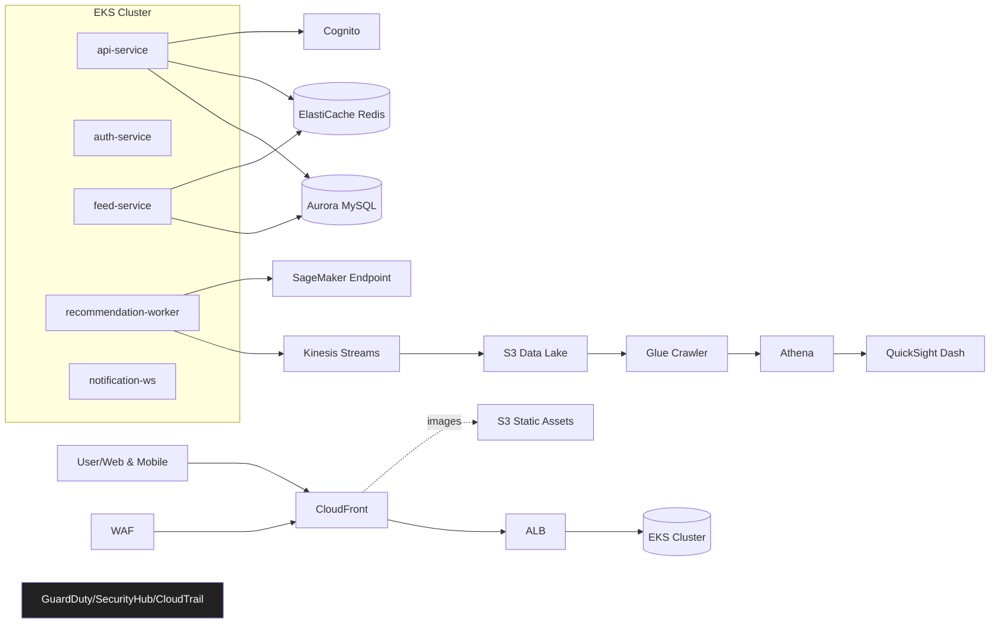

# 🧩 기술 스택 + 아키텍처 설계서 (AWS 스타트업 타이쿤)

본 문서는 텍스트 경영 시뮬레이션에서 확정된 방향을 **실제 제품/인프라 설계**로 변환한 자료입니다.  
MVP → 성장기(5만) → 스케일업(15만+) → IPO 준비까지의 **단계별 로드맵**을 포함합니다.

---

## 0. 목표와 비기능 요구사항(NFR)

- **가용성(SLO)**: 월 가동률 99.9% (성장기), 99.95% (스케일업), 99.99% (IPO 준비)
- **성능**: p95 응답시간
  - MVP: ≤300ms, 성장기: ≤200ms, 스케일업: ≤150ms
- **보안/컴플라이언스**: ISMS-P / SOC 2 대비, 기본 암호화(KMS), 최소권한(IAM)
- **관측성**: MTTD < 3분, MTTR < 30분
- **확장성**: 이벤트성 피크 시 자동 확장 대응(분 단위)
- **비용(FinOps)**: 태깅/대시보드/알람으로 예산 초과 사전 경보

---

## 1. 기술 스택 개요

### 프런트엔드
- **Next.js(React), TypeScript**
- 상태관리: Redux Toolkit / React Query
- 스타일: TailwindCSS
- 번들/빌드: Vite(선택)
- 국제화: next-intl
- 배포: S3 + CloudFront (정적), 앱쉘은 API와 분리

### 백엔드
- **Node.js (NestJS)** 또는 **Python (FastAPI)**
- 인증: Cognito(+ 소셜로그인), JWT
- API: REST + gRPC(내부 서비스 간), WebSocket(실시간 알림)
- 메시징/비동기: SQS / EventBridge

### 데이터/스토리지
- **Aurora MySQL Serverless v2** (성장기에 프로비저닝 전환)
- **ElastiCache Redis** (세션/캐시/레이트리밋)
- S3 (정적 자산, 데이터 레이크)
- Athena + Glue + QuickSight (분석)

### ML/AI
- **Amazon Bedrock**(LLM 기반 챗/요약) + **SageMaker**(추천/광고 모델 학습·서빙)
- Feature Store: SageMaker Feature Store (또는 DynamoDB)
- 실시간 특징 수집: Kinesis Data Streams / Firehose

### 인프라/플랫폼
- **EKS**(Kubernetes) + **Karpenter**(노드 오토프로비저닝)
- Ingress: ALB Ingress Controller
- 이미지: ECR
- 배포: ArgoCD (GitOps) + GitHub Actions (CI)
- 서킷브레이커/레이트리밋: Envoy/NGINX Ingress 또는 API Gateway

### 보안/거버넌스
- WAF + Shield Standard
- IAM 최소권한, IAM Identity Center(SSO)
- Secrets Manager / Parameter Store
- GuardDuty, Security Hub, AWS Config, CloudTrail
- VPC 프라이빗 서브넷, NAT 게이트웨이, SSM Session Manager (SSH 금지)

---

## 2. 아키텍처 다이어그램 (Mermaid)



---

## 3. 환경 구성

- **리전**: ap-northeast-2(서울) / DR 후보: ap-southeast-1(싱가포르)
- **스테이지**: dev / staging / prod (별도 AWS 계정, IAM Identity Center로 분리)
- **네트워크**
  - VPC: /16, Public/Private Subnet × 3AZ
  - 프라이빗 서브넷에 EKS/PODS, RDS, Redis
  - NAT GW 3개(각 AZ) / VPC Endpoint(S3, ECR, CloudWatch 등)

---

## 4. 모듈 구성 (IaC 권장 구조)

```
infra/
 ├─ envs/
 │   ├─ dev
 │   ├─ stg
 │   └─ prod
 ├─ modules/
 │   ├─ vpc
 │   ├─ eks (eksctl/terraform-aws-eks)
 │   ├─ karpenter
 │   ├─ alb-ingress
 │   ├─ aurora
 │   ├─ elasticache
 │   ├─ s3-cloudfront
 │   ├─ kinesis-firehose
 │   ├─ glue-athena-quicksight
 │   ├─ cognito
 │   ├─ waf
 │   └─ o11y (cloudwatch, x-ray, datadog agent)
 └─ pipelines/ (GitHub Actions, ArgoCD app-of-apps)
```

---

## 5. 서비스 경계 & 데이터 흐름

- **api-service**
  - 인증/권한, 게시물 CRUD, 결제/구독(Stripe/토스페이먼츠 연동)
  - 캐싱 정책: 캐시 가능한 GET은 Redis 60~300s TTL
- **auth-service (Cognito 연동)**
  - 가입/로그인/소셜, MFA 선택 지원
- **feed-service**
  - 추천/팔로우/랭킹 피드 조립 (읽기 집중, 캐시 퍼스트)
- **recommendation-worker**
  - Kinesis 이벤트 소비 → Feature Store 업데이트 → SM 엔드포인트 호출
- **notification-ws**
  - WebSocket/Server-Sent Events 로 알림 푸시

---

## 6. 스케일링 전략 & 용량 계획

| 구간 | 유저 규모 | 핵심 조치 | 병목 & 해결 |
|---|---:|---|---|
| MVP | ~5천 | EC2→Aurora Serverless, 캐시 초도 | EBS IOPS → Aurora로 분리 |
| 성장기 | ~5만 | ALB + ASG/EKS, Redis 본격화 | DB 읽기 부하 → 캐시 미스 개선 |
| 스케일업 | 5만~15만+ | **EKS + Karpenter**, HPA/Cluster Autoscaler | 피드 조립 CPU/GPU → 추론 노드풀 분리 |
| 글로벌 | 15만~100만 | Aurora 프로비저닝 + Read Replica, **Global DB**(읽기), CloudFront | 라우팅/세션 → Sticky + 지역 세션 & 글로벌 키는 DynamoDB |

- **HPA 지표**: CPU 60%, RPS/Pod, 큐 길이(SQS), 커스텀(Biz-QPS)
- **캐시 목표**: Read 캐시 히트율 85%+, 핫키 보호

---

## 7. 관측/알람(O11y)

- **Metrics**: 요청수, 에러율(5xx/4xx), p50/p95/p99, DB CPU/커넥션, Redis 히트율
- **Tracing**: OpenTelemetry SDK → X-Ray/Datadog
- **Logging**: 구조화 JSON(TraceID 포함) → CloudWatch Logs → Athena/Search
- **Alert**:
  - p95 > SLO 5분 지속
  - 에러율 1% 초과 3분
  - RDS CPU > 80% 10분
  - Redis 미스율 > 30% 10분
  - 비용 알람(Budget 80/90/100%)

---

## 8. 보안/컴플라이언스

- 네트워크: SG 최소 허용, NACL 기본 거부
- 비밀관리: Secrets Manager (로테이션), KMS CMK
- 접근: SSM Session Manager, Bastion 금지
- 감사: CloudTrail Lake + Athena (90일 이상 보관)
- 규정: WAF 관리형 룰 + Bot Control, RateLimit
- 인증: ISMS-P/SOC2 증빙 자동화(Conformance Packs)

---

## 9. CI/CD & 품질

- **CI**: GitHub Actions (lint/test/build/sca), 취약점 스캔(CodeQL/Trivy)
- **CD**: ArgoCD (App-of-Apps), Progressive Delivery (Argo Rollouts, Canary/Blue-Green)
- **릴리즈 정책**: SemVer, 환경별 승인 게이트
- **테스트**: 단위/통합/부하(K6), 카오스(실선택)

---

## 10. DR/백업/복구

- **RPO/RTO**: RPO ≤ 5분(포인트인타임), RTO ≤ 30분(리전 장애 제외)
- **Aurora**: PITR + 스냅샷 주간, Read Replica 다중 AZ
- **S3**: 버전닝 + Glacier 보관
- **멀티리전**: 단계 2에서 Aurora Global DB(Reader) + Route 53 Latency Routing
- **DR 리허설**: 분기 1회, Runbook 업데이트

---

## 11. 비용 모델(월, 대략치)

| 단계 | 컴퓨트(EKS/EC2) | DB(Aurora) | Redis | 네트워크/CF | O11y | 합계 |
|---|---:|---:|---:|---:|---:|---:|
| MVP | 10 | 30 | 5 | 3 | 2 | **50** |
| 성장기(5만) | 120 | 80 | 20 | 15 | 10 | **245** |
| 스케일업(15만+) | 400 | 180 | 60 | 40 | 30 | **710** |
| 글로벌 준비 | 600 | 260 | 80 | 70 | 40 | **1,050** |

> 단위: 만 원 / 실제는 사용량/리전/약정(Savings Plans) 따라 변동

**FinOps 권장**:  
- Savings Plans 1~3년, Graviton 우선, CF 캐시정책/이미지 최적화, DB/Redis 사이징 주간 리뷰

---

## 12. 데이터 모델(요약)

- `users(id, email, plan, locale, created_at, ...)`
- `posts(id, user_id, title, body, tags, created_at, ...)`
- `follows(follower_id, followee_id, created_at)`
- `events(user_id, type, metadata_json, ts)` — Kinesis 유입
- `subscriptions(user_id, plan, status, renewed_at, ...)`

인덱스: `posts(user_id, created_at)`, `follows(follower_id)`, `events(ts)` 파티션  
아카이브: 90일 지난 이벤트는 S3로 오프로딩

---

## 13. 런북(핵심)

- **장애: 에러율 급증**  
  1) 상태 페이지 확인 → 2) 최근 배포 롤백(Argo) → 3) Redis 미스율/DB 커넥션 확인 → 4) HPA/노드풀 상태 확인  
- **DB 고부하**: 읽기 캐시 TTL 상향, 리더 증설, 슬로우쿼리 캡처/인덱스 추가  
- **비용 급증 알람**: 최근 배포/트래픽 소스 점검, CF 미스율/데이터 전송 분석(Athena)

---

## 14. 단계별 로드맵

- **Phase 0 (MVP, 0~5천)**: EC2→Aurora, HTTPS, 최소 CI
- **Phase 1 (성장, ~5만)**: ALB+ASG/EKS, Redis, 유료/광고, 기본 O11y
- **Phase 2 (스케일업, 15만+)**: EKS 완전 전환, Kinesis→S3→Athena, QuickSight
- **Phase 3 (AI/글로벌)**: Bedrock/SageMaker, Aurora Global DB, Latency Routing
- **Phase 4 (IPO 준비)**: 보안/감사 자동화, DR 리허설, FinOps 계약

---

## 15. 리스크 & 대응

- **트래픽 급증**: HPA/LB 스케일, 캐시 확대, 피쳐 토글(AppConfig)로 무거운 기능 끄기
- **DB 단일 병목**: 읽기 분리, CQRS 일부 도입, 핫파티션 분산
- **팀 확장에 따른 복잡도**: 도메인 기반 서비스 경계 정의, GitOps, 표준화 템플릿

---

## 16. 성공 지표(KPI)

- 기술: 가용성, p95, 에러율, 배포건/롤백율, MTTR
- 비즈: MAU/DAU, 전환율, ARPU/ARPA, 코호트 리텐션, CAC/LTV
- 비용: 단위당(요청/유저) 비용, 예산 대비 편차

---

## 부록 A. 레퍼런스 포트 맵(예시)

- API: 443(HTTPS) → Ingress → Pod 8080
- gRPC 내부: 50051
- Redis: 6379 (SG 제한)
- RDS: 3306 (프라이빗, SG 제한)

---

## 부록 B. 태깅 표준

`Environment`, `Owner`, `CostCenter`, `Application`, `DataClassification`, `Compliance`

---

본 설계서는 **개발/운영팀 온보딩 자료**로 사용 가능하며, IaC 모듈화와 GitOps 정책을 따른 구현을 권장합니다.
